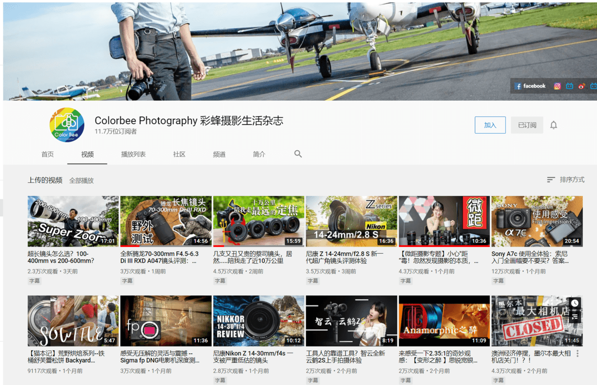
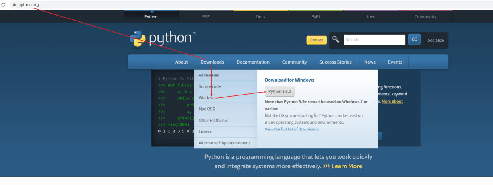
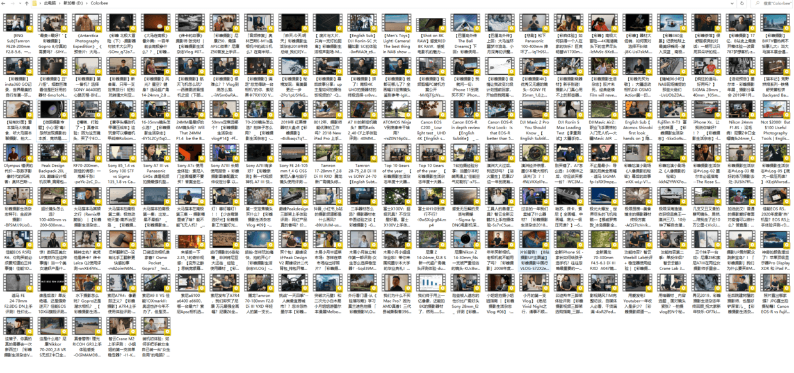

《彩蜂摄影生活杂志》是Youtube的一个摄影频道，我非常喜欢里面的内容，今天是1024程序员节，我们就用程序猿的方法将频道中的所有视频下载到本地，下载完成的视频，我会上传到奶牛快传，感兴趣的小伙伴，可以在文末找到在线观看的链接




## 从Python官网安装Python3.9

python官网：[https://www.python.org/](https://www.python.org/)





## 在命令行使用pip安装youtube-dl

```
# 升级pip
pip install --upgrade pip
# 使用pip安装youtube-dl
pip install youtube-dl
```

## 下载彩蜂摄影视频


```
youtube-dl https://www.youtube.com/channel/UC27M3BS9uxhJfPjYYys7y8w/videos
```


