## 1. 允许Mac安装任何来源的软件


在终端内输入以下命令，Mac就可以安装任何来源的软件

```
sudo spctl --master-disable
```
回车！

如果需要输入密码，则输入开机密码，然后再回车！

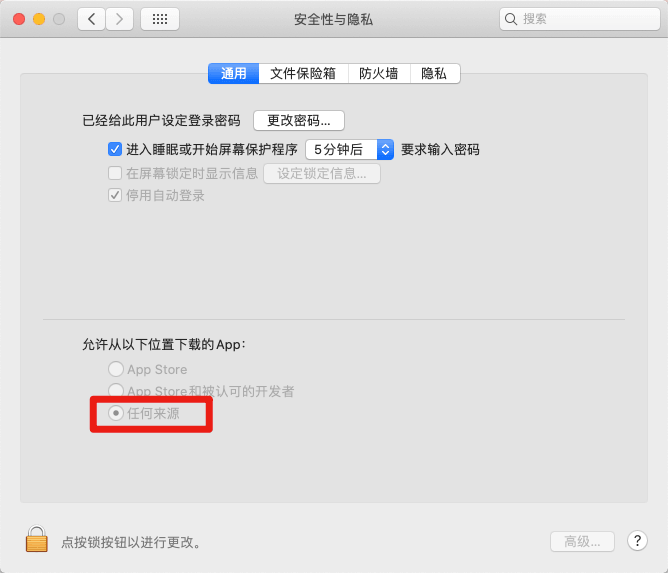


开启任何来源后，如何依然无法安装某些App，我们自省为App进行签名即可解决！


#### 为不明来源App进行签名的方法

1. 从App Store安装Xcode , 安装完成后打开Xcode，待显示主界面后，关闭
2. 在终端运行`xcode-select --install`
3. 在终端对app进行签名，如果app为`QQ.app`, 则命令为 `codesign --force --deep --sign - /Applications/QQ.app`


**哪里可以将收费软件变免费？**  推荐 [https://xclient.info/](https://xclient.info/)


## 2. 显示/隐藏文件和文件夹的快捷键


以 `.`开头的文件和文件夹，默认是不显示的


如需要显示当前目录的以`.`开头的文件/文件夹, 请按下 `⌘ + ⇧ + .`（ Command + Shift + . ）

如果需要隐藏当前目录的以`.`开头的文件/文件夹, 再次按下 `⌘ + ⇧ + .`（ Command + Shift + . ） 即可！


## 3. 在Finder中显示路径

#### 开启在Finder顶部显示路径

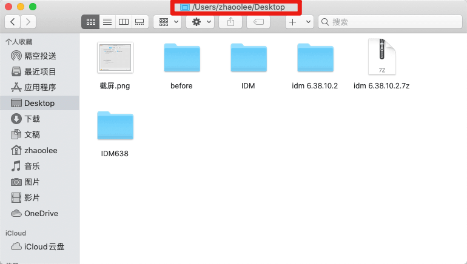

在终端输入：

```
defaults write com.apple.finder _FXShowPosixPathInTitle -bool YES
```

回车！

如果需要输入密码，则输入开机密码，然后再回车！


#### 关闭在Finder顶部显示路径（默认状态）

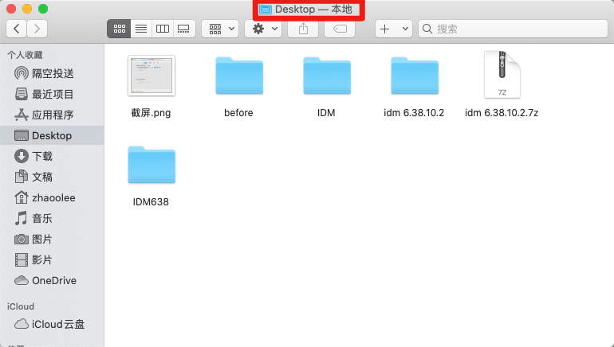

在终端输入：

```
defaults write com.apple.finder _FXShowPosixPathInTitle -bool NO
```
回车！

如果需要输入密码，则输入开机密码，然后再回车！


## 4. 访达优化：显示文件扩展名，桌面排序将文件夹前置


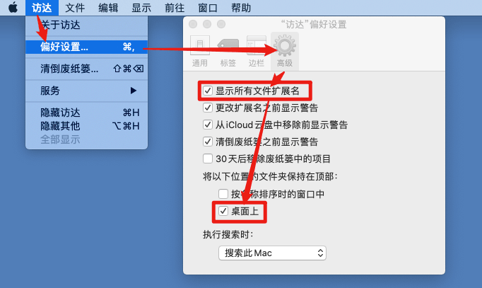


## 5. 设置触发角


如果你将`左下`触发角设置为启动台，每次进入/退出启动台，只需用鼠标触碰`左下`角即可（用了就回不去了～）


## 6. 一些提升审美的设置


将高亮色设置为**中国红**

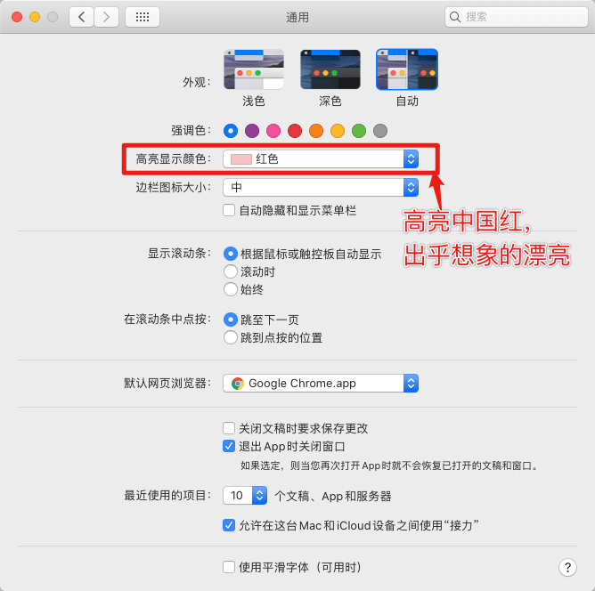

设置后的桌面，被选择到文件夹/文件，高亮配色非常漂亮


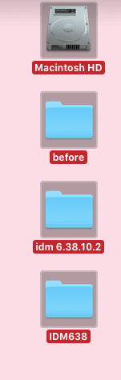

关闭平滑字体


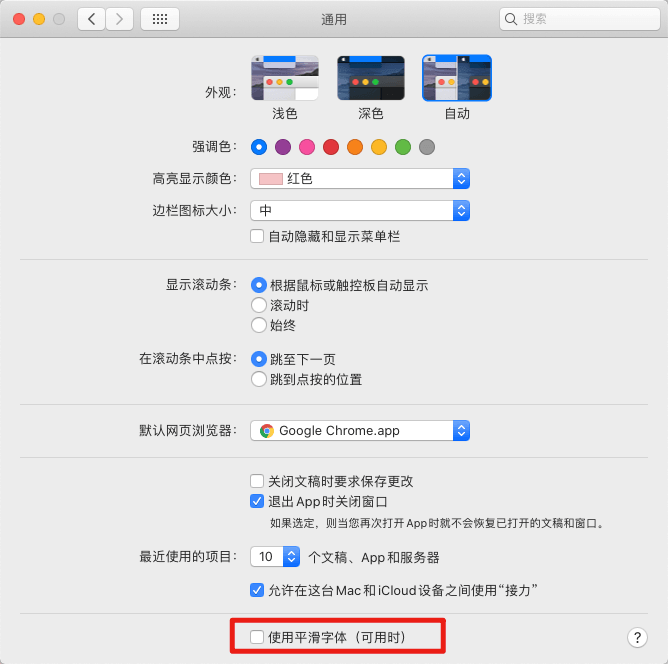

关闭平衡字体后，系统级的字体会**自动减肥**，看上去非常清秀，有艺术感！


####  TinkerTool

可以调整大量系统默认设置

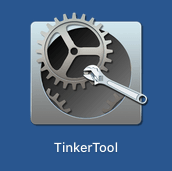


## Caffeine

给Mac灌咖啡，让Mac不休眠

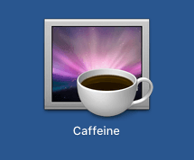


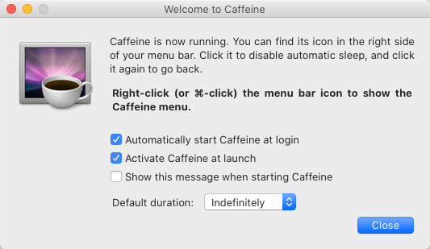


## 截图贴图软件

超级好用的截图软件，截图后可以将图片贴到桌面，作为任务清单！


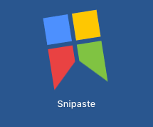

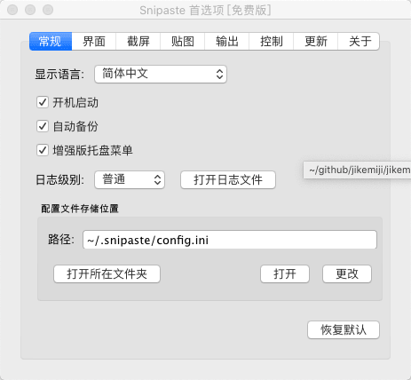

## 程序员必备：运维一体化工具FinalShell


程序员必备，运维一体化工具 FinalShell, 能查看服务器的各种状态，传文件，看进程，还免费


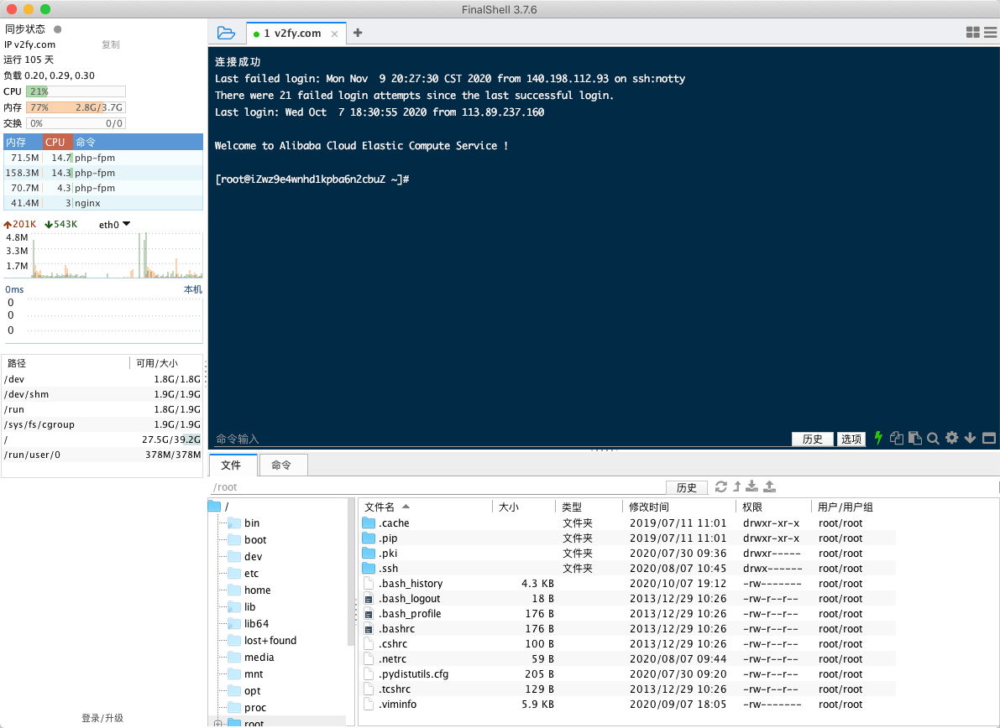


## 百度网盘32线程下载工具 NeatDownloadManager

我们可以通过开启32线程的方式，使用NeatDownloadManager下载百度网盘中的文件！


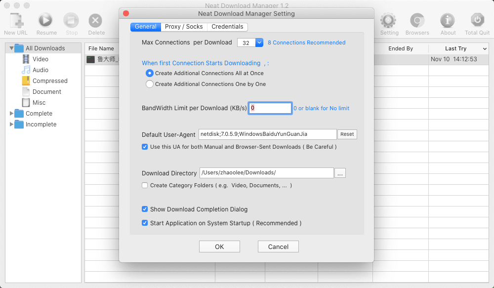

NeatDownloadManager高速下载百度网盘文件教程 : [https://v2fy.com/p/t040-kdbaidu/](https://v2fy.com/p/t040-kdbaidu/)


## 清理Mac： 腾讯柠檬清理


Mac删除软件，只需把App放入回收站即可，但这样清理的并不干净，很多残留文件依然在Mac中占据空间，推荐使用腾讯柠檬清理，清理软件，干净快捷！


觉得以上软件好用，求点赞～


## 8. 不可错过的在线工具


#### 在线版Photoshop


https://www.photopea.com/


#### 在线视频下载


https://www.urlgot.com/


#### 在线压缩图片


https://www.iloveimg.com/zh-cn/compress-image


想要了解更多在线工具可以前往 《在线工具秘籍》[https://v2fy.com/p/readme-onlinetoolsbook/](https://v2fy.com/p/readme-onlinetoolsbook/)


## 9. 使用Chrome开启新世界


首先下载安装Chrome:  [https://www.google.cn/chrome/](https://www.google.cn/chrome/)


然后在公众号**0加1**后台回复**Chrome插件英雄榜**， 获取igg安装程序，解压安装后，访问Google扩展程序商店,安装《iGG谷歌访问助手》


然后就可以愉快免费地使用Google搜索了～


想要了解更多Chrome扩展工具可以前往 《Chrome插件英雄榜》  [https://v2fy.com/p/readme-chromeappheroes/](https://v2fy.com/p/readme-chromeappheroes/)  

挑选你喜欢的英雄！

