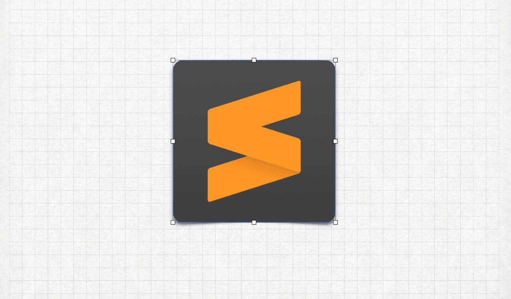
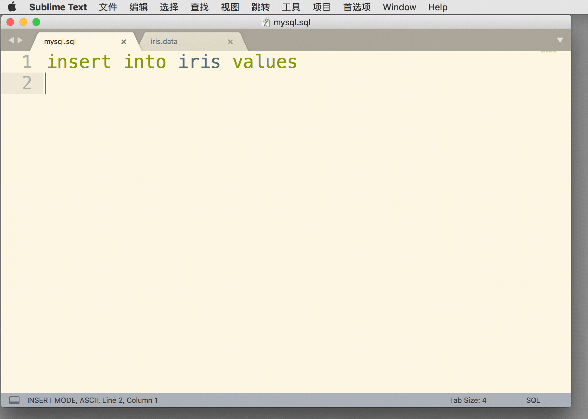
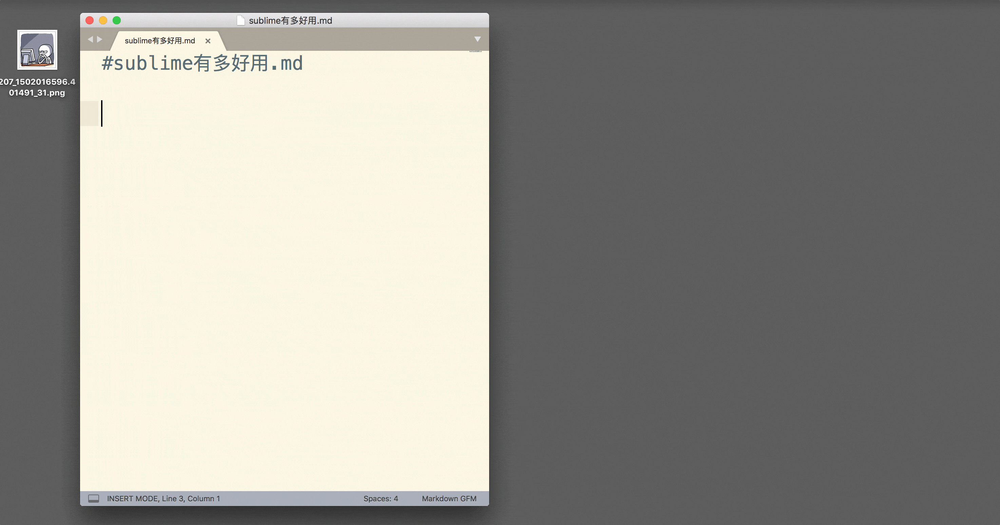
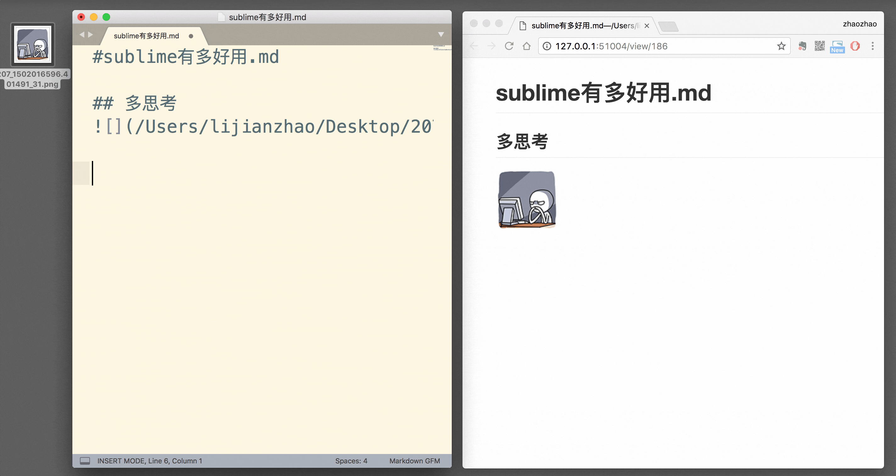

sublime是一款文本编辑器,特点是操作流畅,无卡顿,界面炫酷,问世的时候,凭借首创的"代码小地图",和"多点编辑",甩出其它编辑器几条街...

# 多点编辑
快速编写sql语句

# Markdown写作
插件:
MarkdownEditing(提供更完善的markdown语法支持) 
OmniMarkupPreviewer(在浏览器中实时预览文档效果)

#### 插入图片

#### 绘制表格

