####  iPhone的来电铃声虽然经典,但听久了就想换换口味,这里用最简单的方式教大家自定义iPhone铃声

(2017年12月20日更新)

## 自定义铃声分三步 
| 第一步   | 第二步   | 第三步   |
| -------- | -------- | -------- |
| 打开音乐 | 音乐转码 | 设置铃声 |

## 所需软件 : [iTunes下载](https://www.apple.com/cn/itunes/download/)

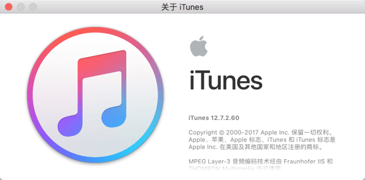
下载安装iTunes后,通过USB将iPhone连接到电脑,如果iTunes能成功识别iPhone,则iTunes安装成功

## 实验环境
MacBook Pro 系统版本: 10.12.6
iPhone6s 版本 11.1.2

 ## 第一步 : 打开音乐  用iTunes打开自己喜欢的音乐

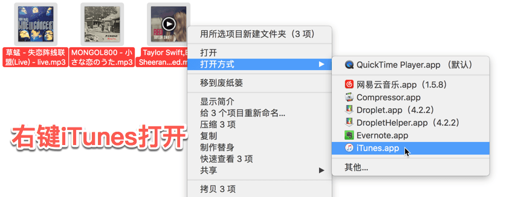

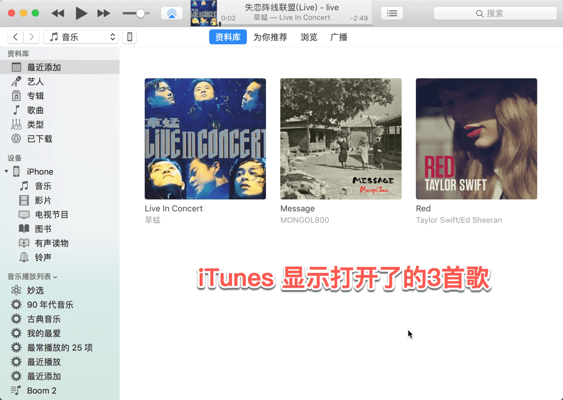

## 第二步 :  一键转码   用iTunes将音乐转换为m4r格式

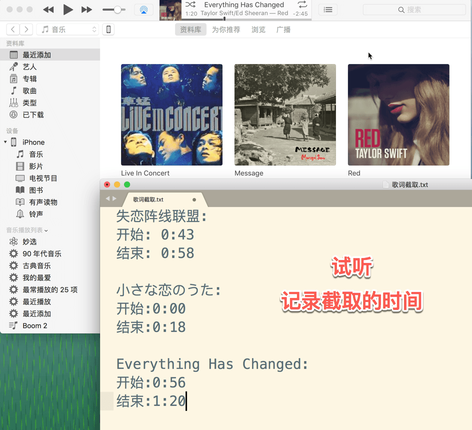

-  查看第一首歌的专题信息

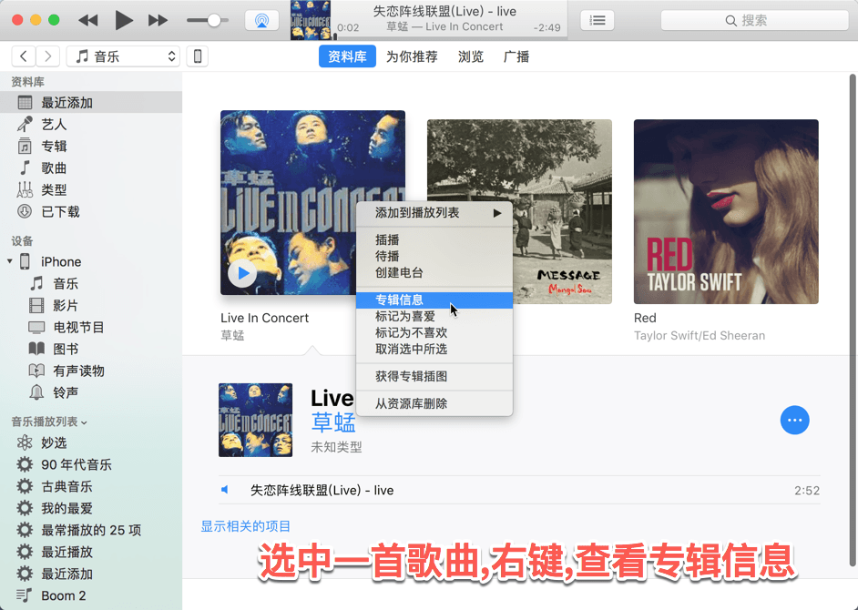

- 填入刚刚记录的需要截取的片段信息(截取的片段长度不要超过30秒)

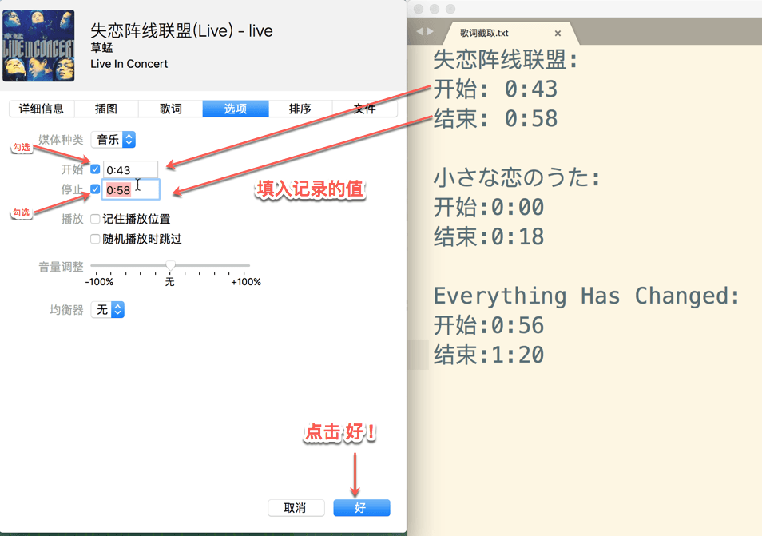

- 选中第一首歌,然后 在菜单栏选中 文件-->转换-->创建AAC版

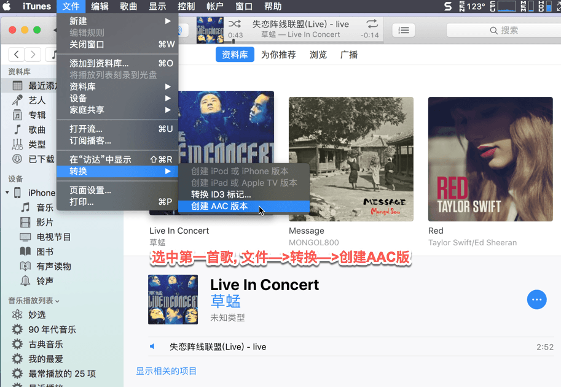

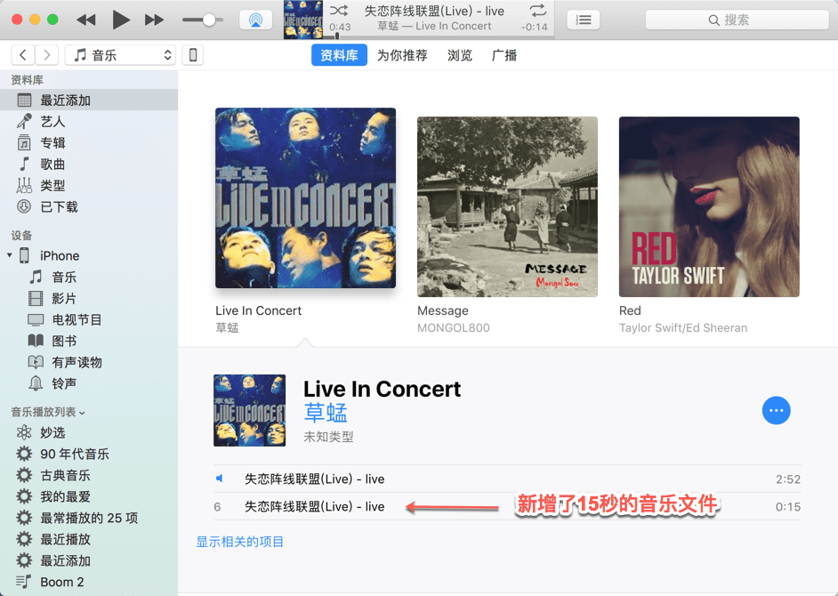

- 在文件夹中查看, 音乐文件所在位置

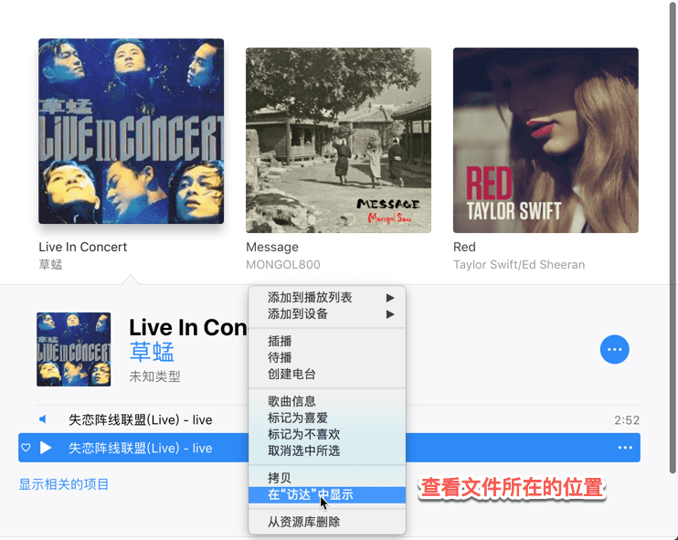

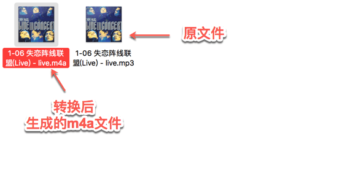

- 更换文件的扩展名,将`m4a`转换为`m4r`

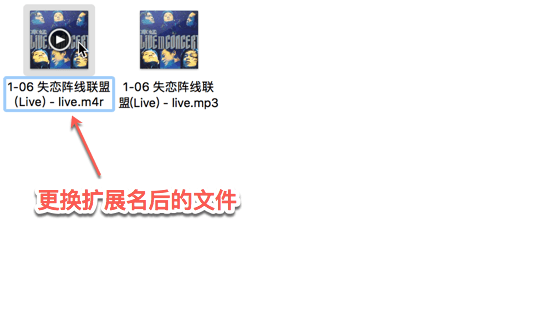

-  重复以上步骤,为后两首歌创建`m4r`文件,并将`m4r`复制到桌面上

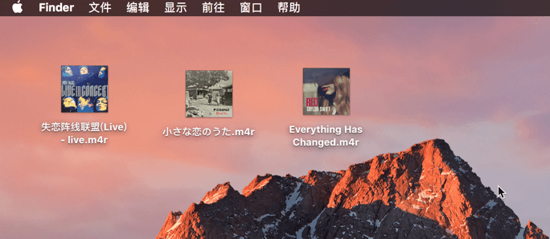

## 第三步 : 设置铃声   将制作的音乐传输到iPhone中

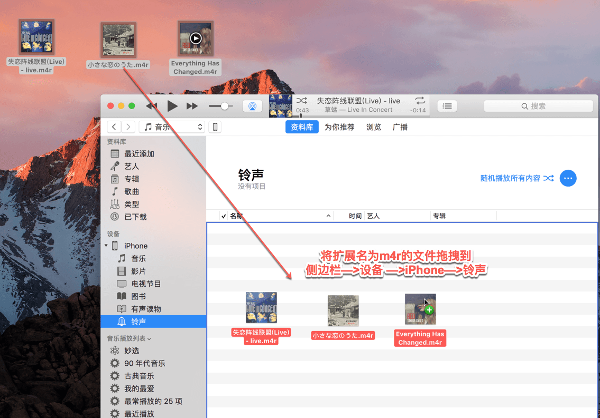

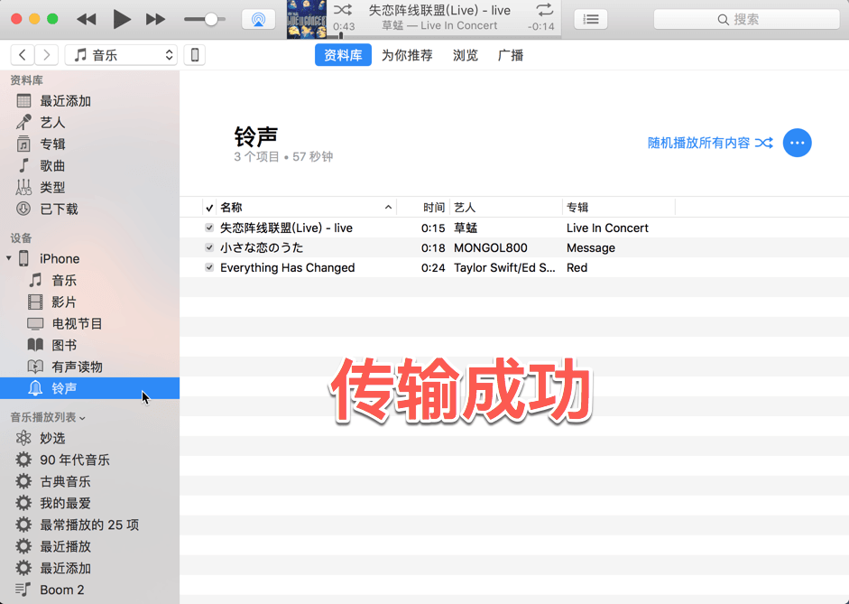

如果iTunse要求同步,允许即可!

#### iPhone设置铃声

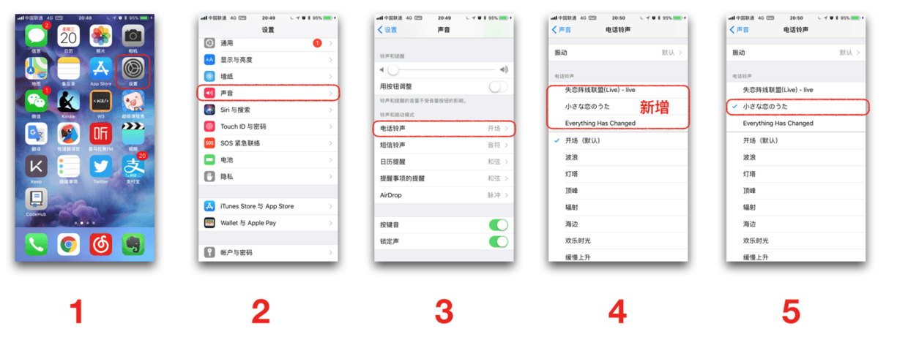