> 简书对markdown的支持非常好,而github恰好也是非常鼓励使用markdown格式,这次我们尝试将简书的文章,搬到GitHub平台.

> 我以前在简书发布过的一篇"[图虫遇爬虫](http://www.jianshu.com/p/93e163865ae7)",这篇文章有代码,有内容,很适合迁移到GitHub, 今天就以它为例

## 在本地生成一对秘钥(以Ubuntu为例)
- 进入到.ssh目录下

```
cd ~/.ssh/
```

- 生成一对秘钥

```
ssh-keygen -t rsa -C "lijianzhao1208@gmail.com"
```
- 为秘钥起个名字(可直接回车跳过)

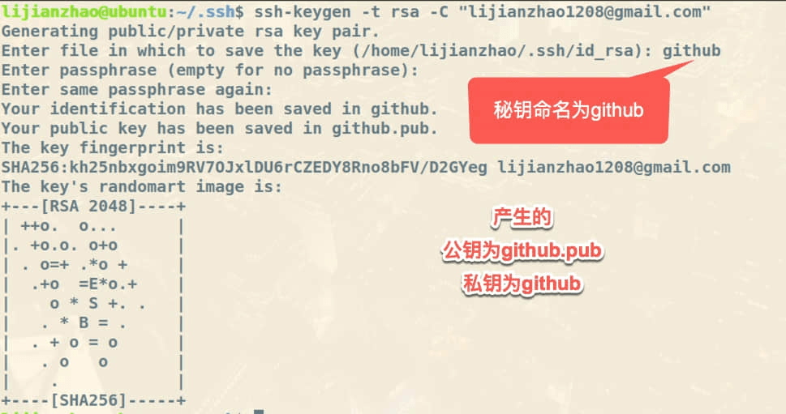


- 将公钥内容添加到github(实现免密向远程仓库提交代码)

复制公钥(github.pub)内容


>登录github,并粘贴公钥内容

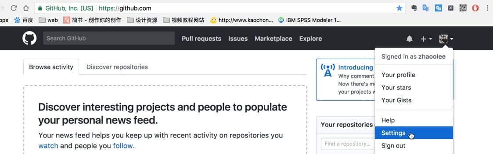

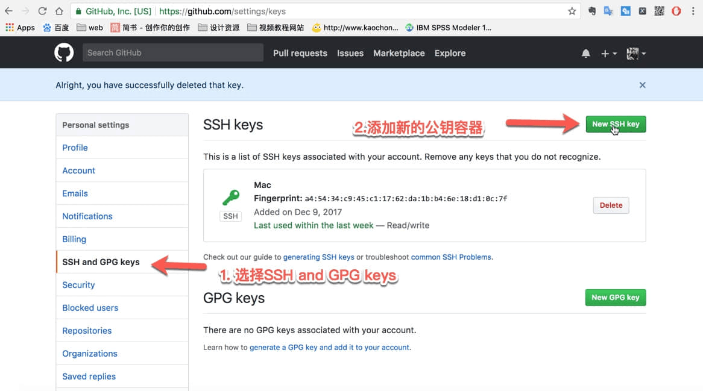


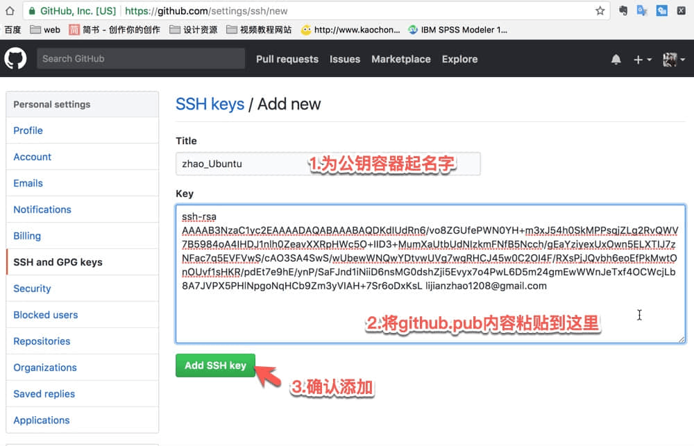


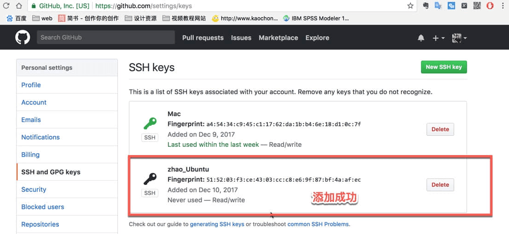


## 在github建立一个仓库


## 创建新仓库

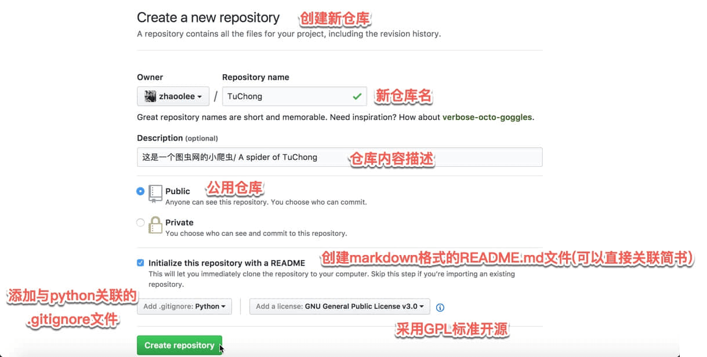

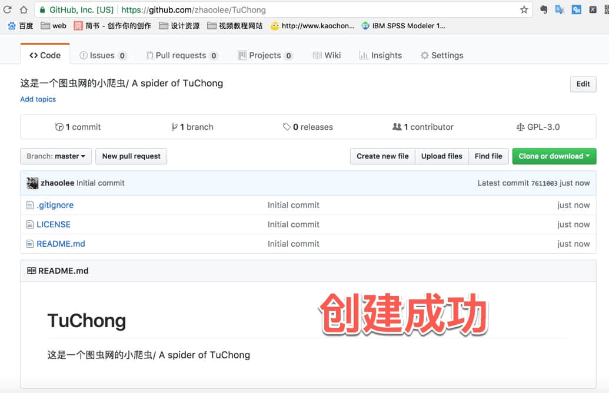

> 新仓库的位置为:
> ```https:github.com/用户名/新仓库名```

## 从本地(Ubuntu16.04环境),获取远程仓库

```
git clone git@github.com:zhaoolee/TuChong.git
```

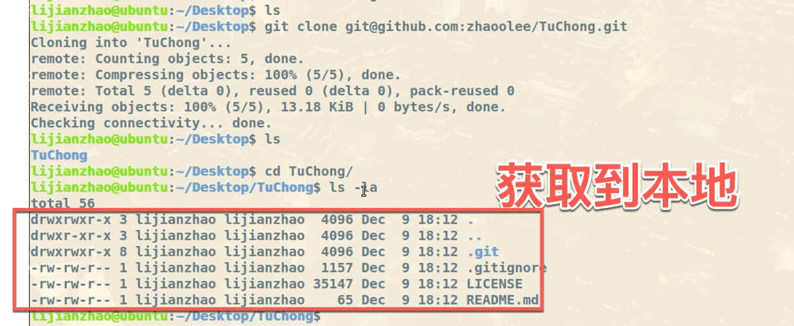


## 将简书内容添加到README.md文件中


- 打开简书后台编辑页面

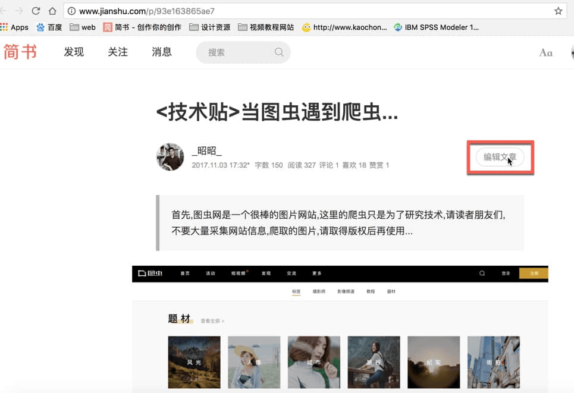


- 复制内容

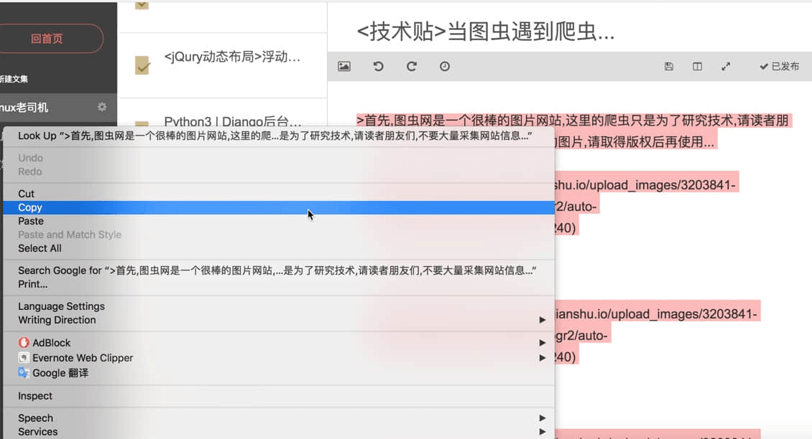


- 将内容添加到README.md


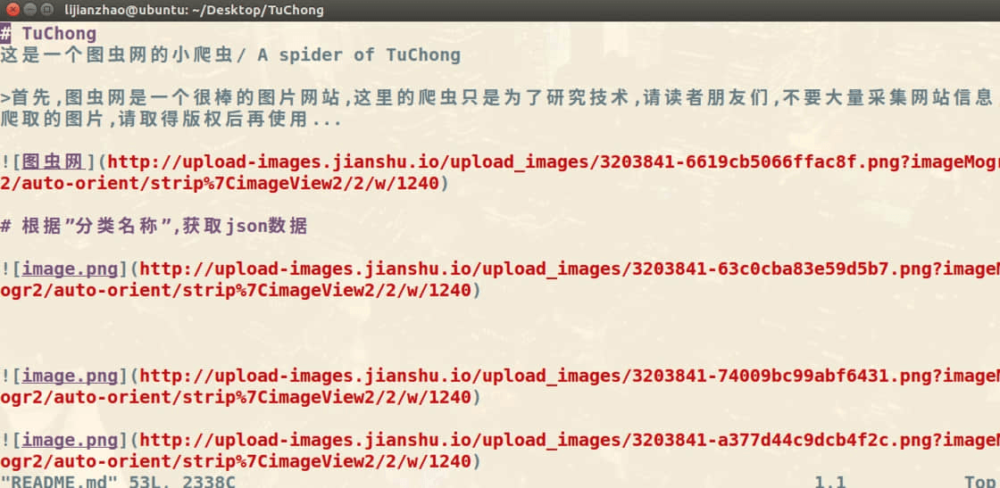


- 将代码文件添加到TuChong目录

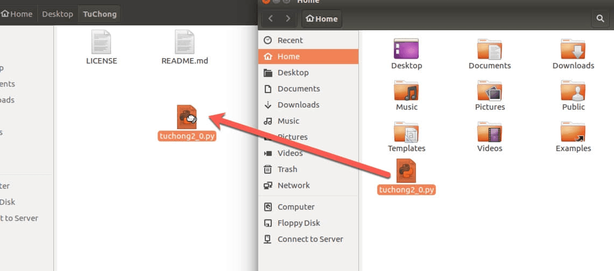


- 将更新的内容添加到本地仓库

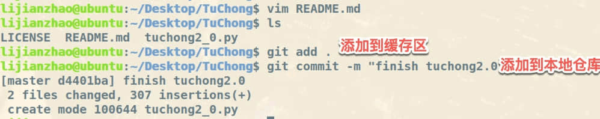


## 将本地仓库内容提交到github仓库

- 添加远程仓库

```git remote add TuChong git@github.com:zhaoolee/TuChong.git```

- 正式提交代码

```
git push -u TuChong master
```

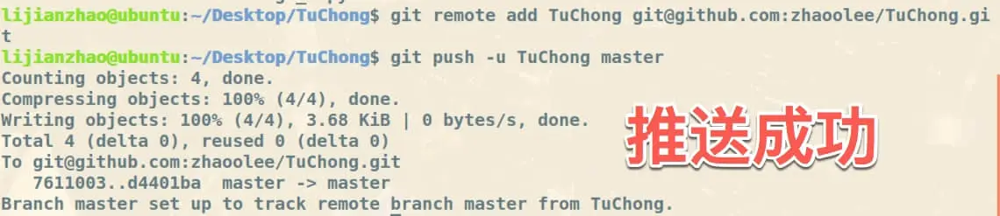


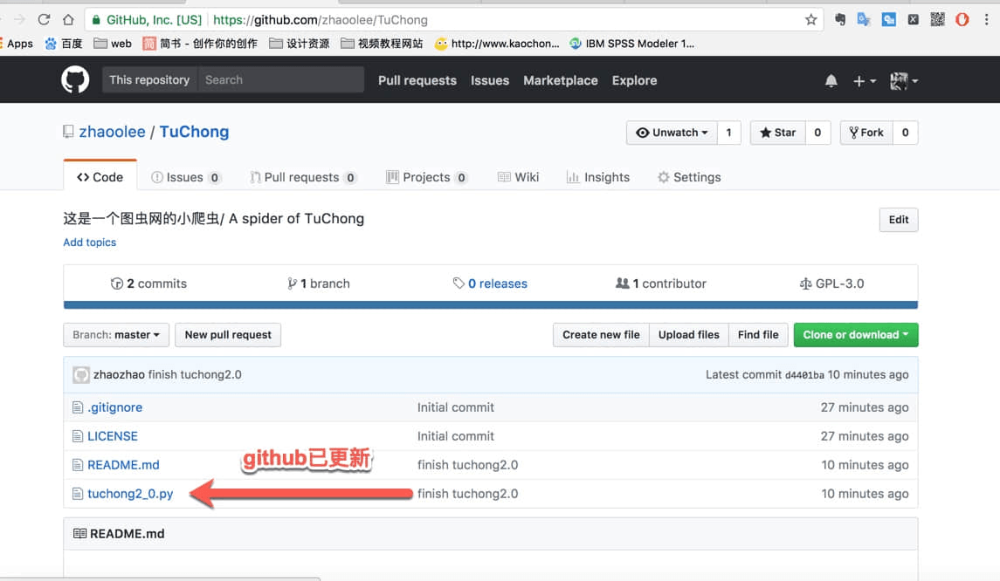


## [Github显示效果](https://github.com/zhaoolee/TuChong)对比[简书显示效果](http://www.jianshu.com/p/93e163865ae7)

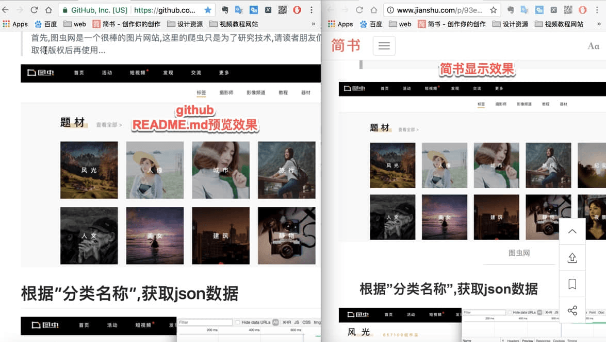

## Github还能更个性化些

- 上面的显示完全依赖于README.md文件的内容, github提供了将README.md文件内容独立为网页的功能(网页还预制了个性化主题)


- 选择主题


- 可选主题

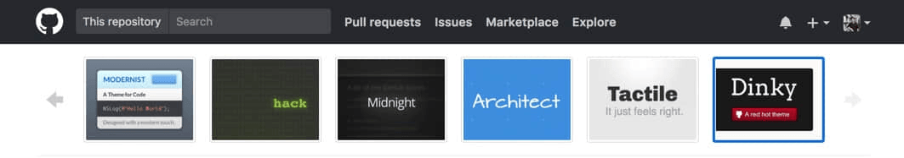


## 个性化主题效果 [预览链接](https://zhaoolee.github.io/TuChong/)

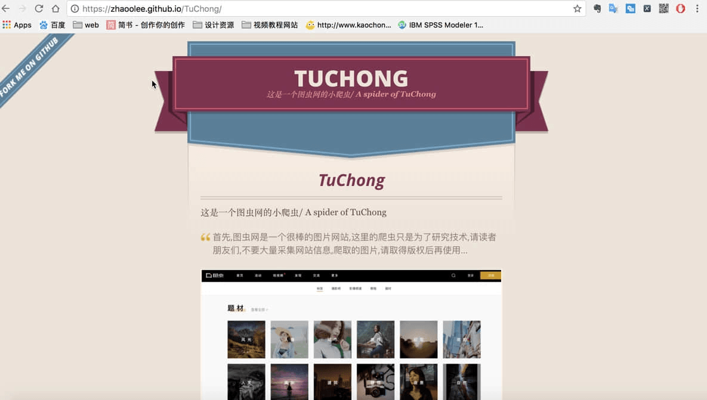

如果你想使用python自动化完成仓库创建, 并在新仓库上传一些稳定关联的资源,参考这篇 [Github变身网络硬盘](https://v2fy.com/p/2020-12-27-github-disk-1609059045000)