前段时间, 未来降低网址运行成本，搭了一套Mysql Docker 数据库, 包括外部链接，数据备份，数据导出，数据恢复一套解决方案。 [在Ubuntu20.04以Docker方式安装Mysql详细教程（支持外部连接，数据映射到物理磁盘，备份数据，导出数据，恢复数据）https://v2fy.com/p/2023-08-12-mysql-docker-1691853033000/](https://v2fy.com/p/2023-08-12-mysql-docker-1691853033000/)  

这套方案其实还是不够完美，为了能远程连接操作数据库，暴露了3306端口，即使换端口，依然有被爆破脱库的危险。

本文将进一步自建数据库完善方案, 关闭数据库对外的3306端口, 改为使用ssh秘钥登录目标主机。本文使用的实例软件为开源社区版DBeaver, 可以免费使用。

## 首先让云服务器, 支持ssh秘钥登录

查看 [Mac和Windows10配置ssh免密码登录 https://v2fy.com/p/kr-000044/](https://v2fy.com/p/kr-000044/) 可以完成配置

## 下载 DBeaver 社区版

 https://dbeaver.io/download/

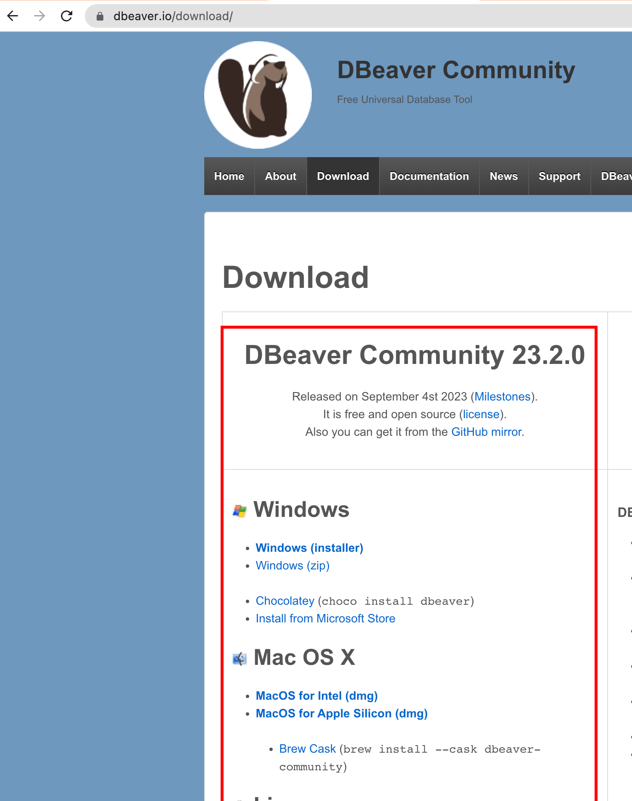

## 下载DBeaver后，关闭数据库所在云服务器的3306端口，然后开始连接

新建数据库连接

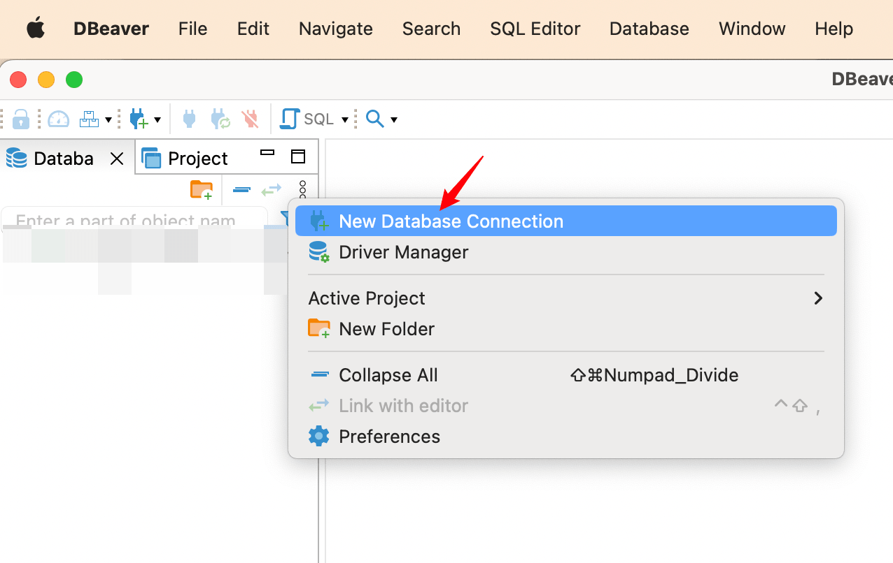

选择Mysql, 继续

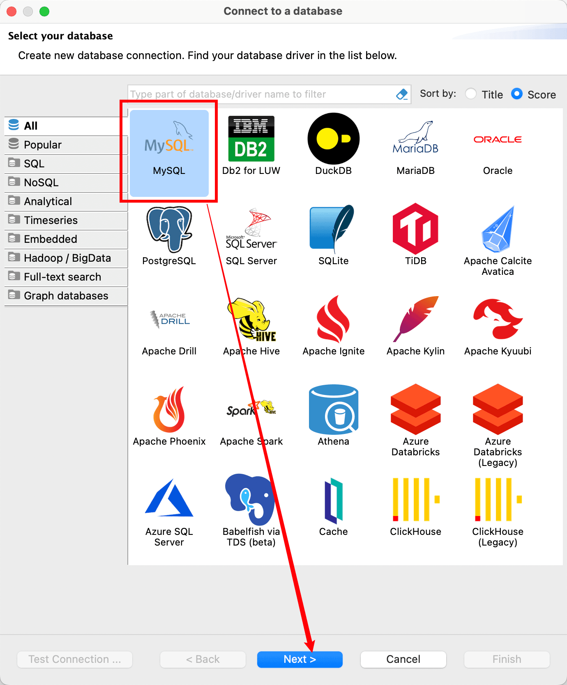

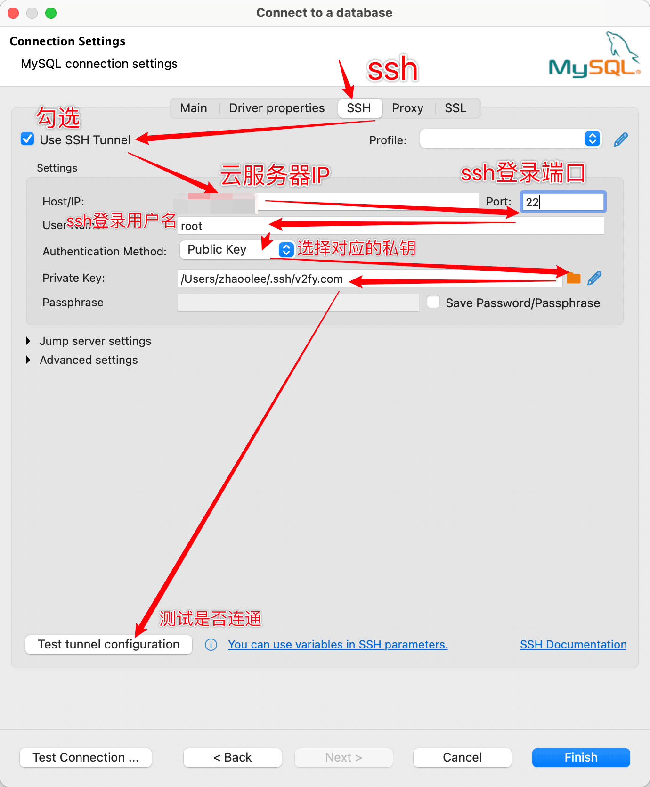

配置ssh连通后，弹窗会显示成功, 这里填写的连接

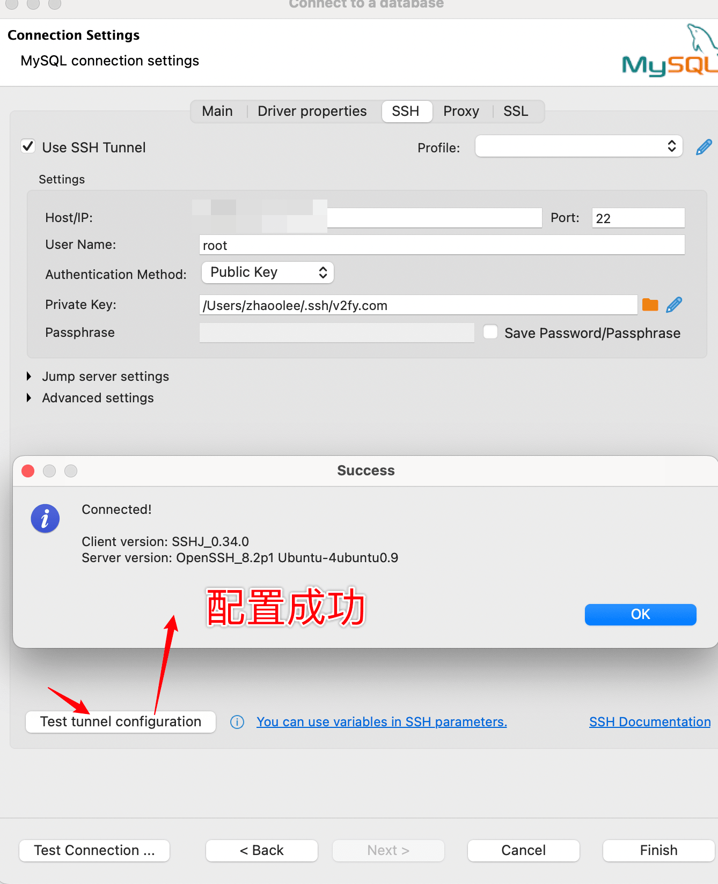

进入Main面板，填写用户名密码，测试连接是否成功

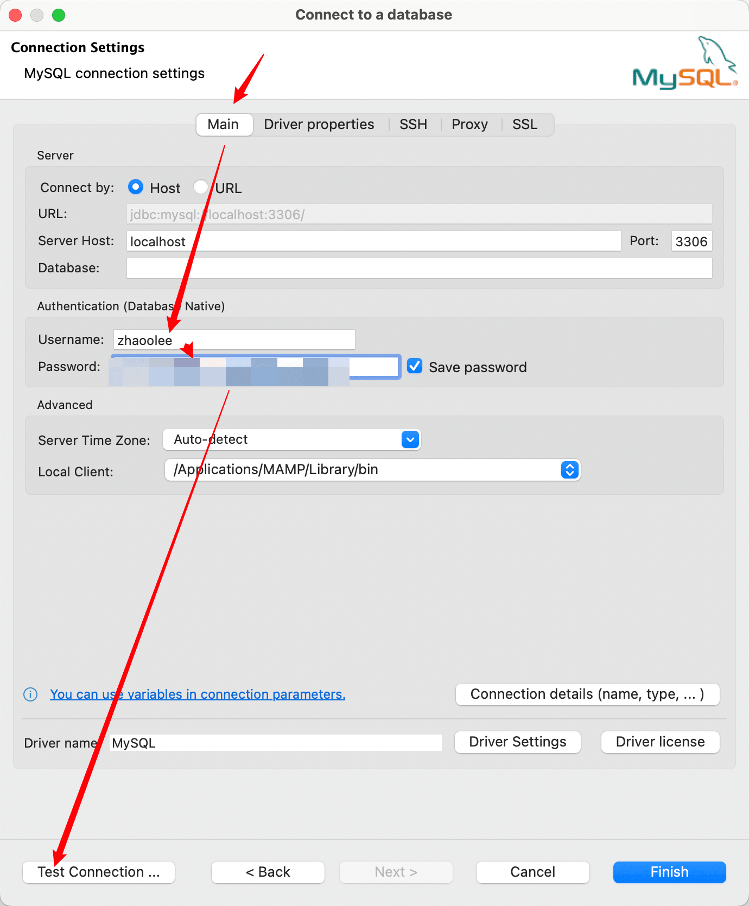

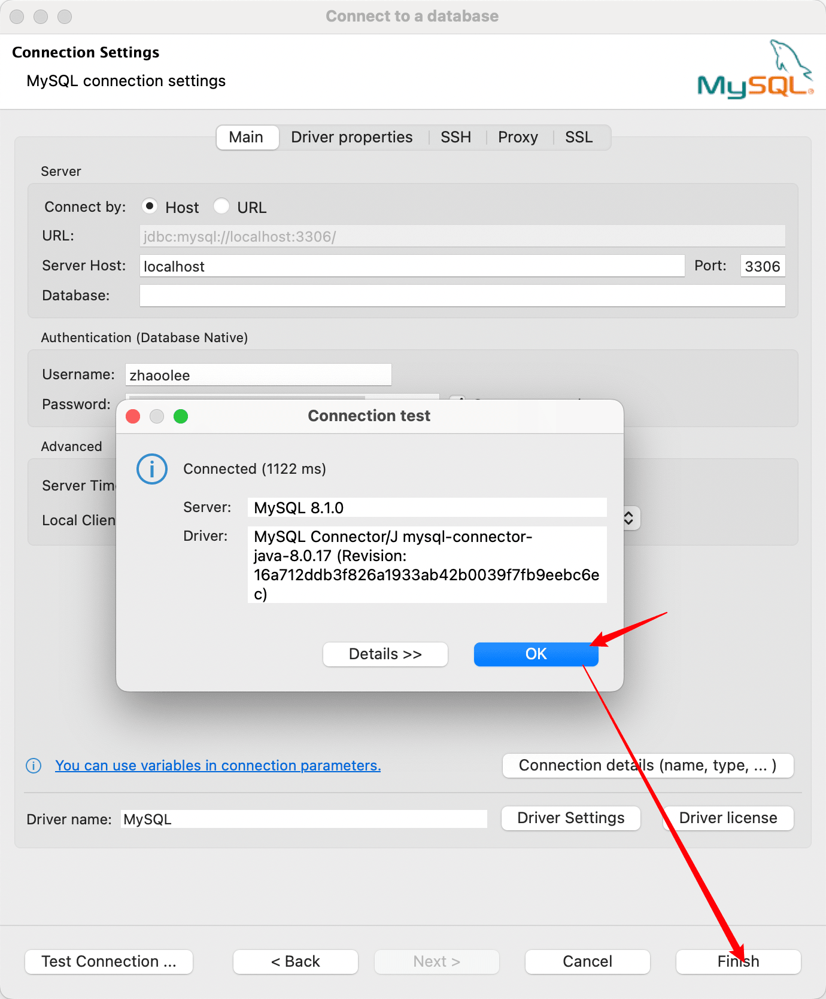

最后点击Finish，查看DBeaver左侧，可以看到数据库，以及表数据

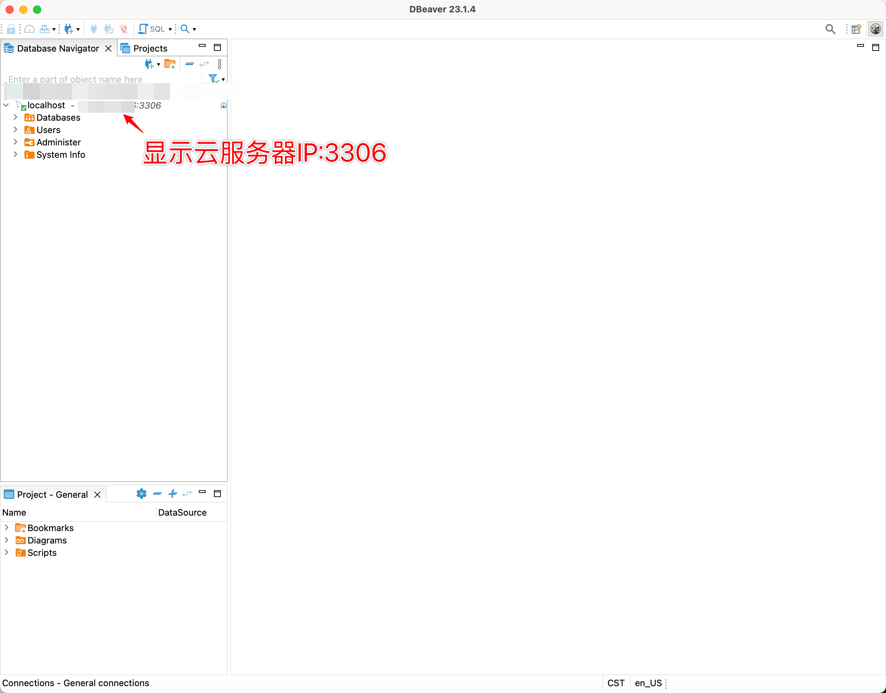

可以查看到数据

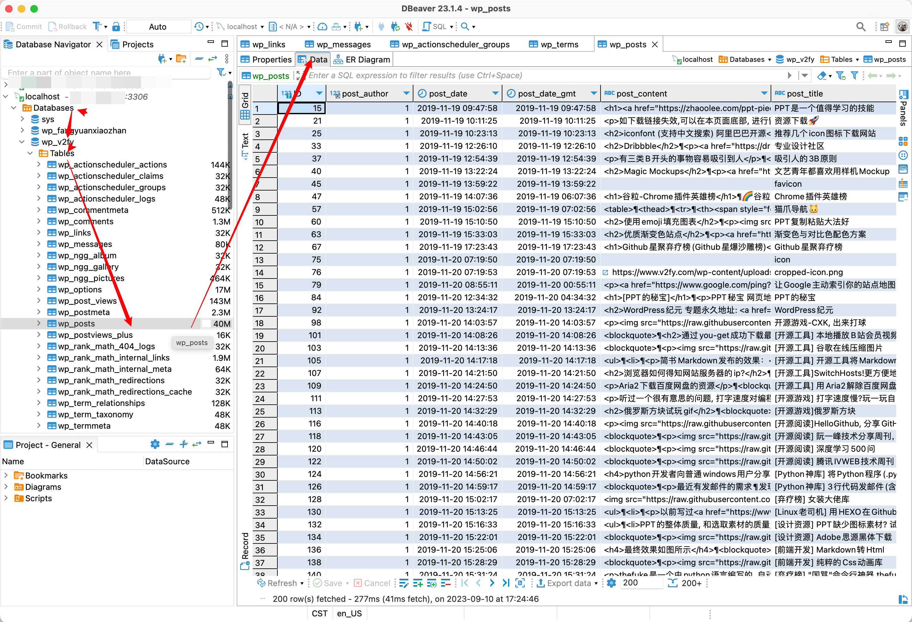

为了避免数据断开，我们可以设置每10秒钟重连一下，保证不会被断开

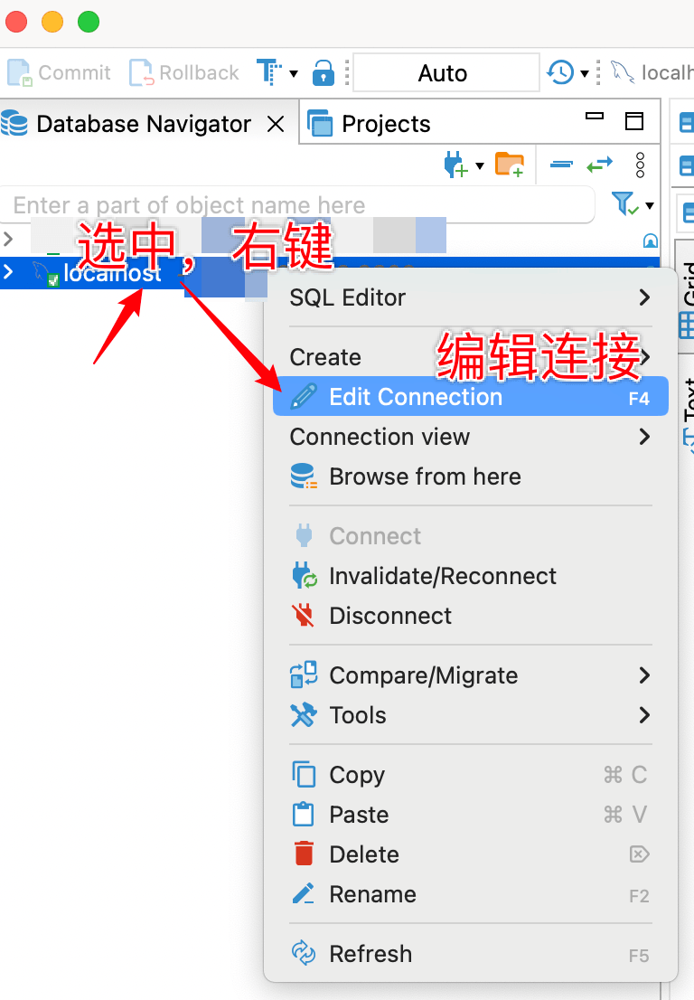

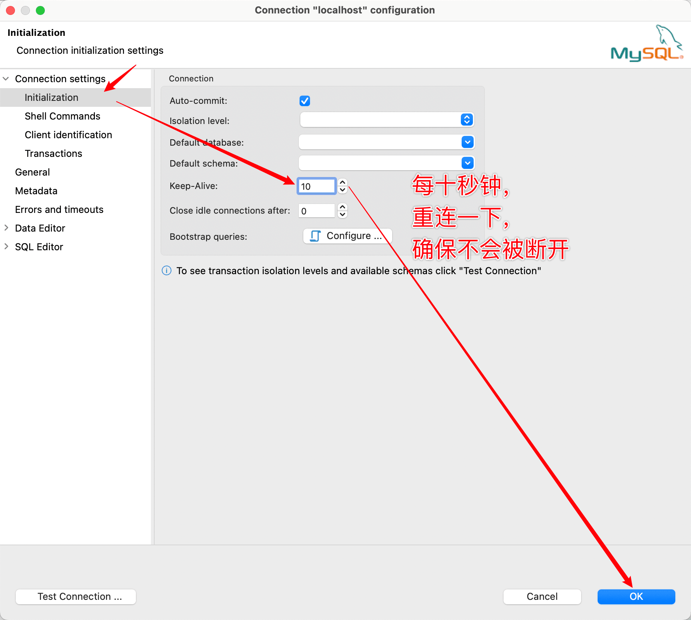

确认

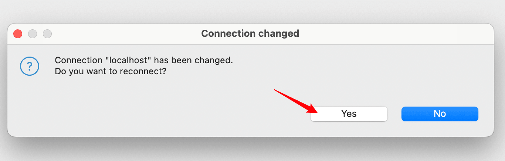

我们可以通过DBeaver图形化界面，稳定地增删改查Docker Mysql数据库了。

## 小结

进行以上的配置后，我们可以降低数据库被爆破的风险，数据的安全性提升。如果你担心数据库数据丢失，建议做好备份，低成本数据备份教程 [《树莓派4B家庭服务器搭建指南》第二十期：在树莓派运行rsnapshot, 实现对服务器数据低成本增量本地备份 https://v2fy.com/p/2023-08-17-rsnapshot-1692258217000/](https://v2fy.com/p/2023-08-17-rsnapshot-1692258217000/)

