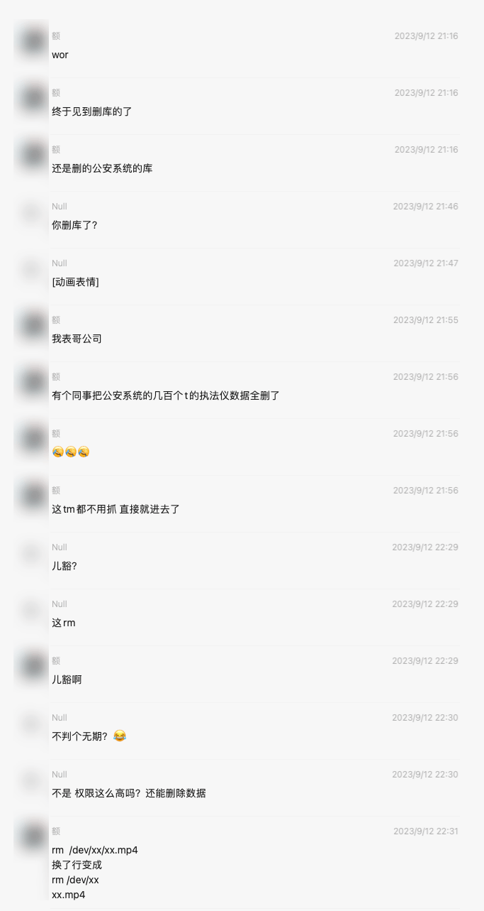
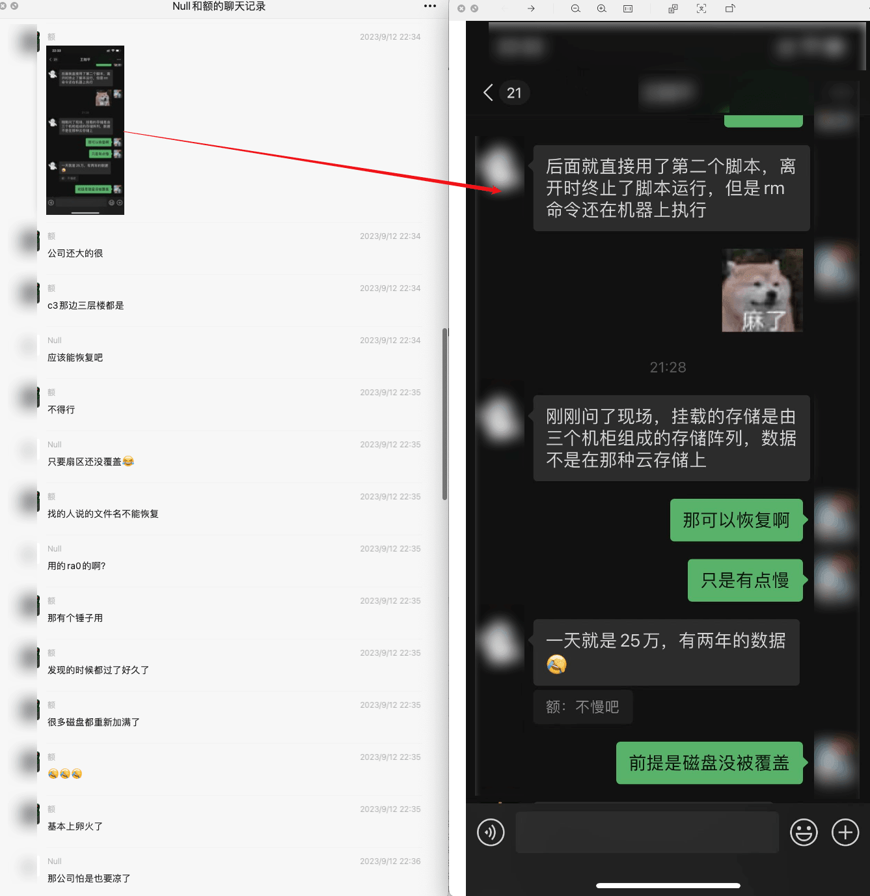
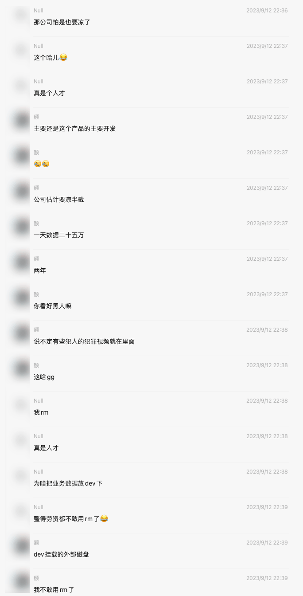
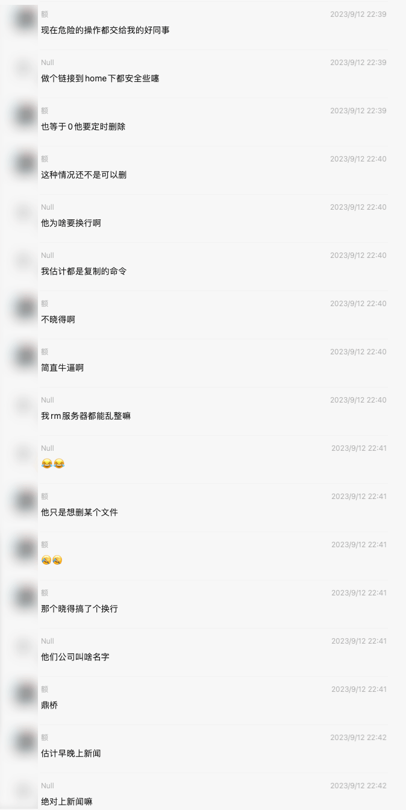
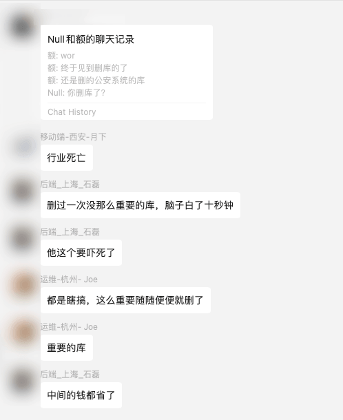
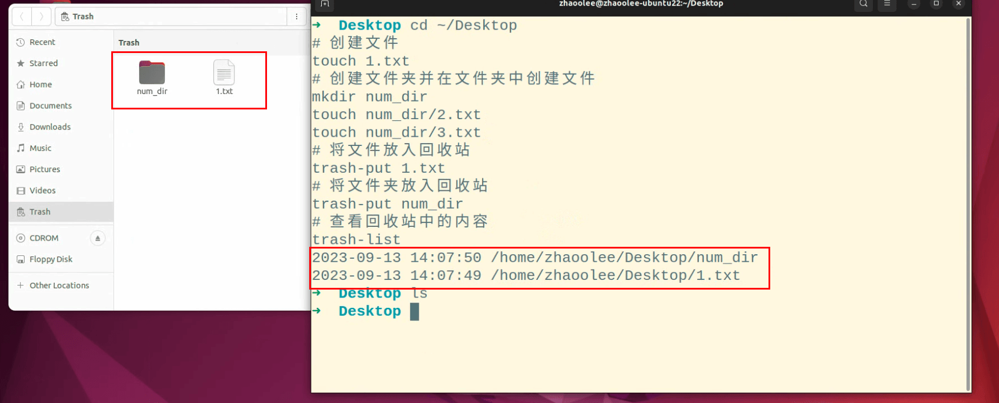
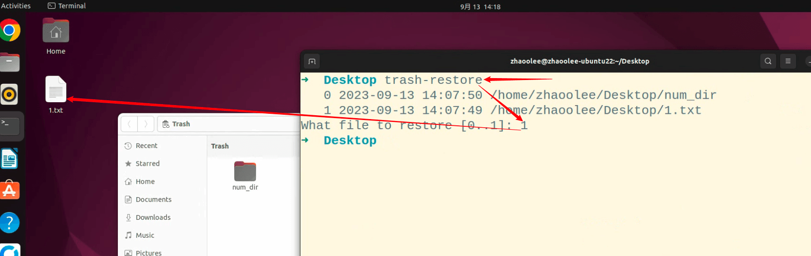
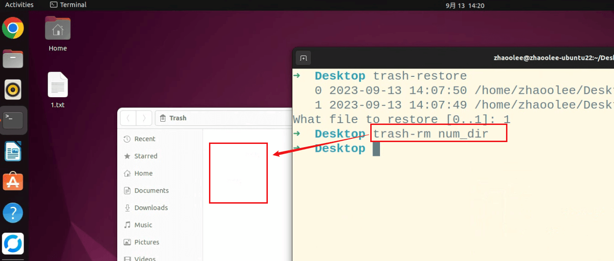

今天在一个群看到转发的聊天记录，总结来说，就是rm引发的悲剧, 如下:















对于个人站长而言，登录Linux服务器，手动运行rm的风险还是太高了，毕竟手一抖，或者路径里面多一个换行，就可能把父目录也删了。


对此，我建议使用alias将rm屏蔽掉（如果你使用zsh， 则在`~/.zshrc`中添加以下行， r然后 `source ~/.zshrc` ；如果你使用bash, 则在`~/.bashrc` 中添加以下行, 然后`source ~/.bashrc`）

```
alias rm='echo "This is not the command you are looking for."; false'
```

以上屏蔽只是在shell环境中屏蔽，如果你使用`\rm` 或 `/bin/rm` 依然可以调用`rm` 命令

比如使用语法`\rm  某个文件` 或 `/bin/rm 某个文件` 依然可以正常运行


## 安装trash-cli

trash-cli 开源地址 https://github.com/andreafrancia/trash-cli

trash-cli 的开源地址提供了多种安装方法，这里我以ubuntu为例

```
sudo apt install trash-cli
```

安装完成后，我们就可以使用trash-cli进行删除文件了, 在有桌面环境的Linux中（比如Ubuntu桌面版），我们使用`trash-put` 放入回收站的文件或文件夹，都可以在桌面环境的回收站中看到

```
trash-put 待删除的文件或文件夹
```

示例

```
cd ~/Desktop
# 创建文件
touch 1.txt
# 创建文件夹并在文件夹中创建文件
mkdir num_dir
touch num_dir/2.txt
touch num_dir/3.txt
# 将文件放入回收站
trash-put 1.txt
# 将文件夹放入回收站
trash-put num_dir
# 查看回收站中的内容
trash-list
```




这里删除的文件并没有真正删除，只是被移动到了回收站，回收站所在的位置为`~/.local/share/Trash` ，回收站存储文件的位置为`~/.local/share/Trash/files`

如果我们需要查看回收站存在的文件，直接输入`trash-list` 即可查看

- 如果我们需要恢复回收站存在的文件到原来的位置

```
trash-restore
```
输入`trash-restore` 后，可以通过数字选择需要恢复的文件或文件夹，然后回车，确认恢复



- 如果我们需要删除回收站中的文件或文件夹

```
trash-rm 回收站里存在的文件或文件夹
```




这里的trash-rm只会对**回收站内存在的**文件或文件夹进行删除，如果回收站内不存在`123.txt`, 而你运行了`trash-rm 123.txt` , 结果就是磁盘没有删除任何内容，命令行也不会出现报异常的信息


- 如果我们需要清空回收站, 则会彻底移除回收站内所有数据

```
trash-empty
```


## 小结

数据无价，而`rm`又太过简单暴力，为了保护数据，希望站长们都尽量不直接使用原生的`rm`命令, 使用回收站做二次确认后再删除数据。


另外，主动做好备份，低成本7x24小时备份攻略：[《树莓派家庭服务器搭建指南》第二十期：在树莓派运行rsnapshot, 实现对服务器数据低成本增量本地备份 https://v2fy.com/p/2023-08-17-rsnapshot-1692258217000/](https://v2fy.com/p/2023-08-17-rsnapshot-1692258217000/)
