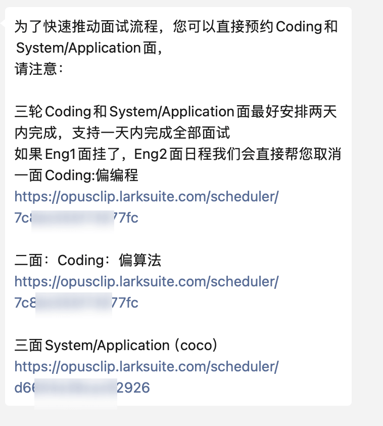

最近找工作，发现中国的程序员面试已经完成了工业化，对面试者而言，越来越有魂味了。

## 自助约面

投简历通过后，hr连电话约面的步骤都省了，直接让求职者去一个网页，自助约面试，极大的降低了hr的工作量。面试者的体验就很差，要自己排期，而且写的题目大多都是平常用不到的代码，即使你的工程能力再牛逼，如果不刷题，根本没有通过两轮code面试的可能。

## 共享屏幕写代码，并检查下载目录和回收站，确认删除了题目

还有一种面试方式，就是给一套pdf题目，开启屏幕共享，限时一小时写代码，如果你把pdf下载到本地，最后面试官会要求你当场删除，并检查你的下载目录和回收站，而且面试官连脸都不漏，只是语音交流。

## 大厂的傲慢，不发面试邀请，反复拿捏面试者

某个主营电商的互联网大厂，2024年的社招约面，居然是通过面试官的个人电话，面试官也不发面试邀请，只是口头说一下，遇到代码题目，就发个链接到面试者邮箱，在线code，保持电话接通，面试官也不露脸。

如果想知道面试结果，**要通过面试官的私人号码获取结果**，又是一波拿捏，真的是把大厂的傲慢发挥到极致。

最骚的是，**技术的面试官会问面试者是否已婚**，纯纯的破冰行动了。

## 同一个面试官，面试两轮，加低血糖耐受测试

我面试了一个看起来很正规的公司，**面试第一轮，面试官东拉西扯，一个多小时消耗完，面试结束**

然后hr又安排同一个人面试第二轮... 纯纯把面试当KPI了

更乐子的是，**hr把一个小时的面试，设置在中午11点半开始，面试变成了低血糖耐受测试**...

## 小结

中国的人力资源太丰富了，程序员面试也在2024年卷到起飞，**即使你是很厉害的工程师，如果不刷题，也很难通过面试**

到了35岁，能做对所有的题目，也无法保证不被优化。

任何时候，企业找个理由，搞个**经济性裁员，打工人就很难拿到N+1的赔偿**，而且**企业还有背调威胁**，如果要起诉要求裁员赔偿，企业就扬言要给个很差的背调，导致打工人下一份工作难找，对劳动者极其不友好。

选择比努力重要，无法改变环境，就改变自身，好好学英语，**在海的那边，还是有一些对打工人相对友好的岗位，过硬的英语水平，往往就是敲门砖**。

地球online是一个比命长的游戏，如果感觉学英语难，就**保持身体健康，多活几年，熬过去**！
