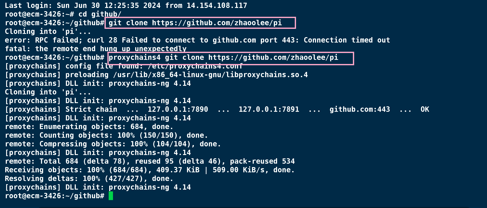

## 安装proxychain4

```
sudo apt install proxychains4 -y
```

## 设置配置文件

编辑 `/etc/proxychains4.conf` 底部添加本机可用的代理，保存 `/etc/proxychains4.conf`  即可自动生效


##  使用proxychain4为curl设置代理


## 使用proxychain4为git设置代理





## 为 proxychains4设置别名

在`.zshrc` 或 `.bashrc` 中添加以下别名即可

```
alias pc='proxychains4'
```

