PostGIS是个好东西，PostGIS内置了大量空间运算函数，让复杂的空间计算变得简单。

PostGIS的优势有，开源免费,社区活跃，与SQL完美集成,学习曲线平缓，支持各种空间数据类型和分析函数，性能出色,可处理大规模数据集，与多种GIS软件兼容。


## 首先用Docker创建一个PostGIS服务


### 1. 拉取PostGIS镜像

```
docker pull postgis/postgis
```

### 2. 创建一个Docker volume来持久化数据（可选）
```
docker volume create postgis_data
```

### 3. 运行PostGIS容器
```
docker run --name postgis \
    -e POSTGRES_PASSWORD="yourpassword" \
    -p 5432:5432 \
    -v postgis_data:/var/lib/postgresql/data \
    -d postgis/postgis
```


### 4. 验证容器是否正在运行

```
docker ps
```

如果容器运行正常则添加自动重启
```
docker update --restart=unless-stopped postgis
```

### 5. 创建数据库备份


```
# 假设要备份名为USD_sample的数据库
sudo docker exec -t postgis pg_dump -U postgres -d USD_sample -F c -f /tmp/USD_sample_backup.dump

# 将备份文件从容器复制到主机
sudo docker cp postgis:/tmp/USD_sample_backup.dump ./USD_sample_backup.dump

# 重命名（非必要）
cp USD_sample_backup.dump USD_sample
```

### 6. 恢复数据库

```
# 将备份文件拷贝到容器的tmp目录下
sudo docker cp USD_sample postgis:/tmp/
# 创建数据库
sudo docker exec -it postgis psql -U postgres -c 'CREATE DATABASE "USD_sample";'
# 将备份文件恢复到数据库
sudo docker exec -it postgis pg_restore -U postgres -d USD_sample -v /tmp/USD_sample
# 移除容器内的备份文件
sudo docker exec -it postgis rm /tmp/USD_sample
```


## PostGIS数据库对比Mysql的优势


接下来我们来展示一下，PostGIS数据库对比Mysql的优势，推荐使用DBeaver或pgAdmin4进行连接


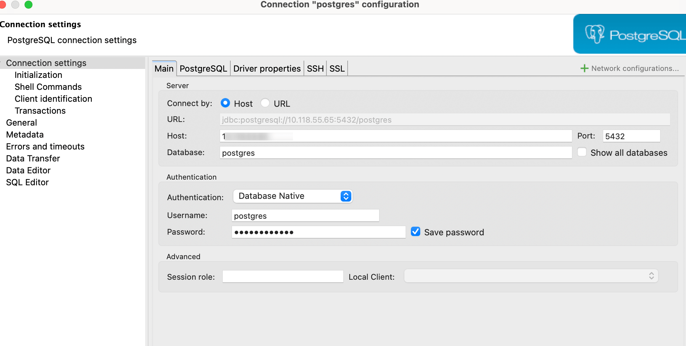

 

### 首先创建地理数据表，并在表中插入测试数据

```
-- 创建商店表
CREATE TABLE stores (
    id SERIAL PRIMARY KEY,
    name VARCHAR(100),
    geom GEOGRAPHY(POINT, 4326)
);

-- 插入一些示例商店数据
INSERT INTO stores (name, geom) VALUES
    ('北京商店', ST_SetSRID(ST_MakePoint(116.4074, 39.9042), 4326)),
    ('上海商店', ST_SetSRID(ST_MakePoint(121.4737, 31.2304), 4326)),
    ('广州商店', ST_SetSRID(ST_MakePoint(113.2644, 23.1291), 4326)),
    ('深圳商店', ST_SetSRID(ST_MakePoint(114.0579, 22.5431), 4326));

-- 创建城市边界表
CREATE TABLE city_boundaries (
    id SERIAL PRIMARY KEY,
    city_name VARCHAR(100),
    geom GEOMETRY(POLYGON, 4326)
);

-- 插入一个示例城市边界（简化的北京边界）
INSERT INTO city_boundaries (city_name, geom) VALUES
    ('北京', ST_GeomFromText('POLYGON((116.1 39.7, 116.1 40.2, 116.8 40.2, 116.8 39.7, 116.1 39.7))', 4326));

-- 创建建筑物表
CREATE TABLE buildings (
    id SERIAL PRIMARY KEY,
    building_id VARCHAR(100),
    geom GEOMETRY(POLYHEDRALSURFACEZ, 4326)
);

-- 插入一个示例3D建筑物
INSERT INTO buildings (building_id, geom) VALUES
    ('BLDG001', ST_GeomFromText('POLYHEDRALSURFACE Z(
        ((116.4 39.9 0, 116.41 39.9 0, 116.41 39.91 0, 116.4 39.91 0, 116.4 39.9 0)),
        ((116.4 39.9 0, 116.4 39.91 0, 116.4 39.91 10, 116.4 39.9 10, 116.4 39.9 0)),
        ((116.41 39.9 0, 116.41 39.91 0, 116.41 39.91 10, 116.41 39.9 10, 116.41 39.9 0)),
        ((116.4 39.9 10, 116.41 39.9 10, 116.41 39.91 10, 116.4 39.91 10, 116.4 39.9 10))
    )', 4326));

-- 创建行政区表
CREATE TABLE admin_areas (
    id SERIAL PRIMARY KEY,
    name VARCHAR(100),
    geom GEOMETRY(POLYGON, 4326)
);

-- 插入一些示例行政区域
INSERT INTO admin_areas (name, geom) VALUES
    ('海淀区', ST_GeomFromText('POLYGON((116.2 39.9, 116.2 40.0, 116.3 40.0, 116.3 39.9, 116.2 39.9))', 4326)),
    ('朝阳区', ST_GeomFromText('POLYGON((116.3 39.9, 116.3 40.0, 116.4 40.0, 116.4 39.9, 116.3 39.9))', 4326)),
    ('西城区', ST_GeomFromText('POLYGON((116.3 39.8, 116.3 39.9, 116.4 39.9, 116.4 39.8, 116.3 39.8))', 4326));

-- 创建设施表
CREATE TABLE facilities (
    id SERIAL PRIMARY KEY,
    name VARCHAR(100),
    geom GEOGRAPHY(POINT, 4326)
);

-- 插入一些示例设施
INSERT INTO facilities (name, geom) VALUES
    ('医院A', ST_SetSRID(ST_MakePoint(116.3, 39.95), 4326)),
    ('学校B', ST_SetSRID(ST_MakePoint(116.35, 39.93), 4326)),
    ('公园C', ST_SetSRID(ST_MakePoint(116.38, 39.92), 4326)),
    ('图书馆D', ST_SetSRID(ST_MakePoint(116.42, 39.94), 4326));

-- 验证数据插入
SELECT 'stores' AS table_name, COUNT(*) AS row_count FROM stores
UNION ALL
SELECT 'city_boundaries' AS table_name, COUNT(*) AS row_count FROM city_boundaries
UNION ALL
SELECT 'buildings' AS table_name, COUNT(*) AS row_count FROM buildings
UNION ALL
SELECT 'admin_areas' AS table_name, COUNT(*) AS row_count FROM admin_areas
UNION ALL
SELECT 'facilities' AS table_name, COUNT(*) AS row_count FROM facilities;
```

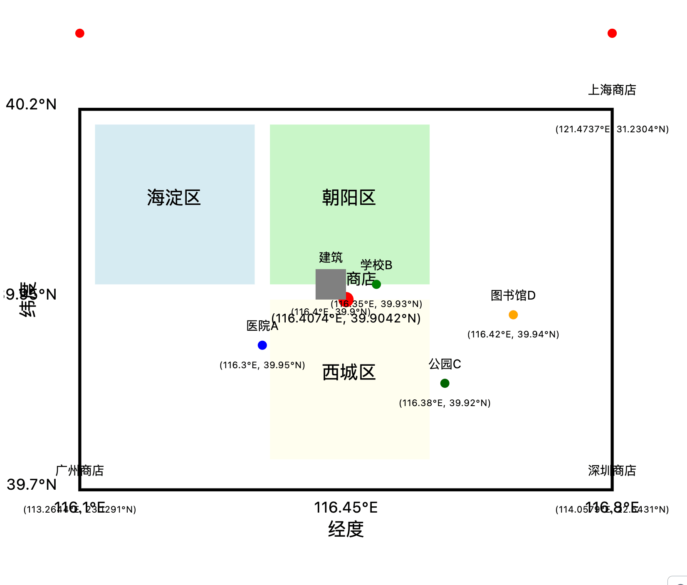

### 计算两个地点之间的距离：

```
SELECT ST_Distance(
    (SELECT geom FROM stores WHERE name = '北京商店'),
    (SELECT geom FROM stores WHERE name = '上海商店')
) / 1000 AS distance_km;
```

这个查询计算北京商店和上海商店之间的距离（单位：公里）。PostGIS 自动处理地理坐标系统，而 MySQL 需要复杂的三角函数计算。

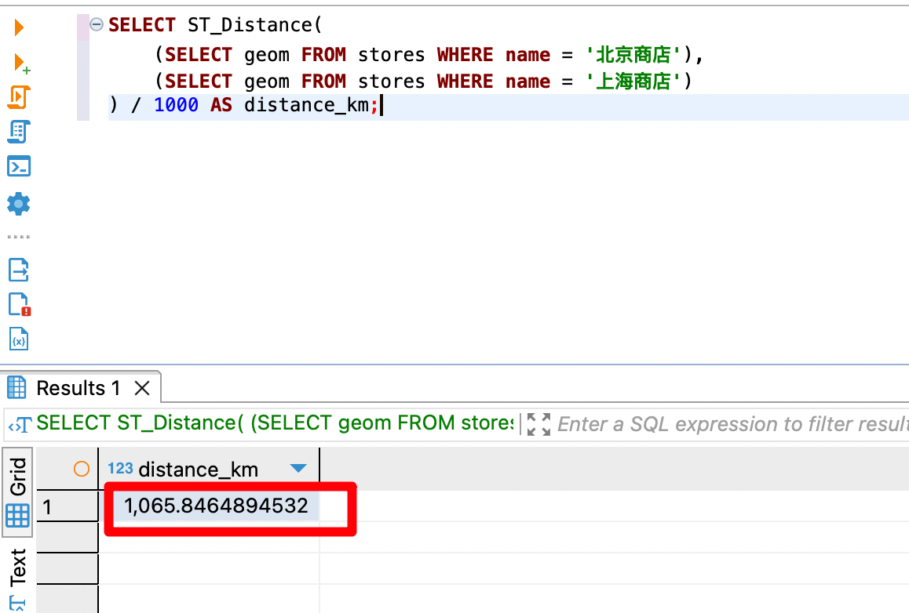


### 查找距离特定点 5 公里范围内的所有设施，并按距离排序：

```
SELECT name, ST_Distance(geom, ST_SetSRID(ST_MakePoint(116.4074, 39.9042), 4326)::geography) AS distance
FROM facilities
WHERE ST_DWithin(geom, ST_SetSRID(ST_MakePoint(116.4074, 39.9042), 4326)::geography, 5000)
ORDER BY distance;
```

这个查询利用了 PostGIS 的空间索引和 `ST_DWithin` 函数，可以高效地进行范围查询。

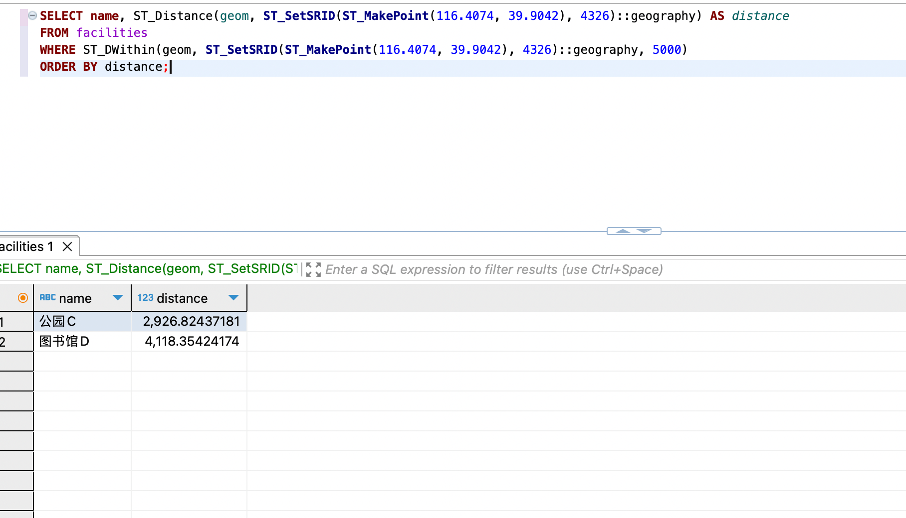

### 计算行政区的面积（单位：平方公里）

```
SELECT name, ST_Area(geom::geography) / 1000000 AS area_km2
FROM admin_areas;
```

PostGIS 可以直接计算地理坐标系下的面积，而 MySQL 需要先投影到平面坐标系。

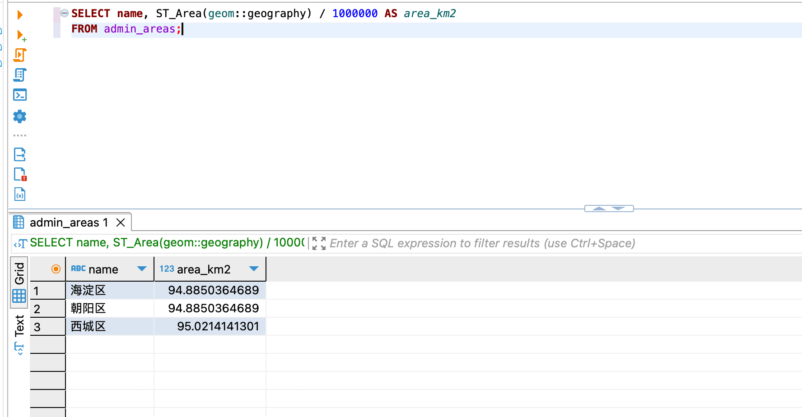

### 查找相邻的行政区

```
SELECT a.name AS area1, b.name AS area2
FROM admin_areas a
JOIN admin_areas b ON ST_Touches(a.geom, b.geom)
WHERE a.name < b.name;
```

`ST_Touches` 函数可以高效地找出相邻的多边形，这在 MySQL 中很难实现。

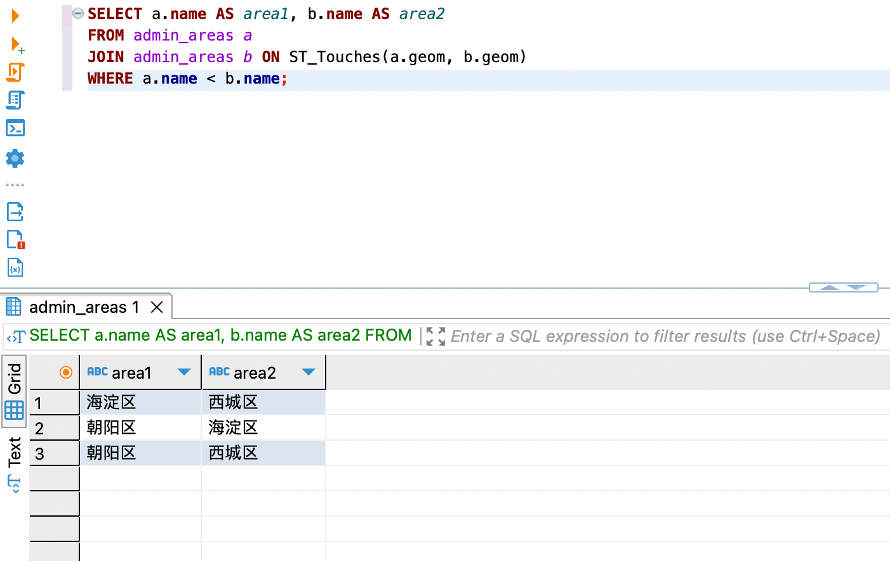

### 创建 500 米宽的道路缓冲区并计算与行政区的交集面积：

```
WITH road AS (
    SELECT ST_GeomFromText('LINESTRING(116.3 39.9, 116.4 39.95)', 4326) AS geom
)
SELECT a.name, 
       ST_Area(ST_Intersection(
           ST_Buffer(road.geom::geography, 500)::geometry, 
           a.geom
       )::geography) / 1000000 AS intersection_area_km2
FROM admin_areas a, road
WHERE ST_Intersects(ST_Buffer(road.geom::geography, 500)::geometry, a.geom);
```

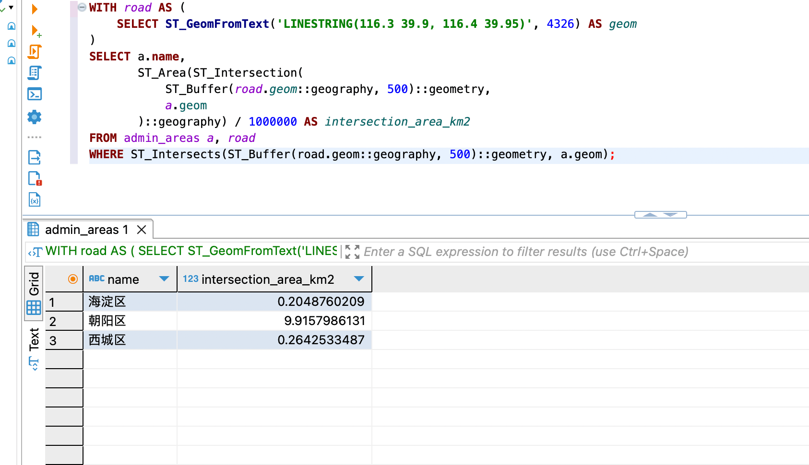

### 使用 3D 距离查询：

```
SELECT building_id, ST_3DDistance(
    geom,
    ST_GeomFromText('POINT Z(116.4 39.9 50)', 4326)
) AS distance_3d
FROM buildings
ORDER BY distance_3d
LIMIT 1;
```

这个查询计算 3D 空间中点到建筑物的最短距离，展示了 PostGIS 处理 3D 数据的能力。

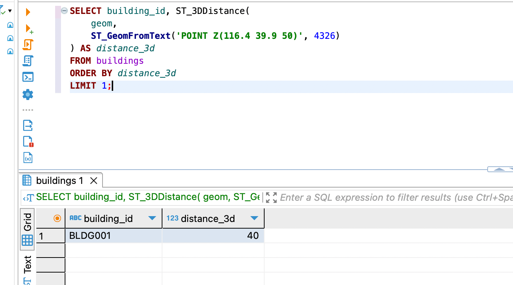


### 查找某个点的最近邻（使用 KNN 算法）：

```
SELECT name, ST_Distance(geom, ST_SetSRID(ST_MakePoint(116.4074, 39.9042), 4326)::geography) AS distance
FROM facilities
ORDER BY geom <-> ST_SetSRID(ST_MakePoint(116.4074, 39.9042), 4326)::geography
LIMIT 5;
```

这个查询使用了 PostGIS 的 KNN（K-Nearest Neighbor）操作符 `<->`，可以非常高效地找到最近的点。


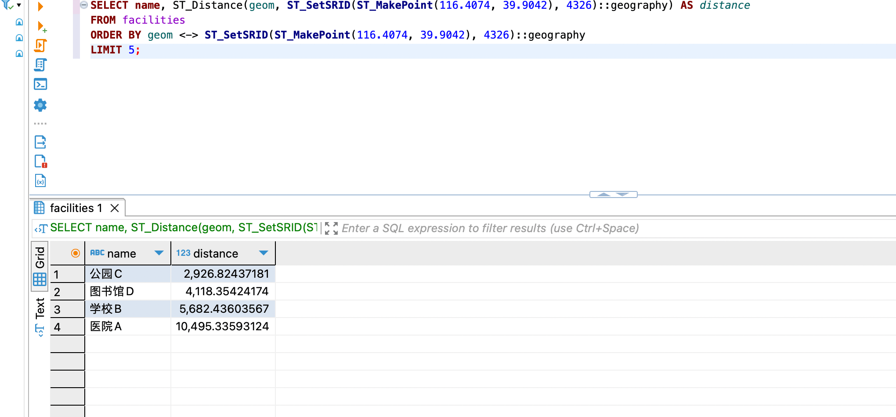


## 为PostgreSQL创建定时自动化备份脚本

脚本地址:

https://github.com/zhaoolee/some-server-operation-and-maintenance-scripts/blob/main/main.py


另外我们需要为这个脚本设置定时任务，定时任务分两部分，


写入服务配置 `/etc/systemd/system/db-backup.service`

```
[Unit]
Description=Database Backup Service
After=docker.service

[Service]
Type=oneshot
ExecStart=/usr/bin/python3.10 /opt/hdd/postgreSQLBackup/main.py
User=用户名
Group=用户所在的组

[Install]
WantedBy=multi-user.target

```


写入定时运行的逻辑 `/etc/systemd/system/db-backup.timer`

```
[Unit]
Description=Run database backup daily

[Timer]
OnCalendar=*-*-* 02:00:00
Persistent=true

[Install]
WantedBy=timers.target
```


- 使其生效

```
 sudo systemctl daemon-reload
 sudo systemctl enable db-backup.service
 sudo systemctl enable db-backup.timer
 sudo systemctl start db-backup.timer
```


- 手动运行备份逻辑

```
sudo systemctl start db-backup.service
```

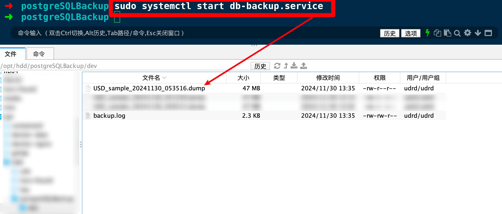

- 查看下一次备份逻辑运行的时间

```
sudo systemctl list-timers db-backup.timer
```


图中显示距离下次自动运行，还剩12h小时左右

- 查看定时服务是否处于激活状态

```
sudo systemctl status db-backup.service
```

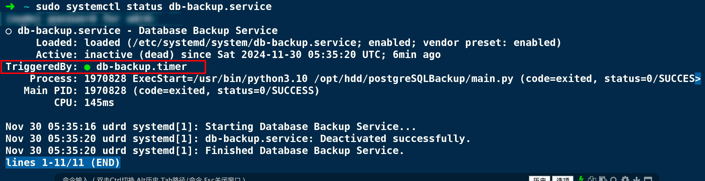
