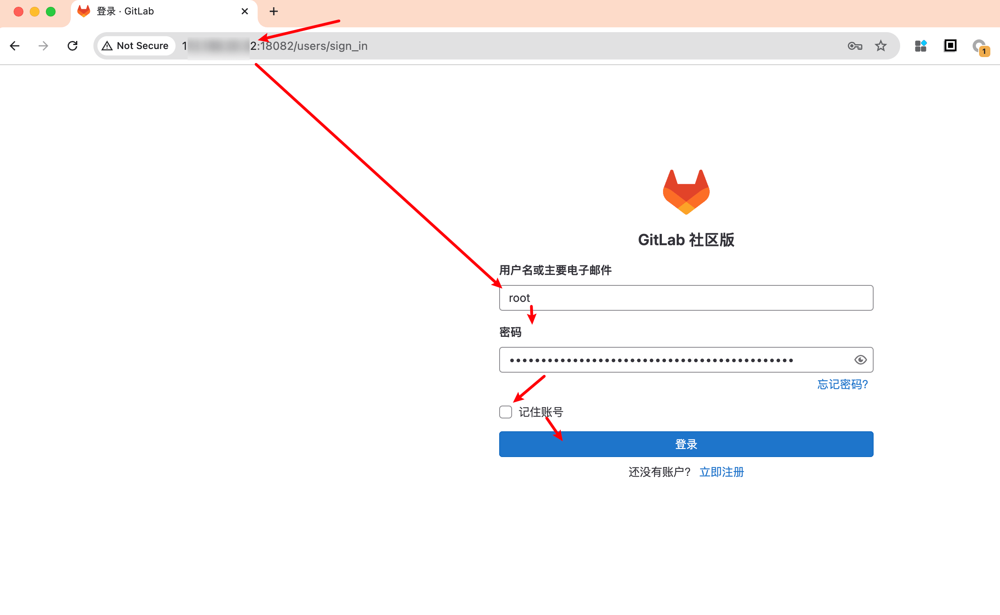

## 创建配置文件夹


```
mkdir -p ~/opt/gitlab/config
mkdir ~/opt/gitlab/logs
mkdir ~/opt/gitlab/data
mkdir ~/opt/gitlab/docker-compose-start
```


##  写入配置文件


```
cat << 'EOF' > /home/u****d/opt/gitlab/docker-compose-start/docker-compose.yml
services:
  gitlab:
    image: gitlab/gitlab-ce:17.1.6-ce.0
    restart: always
    hostname: 1**.1**.2*.3*(服务器ip)
    environment:
      GITLAB_OMNIBUS_CONFIG: |
        gitlab_rails['gitlab_shell_ssh_port'] = 12222
    ports:
      - '18082:80'
      - '12222:22'
    volumes:
      - /home/u****d/opt/gitlab/config:/etc/gitlab
      - /home/u****d/opt/gitlab/logs:/var/log/gitlab
      - /home/u****d/opt/gitlab/data:/var/opt/gitlab
EOF
```


## 运行


```
sudo docker-compose up -d 
```


运行成功后可以通过 `sudo cat  ~/opt/gitlab/config/initial_root_password` 查看root用户的登录密码



