在Python开发中，不同的项目需要不同的Python版本，以及与Python版本对应的依赖包版本。


为了简化这个过程，我推荐使用PyEnv加Poetry来管理项目


**PyEnv**： 用于一键安装各种Python的版本，以及切换Python版本


**Poetry**: 可以基于PyEnv提供的不同Python版本，为工程创建**虚拟环境**，在虚拟环境中安装的各类依赖包，都不会影响到其它工程。


### 首先安装PyEnv


```
curl https://pyenv.run | bash
```

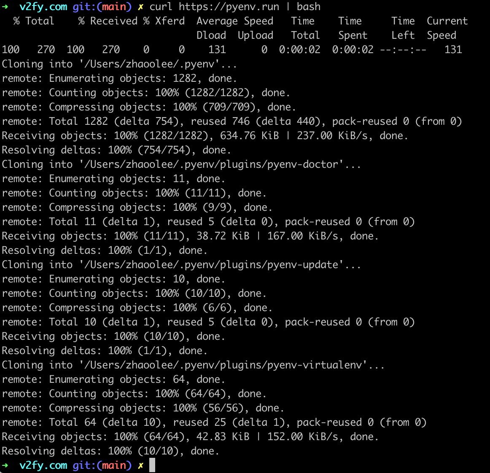

- 将PyEnv写入到zsh

```
echo 'export PYENV_ROOT="$HOME/.pyenv"' >> ~/.zshrc
echo '[[ -d $PYENV_ROOT/bin ]] && export PATH="$PYENV_ROOT/bin:$PATH"' >> ~/.zshrc
echo 'eval "$(pyenv init -)"' >> ~/.zshrc
```

- 重新加载zshrc, 查看pyenv命令是否生效

```
source zshrc

pyenv --help
```


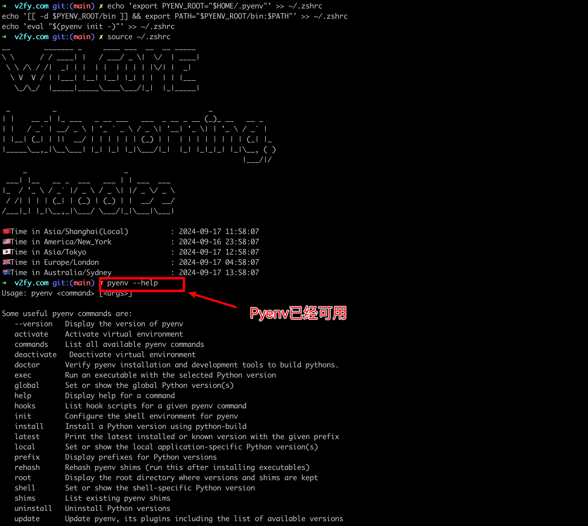

### 安装目前最新的Python3.12.6

```
pyenv install 3.12.6
```


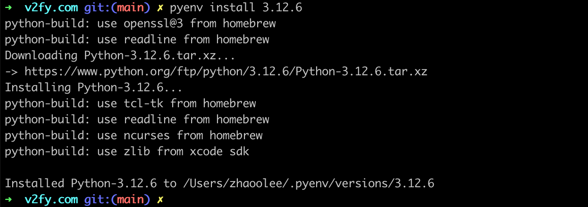

查看可用的版本

```
pyenv versions
```

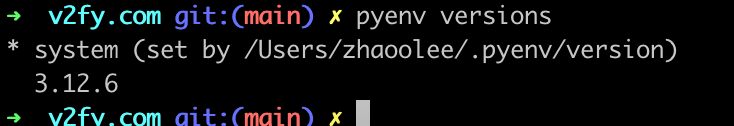

python3.12.6的安装位置


```
cd $(pyenv root)/versions

ls
```

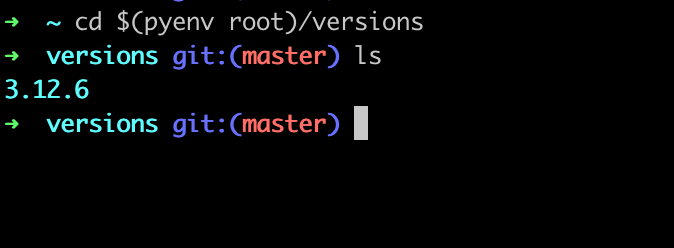


可以看到将刚刚安装的python3.12.6


如果需要安装Python3.11.10，则运行以下命令


```
pyenv install 3.11.10
```


## 安装poetry

```
curl -sSL https://install.python-poetry.org | python3  -
```

如果你的系统默认没有自带Python3，可以使用刚刚安装的python3.12.6

```
curl -sSL https://install.python-poetry.org | $(pyenv root)/versions/3.12.6/bin/python -
```


安装完成后，可以查看poetry安装的位置

```
which poetry
```

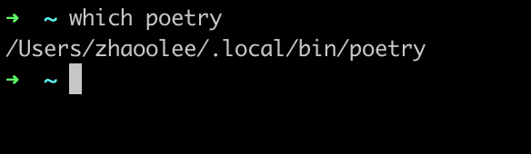

## 使用poetry创建项目


使用python3.12.6 创建项目


```
mkdir test-python312
cd test-python312
poetry init
```

执行`poetry init` 后，将会被询问一系列问题，包括使用的python版本，以及要不要安装必要的依赖包，我这里只设置了python版本

```
➜  test-poetry mkdir test-python312
cd test-python312
poetry init

This command will guide you through creating your pyproject.toml config.

Package name [test-python312]:
Version [0.1.0]:
Description []:
Author [zhaoo lee <zhaoolee@gmail.com>, n to skip]:
License []:
Compatible Python versions [^3.10]:  3.12.6

Would you like to define your main dependencies interactively? (yes/no) [yes] no
Would you like to define your development dependencies interactively? (yes/no) [yes] no
Generated file

[tool.poetry]
name = "test-python312"
version = "0.1.0"
description = ""
authors = ["zhaoo lee <zhaoolee@gmail.com>"]
readme = "README.md"

[tool.poetry.dependencies]
python = "3.12.6"


[build-system]
requires = ["poetry-core"]
build-backend = "poetry.core.masonry.api"


Do you confirm generation? (yes/no) [yes] yes
```

上面一步，我们只是设置了python3.12.6 , 我们还需在文件夹`test-python312`中，明确指定python3.12.6的位置, poetry会自动为我们设置虚拟环境，并进入虚拟环境

```
poetry env use /Users/zhaoolee/.pyenv/versions/3.12.6/bin/python
```

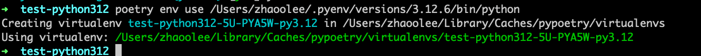

查看虚拟环境和信息

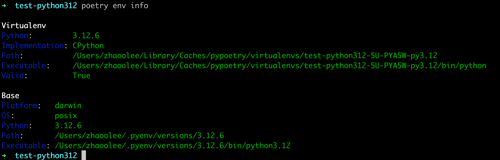

安装经典库requests

```
poetry add requests
```

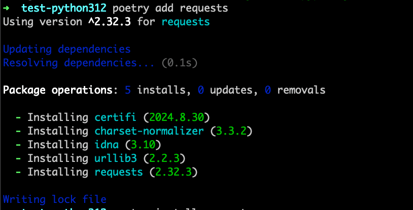

你会发现安装完成后，lock的速度超快！

如果需要移除依赖库requests则可以运行

```
poetry remove requests
```

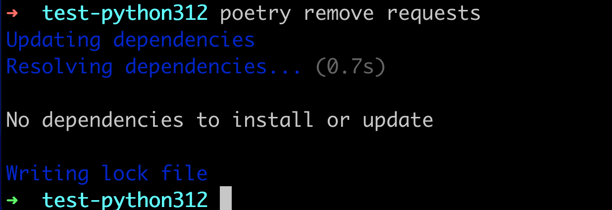


### poetry 非常适合快速切换多个Python工程

poetry 进入文件夹后可以自动激活文件夹对应的虚拟环境，离开文件夹后自动退出当前的虚拟环境


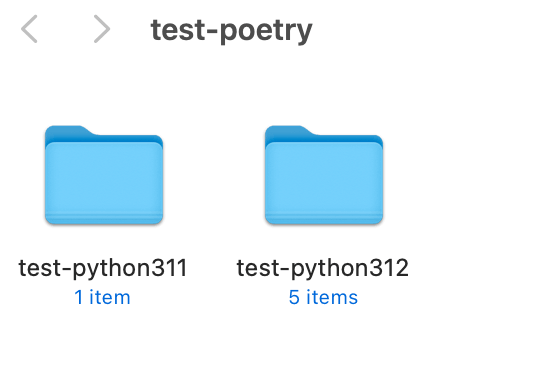

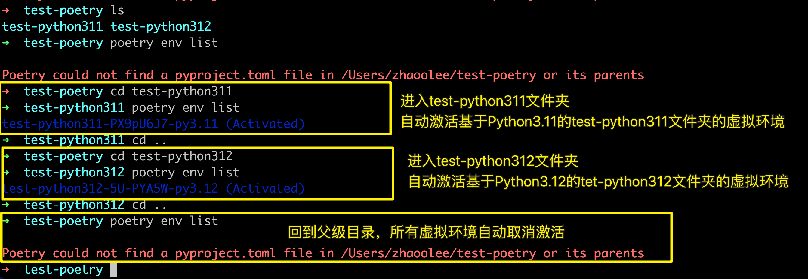

enjoy it!

