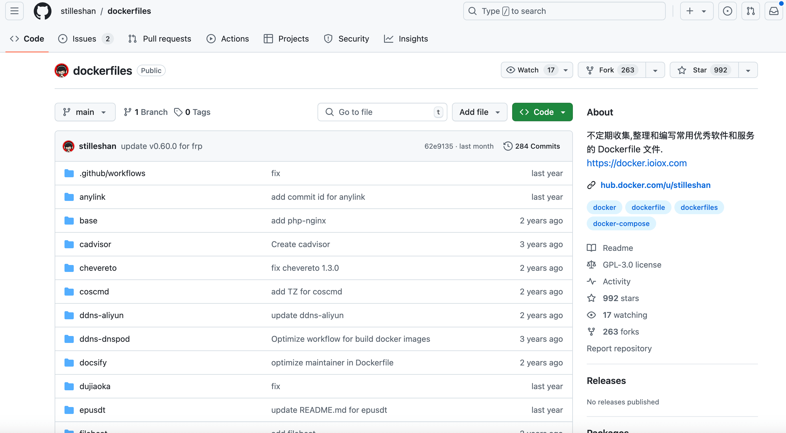

## docker proxy

https://dockerproxy.net/

网站作者有个仓库 https://github.com/stilleshan/dockerfiles 收集各种Dockerfile文件

## dockerhub icu


https://dockerhub.icu


顾名思义，dockerhub进了icu


为Docker配置镜像源, 修改 `/etc/docker/daemon.json` 文件

```json
{
    "registry-mirrors": [
        "https://dockerproxy.com",
        "https://dockerhub.icu",
    ]
}
```

---


长远来看，代理不是长久之计，有条件，还是推荐直接走代理https://v2fy.com/p/2024-06-16-10-23-44-docker-proxy/
