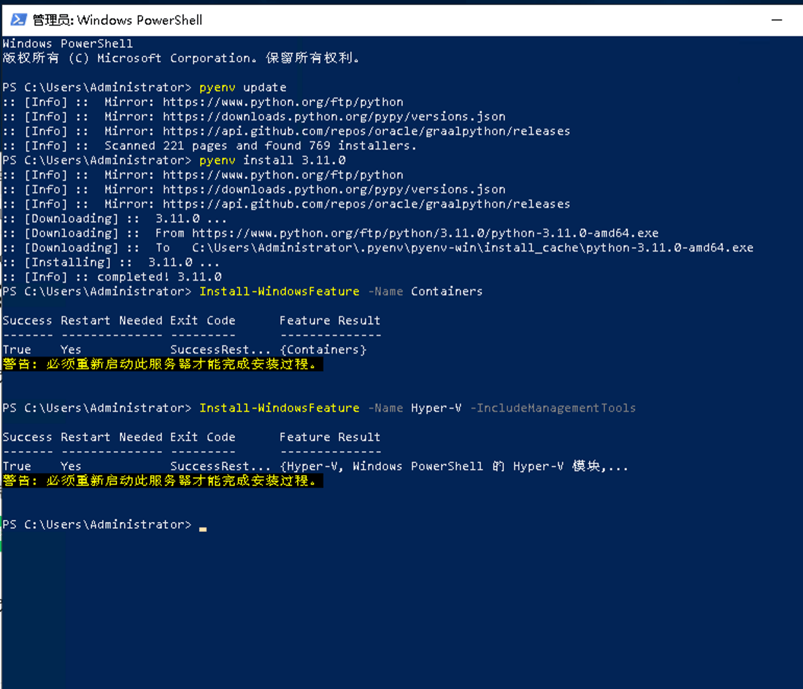
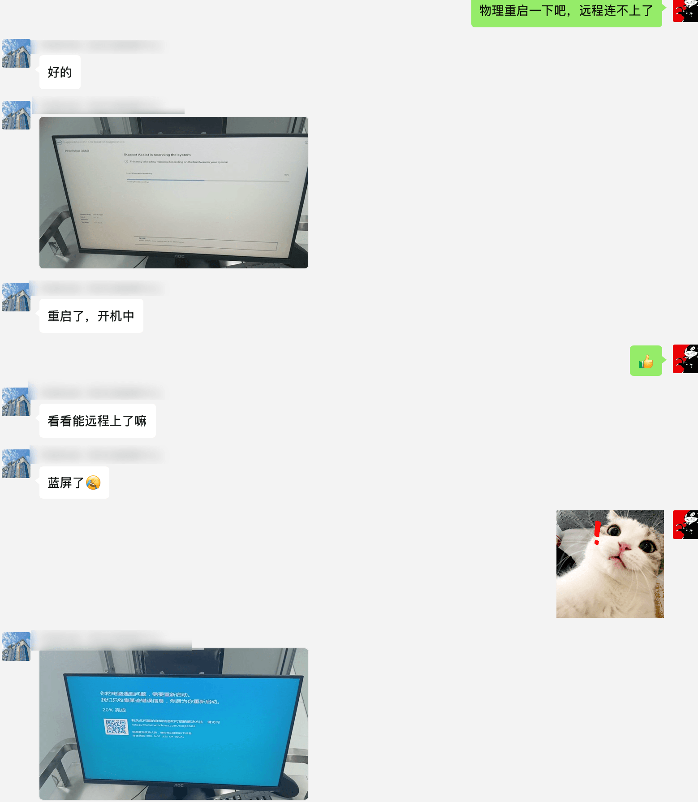
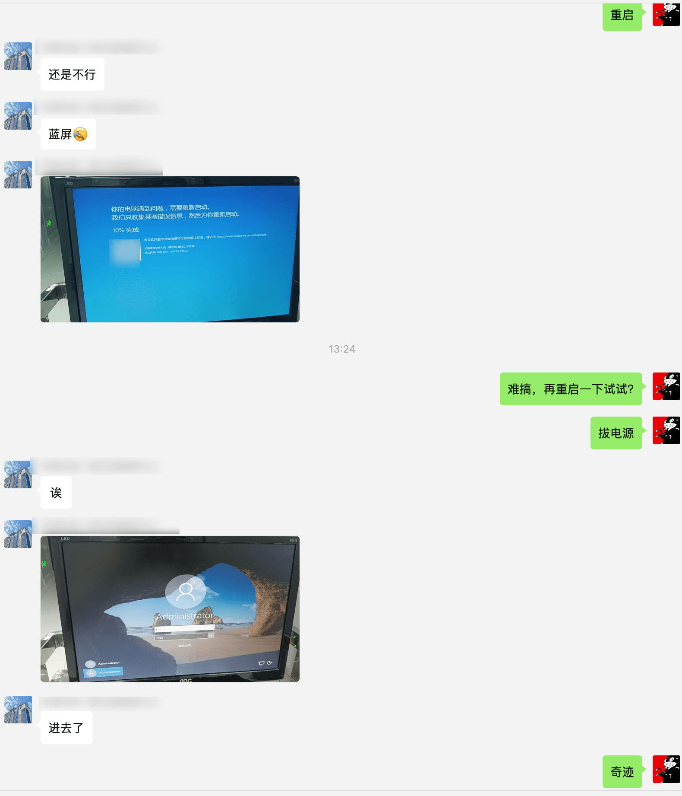
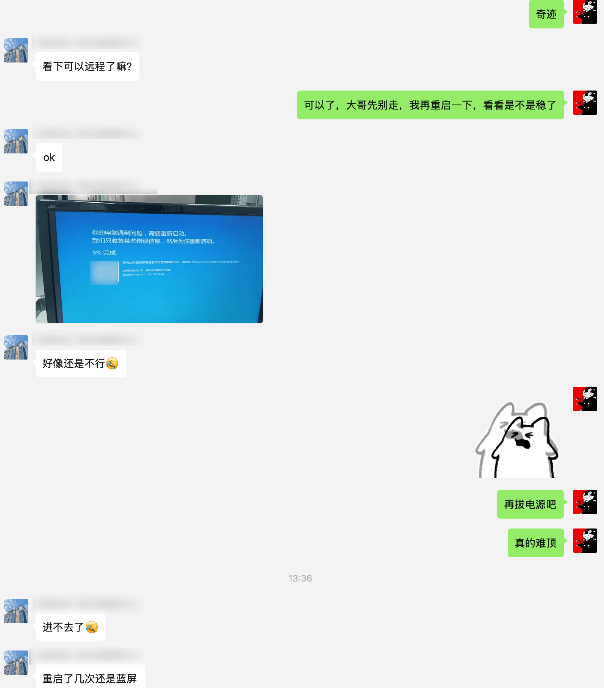
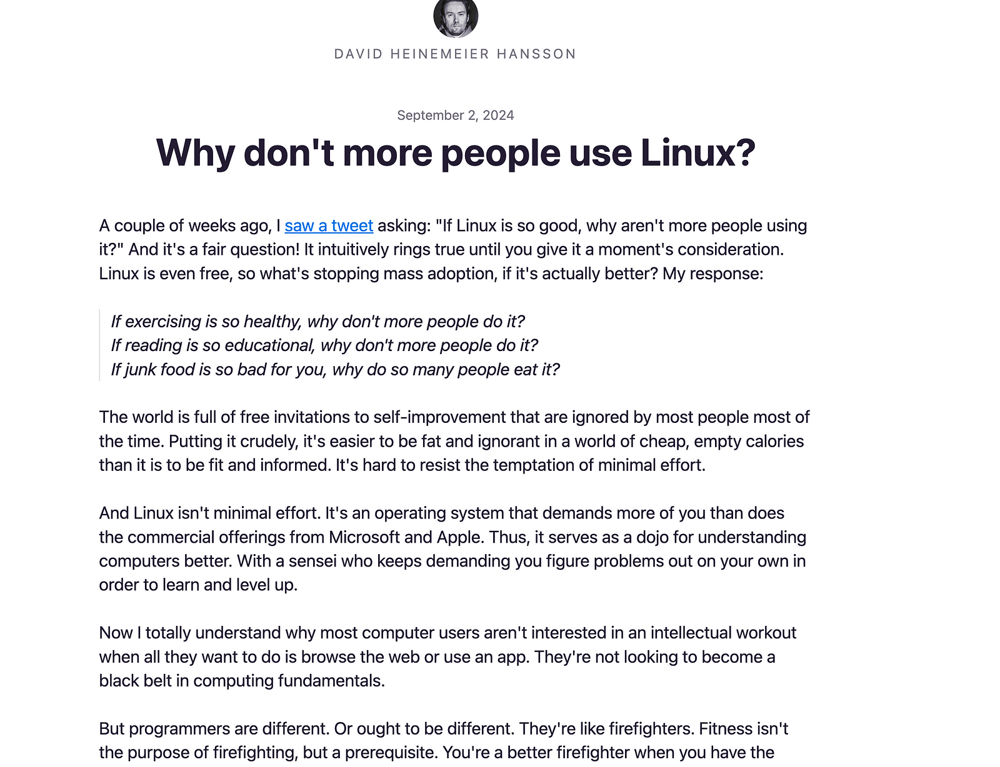

今天遇到一个很大的乐子，我打算通过Docker往一个Windows Server 2019上部署本地大模型，然后发现Windows Server 2019无法直接安装Docker Desktop, 查阅各种资料后发现要启动容器化技术

启用后，Windows Server 2019提示必须重启才能完成安装过程，为了完成安装，我只能选择重启，然后精彩的就来了。

重启后，我发现无论如何都无法通过Microsoft Remote Desktop连接，我开始以为是Windows重启比较慢，然后等了半小时，依然没有连上，于是我找机房值班的管理员，希望排查下问题，最后的结论是：蓝屏了！

Windows Server 2019作为一个服务器系统，居然直接就蓝屏了，导致服务完全不可用，而且没有任何远程的恢复手段，只能让机房人员实地重启。

然后经过一轮排查，我初步认为可能是主板没有启用Hyper V导致的，于是远程指挥机房管理员，启动了Hyper V，并禁用了主板安全。然后让管理员保存BIOS设置，重启！

Windows Server 2019还是给了我更多的惊喜，保存BIOS设置后，重启依然蓝屏，然后拔电源重启，就可以启动成功了，我这时候只能用奇迹形容。

此刻，一种名为好奇的病感染了我，我尝试搞懂其中的原理，于是我通过Microsoft Remote Destkop重新下发了重启指令，看看是不是彻底解决了问题

微软这家公司，总是能给予狂妄的人正确的绝望；没错！重启后Windows Server 2019它又蓝屏了，我此刻脑中同时出现了两个词，第一个是「精彩」，第二个是「狗微软」

然后我告诉机房管理员大哥，多重启几次试试，后面发现只有「拔电源重启，才能避免蓝屏」，进入系统，真的处处是知识点。

本篇文章可以贡献几个无意义但能提升生活品质的知识：

1. 没事不要碰Windows server 2019 ，更不要随便重启
2. 如果Windows Server 2019蓝屏，请尝试拔电源后再开机
3. 想玩容器化，请选择Linux操作系统，能避免很多不必要的麻烦

我对以上问题的来源有个猜测，这台机器被太多人使用，也安装了各种软件驱动，甚至有Epic的游戏咨询会在Windows Server 2019发弹窗，这些驱动狠可能存在问题，导致Windows重启命令总是失败，然后蓝屏，最后只能通过断电，再开机，才能启动这台机器，但这机器不在身边，不好排查，只能未来某个时间把机器从机房搬出来，检查驱动了

最近有篇文章写：为什么没有更多的人使用 Linux？

https://world.hey.com/dhh/why-don-t-more-people-use-linux-33b75f53

文章的观点是，Linux少有人用，是因为Linux学习门槛高，而不是Linux不够好；锻炼有益人体，但锻炼少有人做；阅读使人精神提升，但少有人做；垃圾食品对人体有害，但巨多人喜欢吃。

对于计算机爱好者而言，Linux能提供长期价值，让人对计算机有更深入的理解，进入更高的境界。

在服务器领域，Linux是统治级的存在; 服务器的第一要义是安全稳定，正是因为Linux有一定的学习门槛，所以不了解Linux的人，就没能力Linux服务端乱搞，正是因为没人乱搞，Linux服务器才稳定安全。

反观Windows Server 2019, 基本所有人都能随意双击安装驱动，导致Windows Server 2019直接重启蓝屏了。

## 小结

我认为，微软如果真的想做好服务器系统，最简单的方法就是为Windows Server 提供一个mini版的镜像，mini镜像里面不包括桌面环境，这样能极大提升系统的稳定性和安全性。
