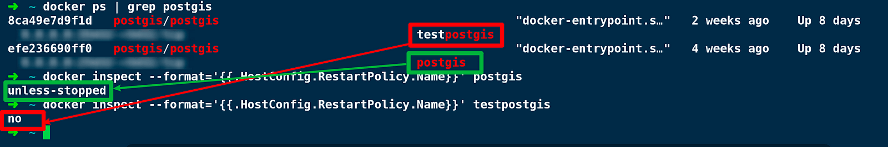
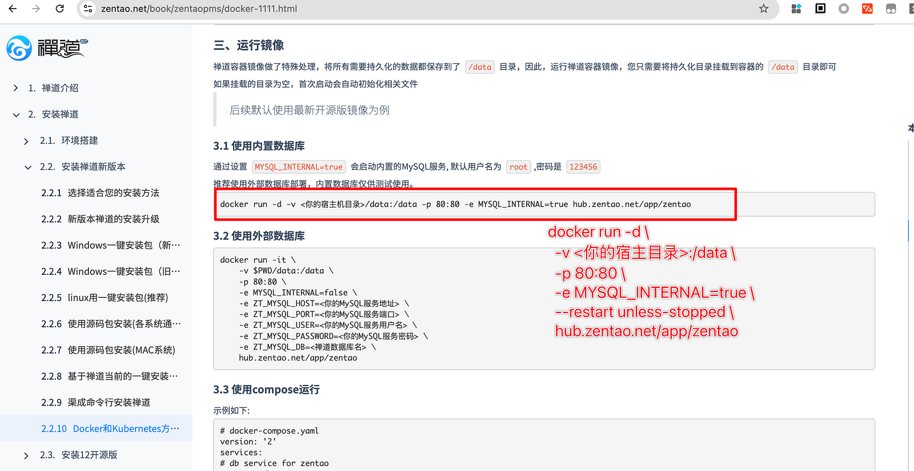
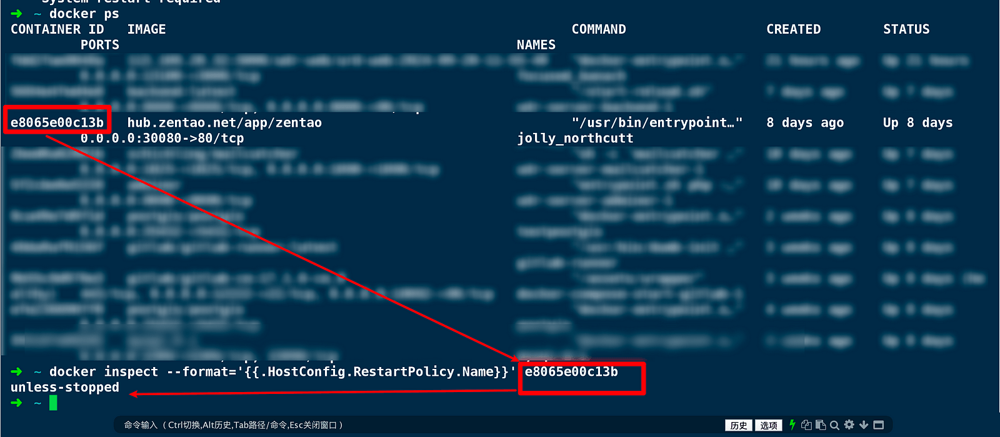

#### 遇到一个服务意外停止的小问题


我最近用Docker搭建了一个两个postgis数据库，一个用于测试环境，一个用于生产环境，后面调整Docker配置时，重启了Docker ，发现测试环境的数据库挂掉了，而生产环境的数据库正常运行

我排查了一下，发现是两个服务的重启策略不同



查看容器当前重启策略的命令如下

```
docker inspect --format='{{.HostConfig.RestartPolicy.Name}}' container_name_or_id
```

于是我将测试环境容器 testpostgis 的重启策略也设置成了 **unless-stopped** 

```
docker update --restart unless-stopped container_name_or_id
```


完美搞定！

#### 改良运行方式，优雅使用开源项目禅道


如果你也使用禅道做需求管理，你会发现官方给的运行命令，如果遇到Docker重启的情况，禅道就需求手动重启，如果使用 unless-stopped参数，你就可以让禅道在重启Docker或重启服务器后，自动恢复服务




禅道Docker启动文档

[ https://www.zentao.net/book/zentaopms/docker-1111.html](https://www.zentao.net/book/zentaopms/docker-1111.html)



使用unless-stop配合docker开机自启，能减少很多运维风险。


#### 重启策略有四个


- `no` (不重启) 这是默认的重启策略，适用于数据分析脚本: 比如一个每晚运行的Python脚本,用于处理日志文件并生成报告。脚本运行完毕后自然退出,无需重启。
- `on-failure` (失败时重启): 适用于定时任务服务: 如cron作业调度器,预期能正常运行并退出,但如果因意外错误崩溃,则需要重启以确保后续任务能够执行。
- `always` (总是重启): 适用于Web服务器: 如Nginx需要24/7不间断运行以服务网站访问。
- `unless-stopped` (除非停止否则总是重启): 适用于开发环境的数据库: 开发者可能需要频繁修改配置或数据,可以手动停止而不是每次都删除容器。


#### 小结


掌握了这些重启策略，可以让我们使用Docker运行服务的过程中更加得心应手，即使遇到Docker重启，服务器重启这种事件，也可以有条不紊的恢复各种服务。
