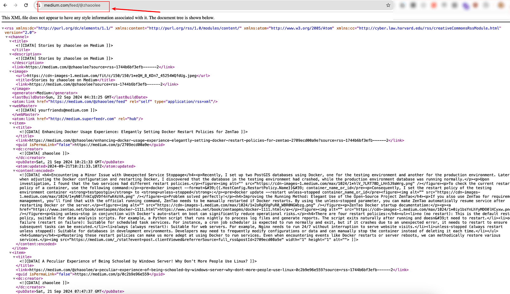
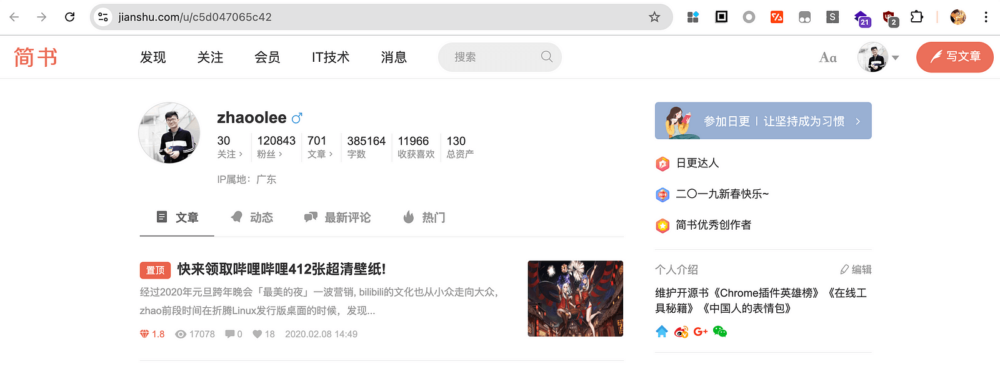

Medium 可以通过Feed订阅作者的图文，比如我的用户名为 @zhaoolee


那我的专属feed链接就是 https://medium.com/feed/@zhaoolee



而我的Gihub 的用户名也是zhaoolee, 我只需建立一个名为zhaoolee的仓库 https://github.com/zhaoolee/zhaoolee ，并在main.py中写如下代码

```
import feedparser
import time
import os
import re
from datetime import datetime
import pytz

def get_link_info(feed_url, num):
    feed = feedparser.parse(feed_url)
    entries = feed.entries[:num]
    return "\n".join(f"- [{entry.title}]({entry.link})" for entry in entries)

def update_readme(insert_info):
    readme_path = os.path.join(os.getcwd(), "README.md")
    with open(readme_path, 'r', encoding='utf-8') as f:
        content = f.read()
    
    update_time = datetime.now(pytz.timezone('Asia/Shanghai')).strftime('%Y-%m-%d %H:%M:%S')
    insert_info = f"""---start---

## zhaoolee（老法师昭昭）的每日更新

> 更新时间: {update_time} | 本部分通过Github Actions抓取RSS自动更新，无意中实现了自动刷绿墙...

{insert_info}

---end---"""

    new_content = re.sub(r'---start---(.|\n)*---end---', insert_info, content)
    
    with open(readme_path, 'w', encoding='utf-8') as f:
        f.write(new_content)
    
    return insert_info

def main():
    feeds = [
        ("https://medium.com/feed/@zhaoolee", 3)
    ]
    
    all_info = []
    for url, num in feeds:
        feed_info = get_link_info(url, num)
        all_info.append(feed_info)
        print(f"\n获取到的 {url} 的信息：\n{feed_info}\n")

    insert_info = "\n\n".join(all_info)
    
    final_result = update_readme(insert_info)
    print("\n最终更新到 README.md 的内容：\n")
    print(final_result)

if __name__ == "__main__":
    main()
```

在 https://github.com/zhaoolee/zhaoolee/blob/main/.github/workflows/main.yml 写入github actions每隔15分钟自动运行的定时任务，即可把我feed同步到github主页

x


将文章链接更新到github主页后，只需点击红框中的标题即可进入medium文章页面，如果你的github开源项目足够优秀，还能为medium文章带来更好的搜索引擎SEO！

如果你也想拥有类似的效果，只需fork我的仓库 https://github.com/zhaoolee/zhaoolee ，并修改main.py里面的feed链接即可，如果你实在不懂代码，可以请教AI帮忙修改。

### 小结


我曾是简书的狂热爱好者，简书是在中文互联网类似Medium的产品，可惜简书在中国不赚钱，被卖掉了，我只好找类似简书的产品做平替，最终我选择了Medium 从 https://www.jianshu.com/u/c5d047065c42 到 https://medium.com/@zhaoolee 原创优质内容在任何平台都是稀缺的，希望能在Medium也能收获良好的创作反馈。




