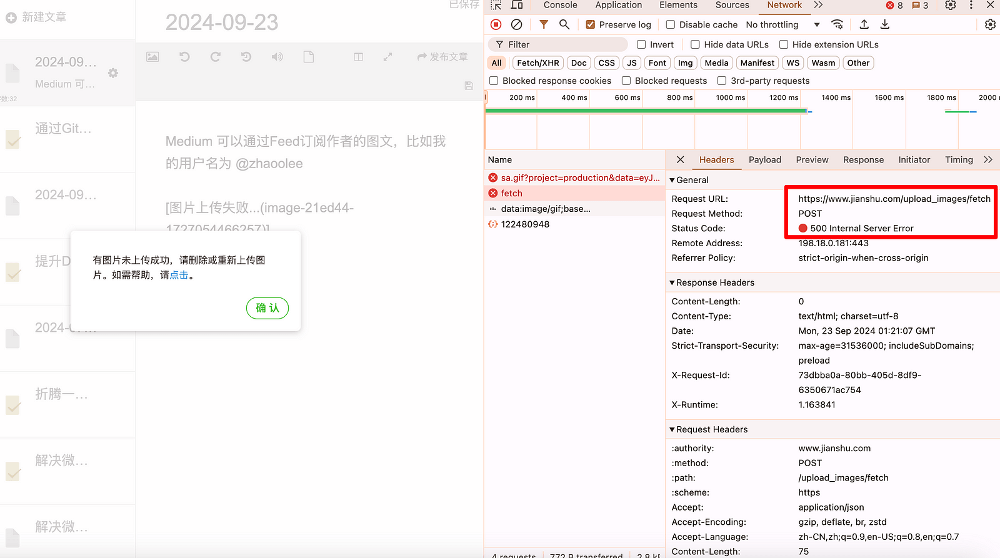
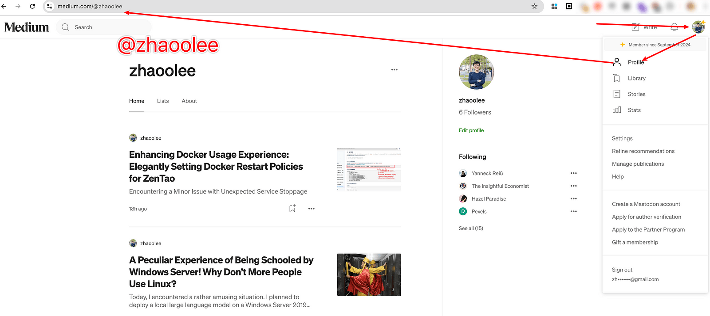
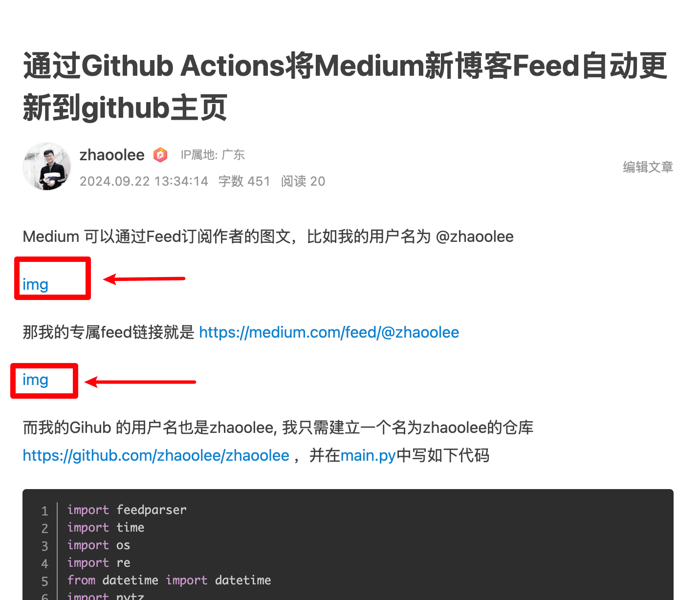

### 



如果往简书添加一段Markdown文本

```
Medium 可以通过Feed订阅作者的图文，比如我的用户名为 @zhaoolee


```

简书会尝试将图片信息上传到自己的服务器，但是简书的 upload_images/fetch 接口已经挂了, 所以根本无法上传成功。

如果一定要发布文章，又不想手动上传图片到简书，可以将markdown的内容改为

```
Medium 可以通过Feed订阅作者的图文，比如我的用户名为 @zhaoolee

[img](https://cdn.fangyuanxiaozhan.com/assets/1726981045434eWasFjCM.png)
```

也就是将图片的 ! 移除掉，将图片转换为超链接的格式，这样就能上传成功了，发布后的的效果如图所示，会保留一个图片的超链接，用户点击即可查看图片。




### 小结


Markdown是html的精简版，本身包含了图片信息，本文所做的就是将图片转换为超链接，很多博客平台都支持了用户写markdown格式，但为了让用户内容能留在自己平台，就会将图片转储到自家服务器，这无可厚非，但简书的扯淡之处在于，他转储失败后没有做好回退，直接把用户原本的图片地址信息给整没了！

简书自从搞了简书钻，大量的营销号涌入，导致平台的大量营销号涌入，而能产生高质量作品的原创用户不断流失，来了一波经典的劣币驱逐良币。

简书如果不想关站大吉，可以效仿v2ex, 如果用户将Markdown粘贴到平台编辑器，则默认支持用户使用外链图片，如果用户想使用平台的图床资源，请额外付费，这样能降低成本，也能拉高平台使用门槛，过滤掉一些营销号。
