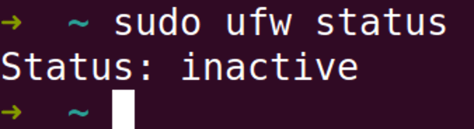
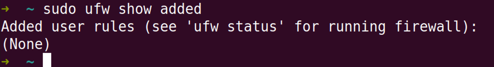
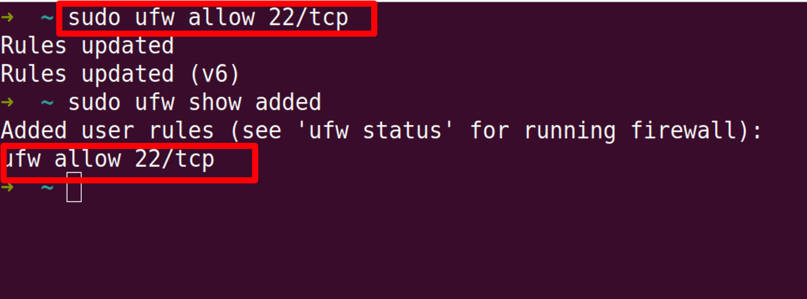
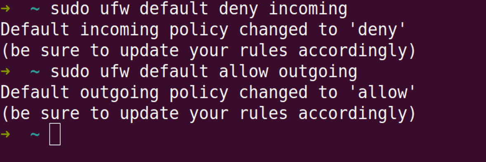
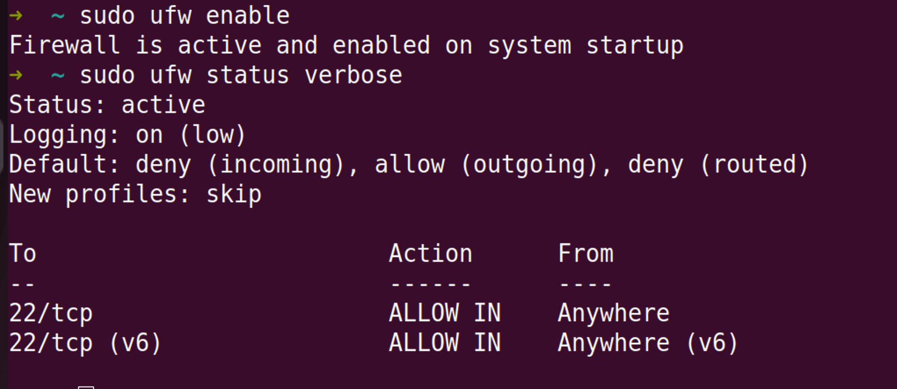
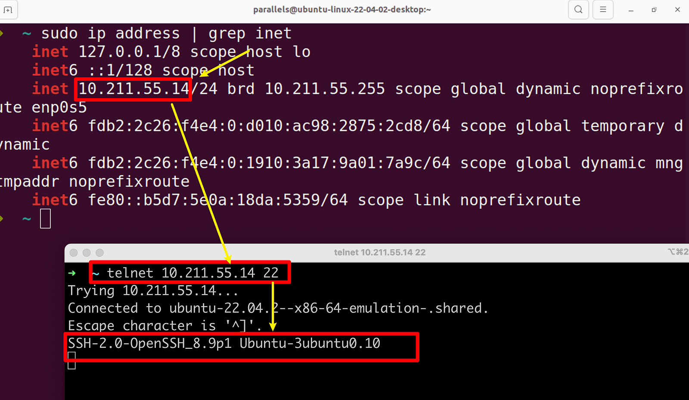
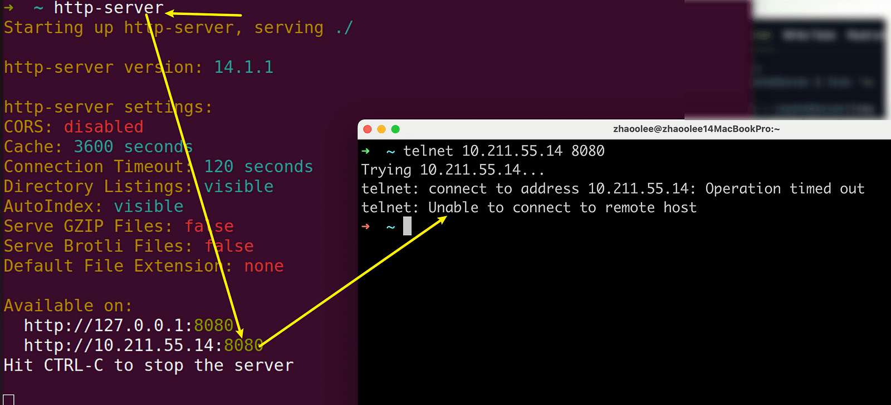
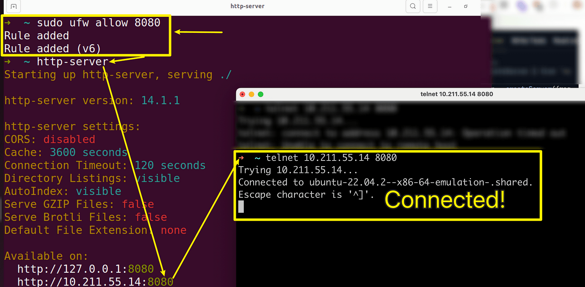
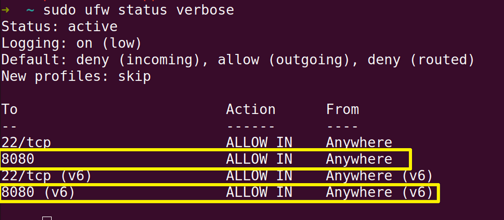

最近将一台服务器托管到了机房，机房给分配了固定的IP, 但并没有像云服务厂商一样，提供防火墙web面板，防火墙还是要自己搭，不过还好我用的是ubuntu，只需轻松几部，就能启用防火墙。以下是启用防火墙的一些常用技巧和实操命令

### 首先需要查看防火墙状态

```
sudo ufw status
```



默认状态一般都是不开启的, 也就是 Status:inactive

### 我们可以查看已有的规则

```
sudo ufw show added
```

默认没有任何规则



添加ssh规则，并查看

```
sudo ufw allow 22/tcp
```



### 为特定IP设置连接特权

如果你有一台独立的云服务器，可以允许特定云服务器ip的所有连接，这样如果后续玩ufw不小心封了ssh端口，也可以用特定的云服务器ip连上去

```
sudo ufw allow from your_ip_address
```

移除特定ip的连接特权（可选）

```
sudo ufw delete allow from your_ip_address
```

如果想禁止可疑IP的访问，则可以运行以下命令

```
sudo ufw deny from suspicious_ip_address
```

拒绝传入链接，允许传出连接（防火墙一般是对传入的连接做限制，传出连接不做限制）

```
sudo ufw default deny incoming
sudo ufw default allow outgoing
```




### 启用防火墙

```
sudo ufw enable
```

启用后，立即检查防火墙状态

```
sudo ufw status verbose
```




### 测试22端口是否支持连接

```
telnet your_server_ip 22
```



如果开启一个8080端口的服务，则防火墙会阻止连接



如果我放开8080端口，则防火墙会允许8080端口传入信息


```
sudo ufw allow 8080
```



### 查看防火墙允许通过的端口信息



```
sudo ufw status verbose
```

如果需要关闭8080端口，运行以下命令，即可生效

```
sudo ufw deny 8080
```

### 查看防火墙日志

查看防火墙日志也是好习惯，如果有不明的IP恶意连接ssh端口，建议直接关闭密码登录，改用公钥认证的登录方式

```
sudo tail -f /var/log/ufw.log
```

### 小结

ufw实际上是iptables(Linux内核防火墙)的一个前端工具，它简化了复杂的iptables的命令，让防火墙变得更加直观和方便。

市面上的的云服务器厂商，都会提供一个web网页进行防火墙端口管理，我们只需在网页上进行配置即可。

如果是托管自己的服务器到机房，合理的配置防火墙能最大程度的保护服务器，还能通过Log记录防火墙活动，一旦服务器被疯狂扫端口，就设置规则拦截可疑的IP或更换服务端口。
