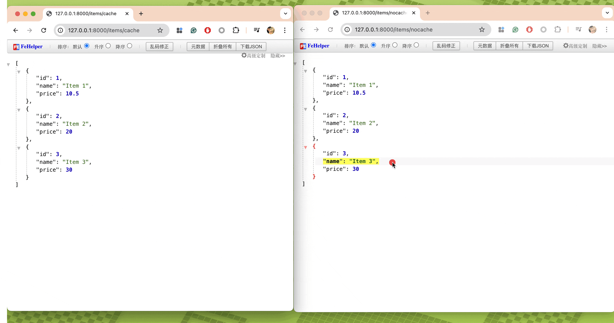
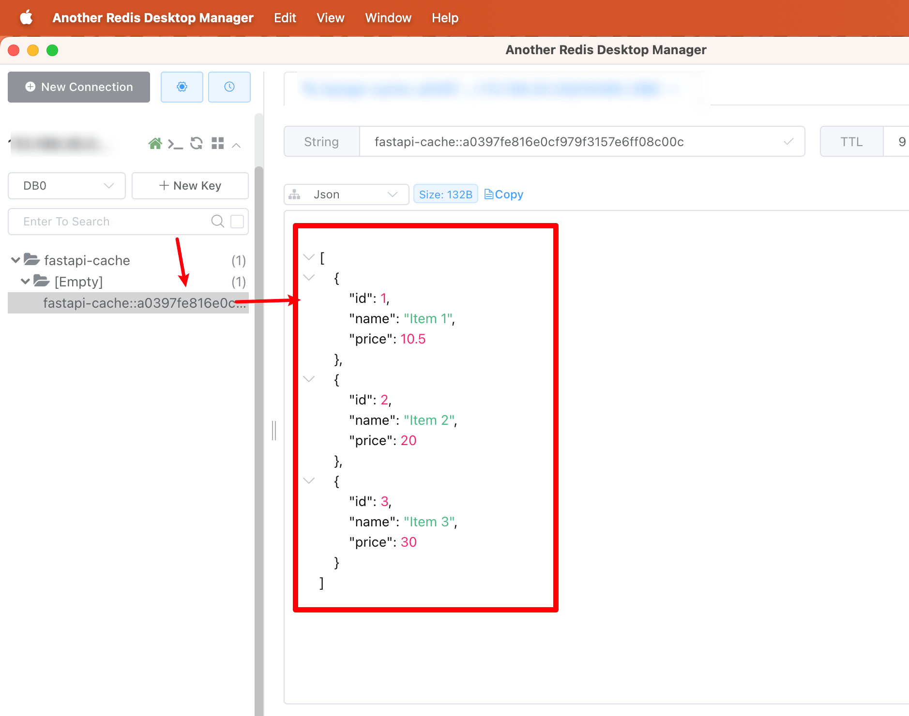

## 创建redis配置文件

```
mkdir -p /opt/redis/dev/
touch /opt/redis/dev/redis.conf
```

将以下内容写入 `/opt/redis/dev/redis.conf`

```
save 60 1
loglevel warning
maxmemory 512mb
maxmemory-policy allkeys-lru
requirepass 认证密码
```

## 创建dev环境的redis

```
docker volume create env_dev_persistent_storage

docker run --name env-dev-redis \
  -v env_dev_persistent_storage:/data \
  -v /opt/redis/dev/redis.conf:/usr/local/etc/redis/redis.conf \
  --restart=unless-stopped \
  -p 16390:6379 \
  -d redis:7.2 \
  redis-server /usr/local/etc/redis/redis.conf
```


## 一个基于fastapi的测试脚本

```
from fastapi import FastAPI, Depends
from fastapi_cache import FastAPICache
from fastapi_cache.backends.redis import RedisBackend
from fastapi_cache.decorator import cache
from redis import asyncio as aioredis
import asyncio
from pydantic import BaseModel
from typing import List

app = FastAPI()

# Redis配置
REDIS_CONFIG = {
    "host": "localhost",
    "port": 16390,
    "password": "认证密码",
    "db": 0
}

class Item(BaseModel):
    id: int
    name: str
    price: float

# 模拟数据库
fake_db = [
    Item(id=1, name="Item 1", price=10.5),
    Item(id=2, name="Item 2", price=20.0),
    Item(id=3, name="Item 3", price=30.0),
]

@app.on_event("startup")
async def startup():
    # 使用你的Redis配置
    redis = aioredis.Redis(
        host=REDIS_CONFIG["host"],
        port=REDIS_CONFIG["port"],
        password=REDIS_CONFIG["password"],
        db=REDIS_CONFIG["db"],
        encoding="utf8",
        decode_responses=False
    )
    FastAPICache.init(RedisBackend(redis), prefix="fastapi-cache")

# 无缓存的端点 - 用于对比
@app.get("/items/nocache", response_model=List[Item])
async def get_items_nocache():
    # 模拟耗时操作
    await asyncio.sleep(2)
    return fake_db

# 使用缓存的端点 - 设置60秒过期时间 0为永不过期
@app.get("/items/cache", response_model=List[Item])
@cache(expire=60)
async def get_items_cache():
    # 模拟耗时操作
    await asyncio.sleep(2)
    return fake_db

# 带参数的缓存端点
@app.get("/items/{item_id}", response_model=Item)
@cache(expire=60)
async def get_item(item_id: int):
    await asyncio.sleep(1)
    for item in fake_db:
        if item.id == item_id:
            return item
    return {"error": "Item not found"}

# 可以通过查询参数影响缓存key
@app.get("/search", response_model=List[Item])
@cache(expire=60, namespace="search")
async def search_items(keyword: str = ""):
    await asyncio.sleep(1)
    results = [item for item in fake_db if keyword.lower() in item.name.lower()]
    return results

# 清除指定命名空间的缓存
@app.post("/clear-cache")
async def clear_cache():
    await FastAPICache.clear(namespace="search")
    return {"message": "Search cache cleared"}

if __name__ == "__main__":
    import uvicorn
    uvicorn.run(app, host="0.0.0.0", port=8000)
```


不启用Redis的效果: 访问 http://127.0.0.1:8000/items/nocache 每次都需要两秒

启用Redis的效果：访问 http://127.0.0.1:8000/items/cache 只有第一次需要两秒，第一次以后，都是直接走缓存







