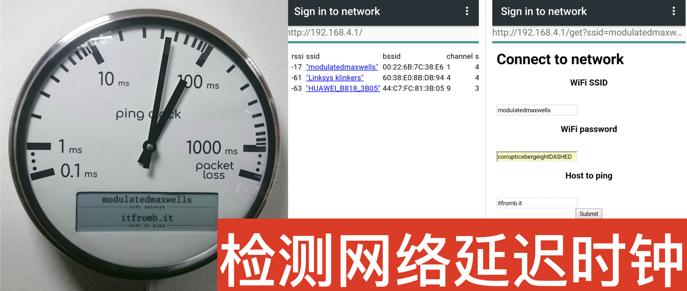

开源地址：https://github.com/turingbirds/ping-clock

一个检测网络延迟的神奇好物，时钟可以连接wifi网络，内部程序通过ping指令，向一个网络地址轮询发请求，收到响应后，计算网络延迟；

长指针负责显示实时的网络延迟。

短指针会跟随长指针的顺时针的最大角度摆动，然后逆时针缓慢回位。

如果长短指针的角度差别过大，说明网络不稳定。

这种带时钟的实物小摆件很适合放在桌面上，或者作为充电宝这类小物件的溢价硬件功能。

这种ping时钟适合做成App，运行在老旧的智能手表或手环上，屏幕显示延迟信息足矣，同时把各类美术风格的表盘变换，延展为增值服务。

