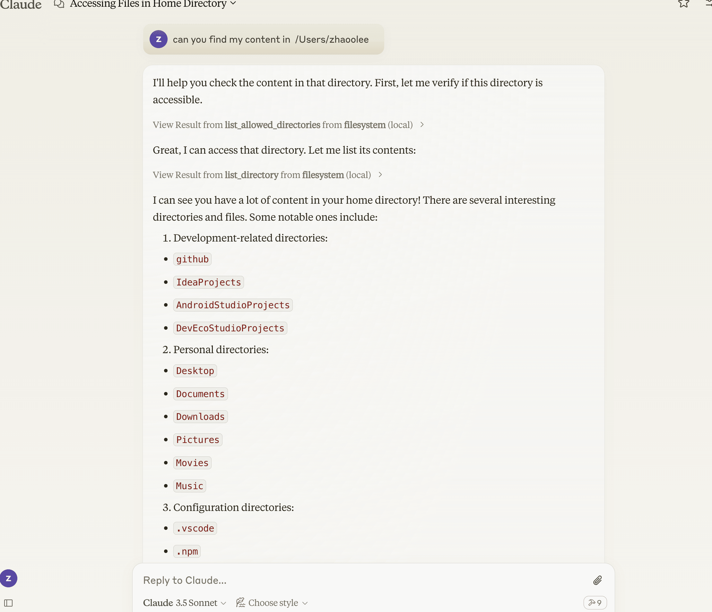

可以通过 ~/Library/Logs/Claude/ 里面的mcp.log 和 mcp-server-filesystem.log 查看log

最终的配置

```
{
  "mcpServers": {
    "filesystem": {
      "command": "/bin/bash",
      "args": [
        "-c",
        "source ~/.nvm/nvm.sh && nvm exec 20.11.0 npx -y @modelcontextprotocol/server-filesystem /Users/zhaoolee"
      ]
    }
  }
}
```


成功读到:




我遇到问题的原因是，使用了nvm管理node.js的版本，但是Claude Desktop却无法使用nvm, 一直使用系统默认的node.js V14作为运行环境，导致@modelcontextprotocol/server-filesystem 无法正常运行，后面我通过log定位了问题，修改运行命令，强制让claude Desktop的启动命令使用nvm提供的node.js版本，问题就解决了！
