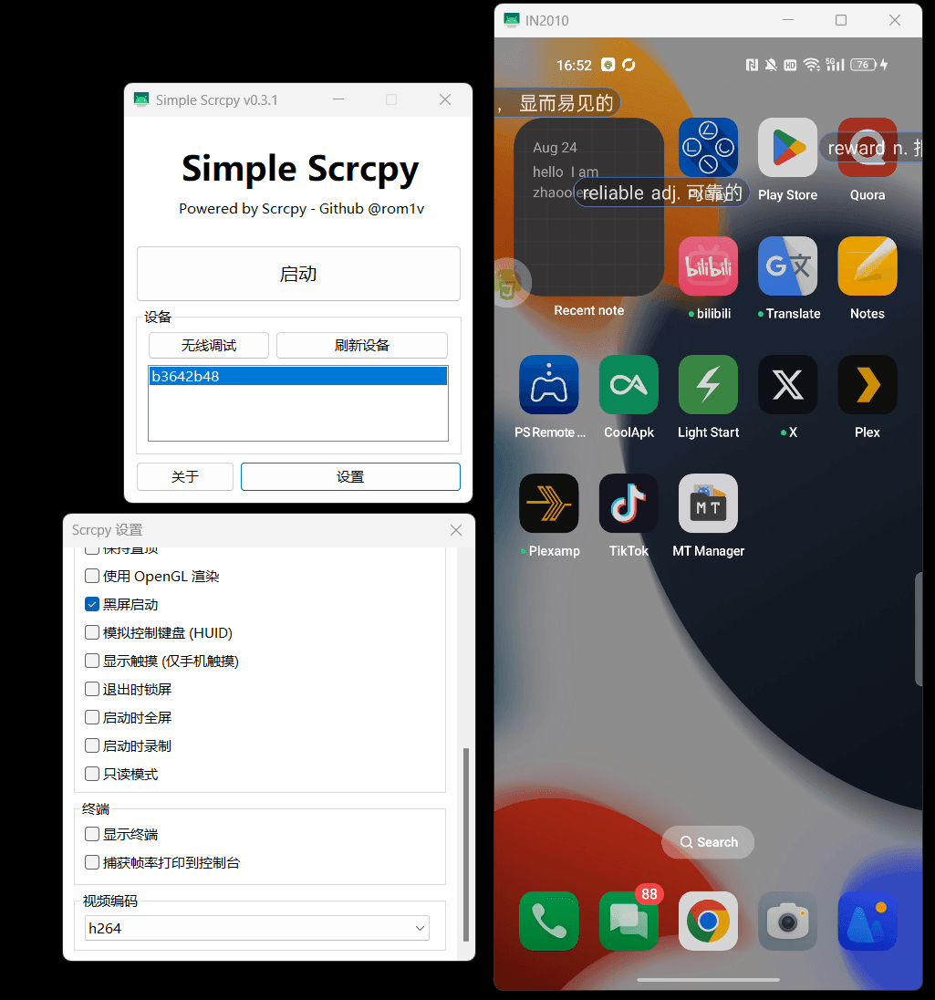
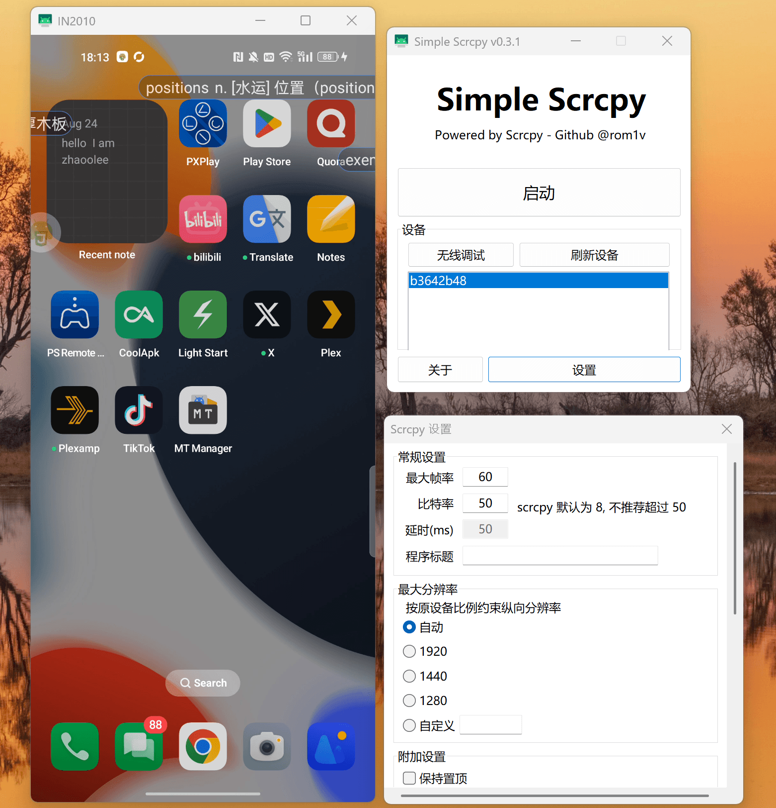
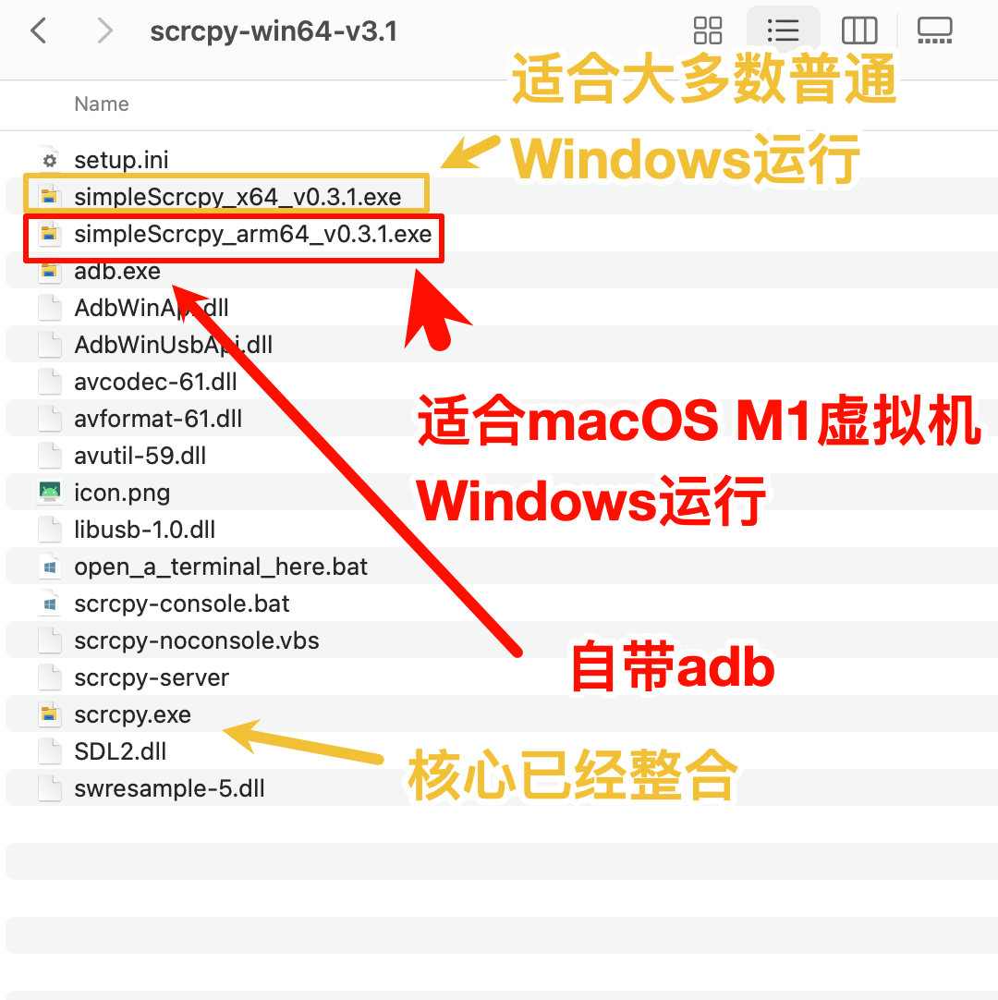
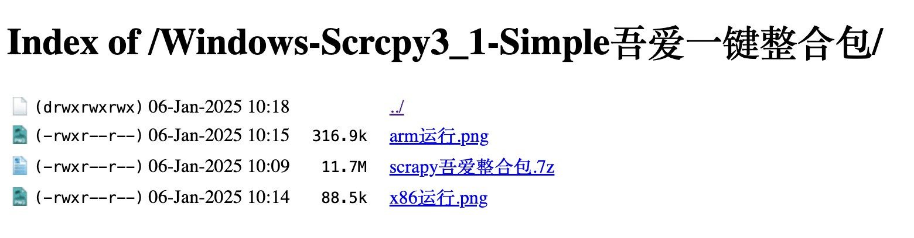

Scrcpy是一款支持镜像控制安卓的开源软件，https://github.com/Genymobile/scrcpy 在github有116k 数量的star，这个软件功能丰富但并没有提供一个GUI界面，于是吾爱的某个老哥就写了一个界面，收到各界网友广泛好评，但GUI界面本身没有带scrcpy本体，于是我做了个进一步的整合包，下载双击即可使用，而且支持arm和x86两种架构cpu的windows，特别arm版适合Mac M系虚拟机使用

## 亲测运行在普通x86平台的Windows11

## 亲测运行在普通arm平台的Windows（macOS M1芯片虚拟机）

## 完美整合包 

## 小结

给一个有潜力的系统做GUI界面，或许是每个工程师都避不开的工作，也是稳定的商业模式。

AI生图时代，有为Stable Diffusion生图模型套界面的 Stable Diffusion WebUI 和 ConfyUI,  有为文生文模型套界面的NextChat；移动互联网时代，也有为安卓做界面优化的MIUI。在更洪荒的PC时代，QQ秀，付费皮肤，也是广义的套壳，给了工程师们赚到钱的机会。

对于绝大多数工程师而言，给有潜力的系统，开发好用的GUI交互界面，是在技术论坛获取关注，获得更好机会的重要方式。

对于工程师而言，其实品味也是很重要的能力，如果大家都开发GUI, 更有品味的软件往往可以买更高的价格，就像Apple，软件搭配硬件，把内存与硬盘卖出金子般的价格。

The only problem with Microsoft is they just have no taste. They have absolutely no taste. And I don't mean that in a small way, I mean that in a big way, in the sense that they don't think of original ideas, and they don't bring much culture into their products.（Steve Jobs）

微软唯一的问题就是他们毫无品味。他们绝对没有品味。我说的不是小问题，而是大问题，就是说他们不会想出原创的点子，也不会在产品中融入多少文化。（史蒂夫·乔布斯）

## 整合包下载地址

公众号 0加1 后台回复 **scrcpy整合包** 即可获取 （自建树莓派Frp内网穿透实时上传）

吾爱原贴：https://www.52pojie.cn/thread-1997098-1-1.html

