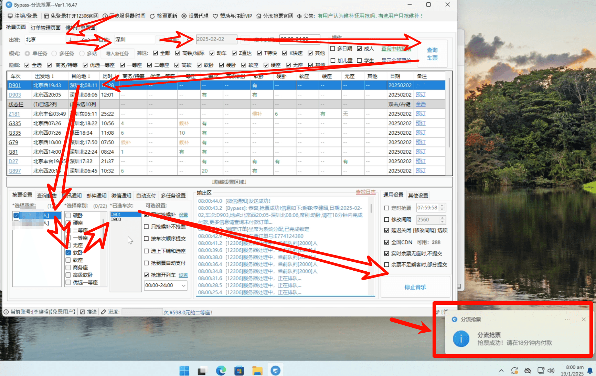

最近春节回家抢票，发现在官方App只能同时只能抢一个车次的票，而且在放票的瞬间，会立刻进入排队状态，不能退出界面，即使其它车次有票，也没机会抢，而且排队还不一定确保能卖到票，非常折磨人。

最骚的是12306的iOS版App会在整点抢票时，疯狂验证人脸，甚至进入重新登陆的界面，买票人心态直接起飞。

朋友推荐了一个可以支持分流抢票的免费工具，官网  https://www.bypass.cn/ 

今天早上试了一下，顺利抢到了返程的票，分享一下：

一张图就讲清楚使用方法：

1. 首先通过12306手机App扫码，或账号密码登录软件
2. 选择出发地，目的地，时间，然后查询车票
3. 找到合适的车次后，右键选择「预定所选车次」
4. 选择乘客（乘客信息在12306官方App填好，这个软件可以自动拉取），选择席别
5. 然后点击右下角的开始抢票按钮，开始抢票
6. 等抢票成功，右下角会弹窗「抢票成功」
7. 最后我们到12306官方App对车票订单进行付款即可

## 小结

这个软件的优势是分流抢票，也就是添加多个车次，同时刷票，一旦有票，立刻自动下单，这是完全合法的；另外也包含了校正时间，使用cdn加速的功能，对比纯人工点击，明显有更大的抢票优势。希望每个打工人都能买到自己心仪的票。
