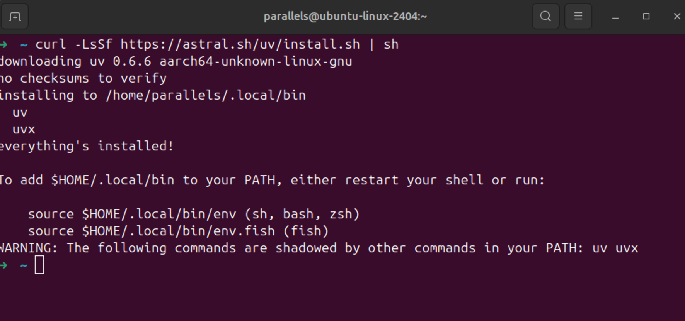
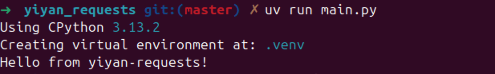
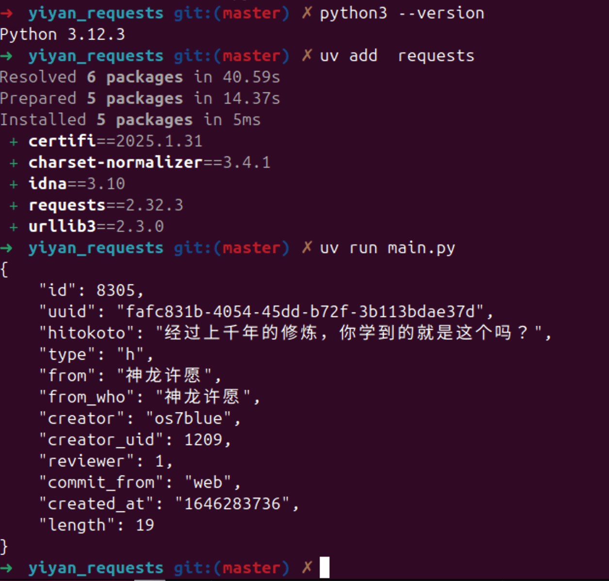
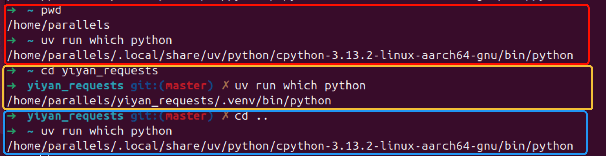
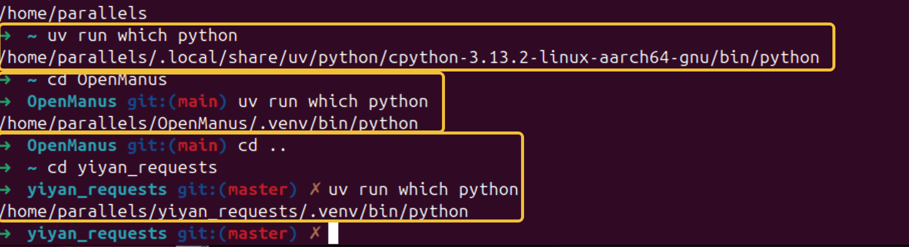
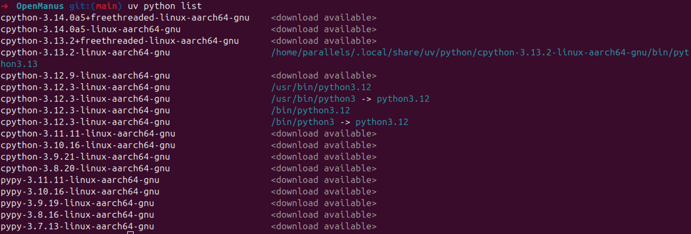

对于Python初学者而言，只要掌握了`pip`（管理依赖包）和`python`（运行代码） 两个命令，就能用很少的代码，编写并运行脚本；

但从工程化的角度来看，每个工程的`Python版本`和对应的`依赖包版本`，应该是`相互隔离`的，为了解决`Python工程化`的问题，uv应运而生

## 安装UV

- macOS 和 Linux安装命令

```
curl -LsSf https://astral.sh/uv/install.sh | sh
```

- windows版

```
powershell -ExecutionPolicy ByPass -c "irm https://astral.sh/uv/install.ps1 | iex"
```




## 使用Python3.13创建一个工程


```
mkdir yiyan_requests
cd yiyan_requests
uv python install 3.13
uv init -p 3.13
```

此时在`yiyan_requests` 文件夹下会生成 `main.py` , `pyproject.toml` 两个重要的文件


其中工程文件`pyproject.toml` 的内容为

```
[project]
name = "yiyan-requests"
version = "0.1.0"
description = "Add your description here"
readme = "README.md"
requires-python = ">=3.13"
dependencies = []

```

代码测试文件`main.py`的内容为

```
def main():
    print("Hello from yiyan-requests!")


if __name__ == "__main__":
    main()

```

运行`main.py` , 可以看到使用了 python的3.13版本，并正常输出了内容 

```
uv run main.py
```



我们安装一个requests库, 并完成一次api的请求

```
# 安装 requests
uv add requests
# 如果需要卸载requests，则运行 uv remove requests
```

安装完成后，我们会发现在项目 `.venv` 目录下已经存在requests依赖包的存储路径

```
➜  yiyan_requests git:(master) ✗ tree -a
.
├── .git
│   ├── branches
│   ├── config
│   ├── description
│   ├── HEAD
│   ├── hooks
│   │   ├── applypatch-msg.sample
│   │   ├── commit-msg.sample
│   │   ├── fsmonitor-watchman.sample
│   │   ├── post-update.sample
│   │   ├── pre-applypatch.sample
│   │   ├── pre-commit.sample
│   │   ├── pre-merge-commit.sample
│   │   ├── prepare-commit-msg.sample
│   │   ├── pre-push.sample
│   │   ├── pre-rebase.sample
│   │   ├── pre-receive.sample
│   │   ├── push-to-checkout.sample
│   │   ├── sendemail-validate.sample
│   │   └── update.sample
│   ├── info
│   │   └── exclude
│   ├── objects
│   │   ├── info
│   │   └── pack
│   └── refs
│       ├── heads
│       └── tags
├── .gitignore
├── main.py
├── pyproject.toml
├── .python-version
├── README.md
├── uv.lock
└── .venv
    ├── bin
    │   ├── activate
    │   ├── activate.bat
    │   ├── activate.csh
    │   ├── activate.fish
    │   ├── activate.nu
    │   ├── activate.ps1
    │   ├── activate_this.py
    │   ├── deactivate.bat
    │   ├── normalizer
    │   ├── pydoc.bat
    │   ├── python -> /home/parallels/.local/share/uv/python/cpython-3.13.2-linux-aarch64-gnu/bin/python3.13
    │   ├── python3 -> python
    │   └── python3.13 -> python
    ├── CACHEDIR.TAG
    ├── .gitignore
    ├── lib
    │   └── python3.13
    │       └── site-packages
    │           ├── certifi
    │           │   ├── cacert.pem
    │           │   ├── core.py
    │           │   ├── __init__.py
    │           │   ├── __main__.py
    │           │   └── py.typed
    │           ├── certifi-2025.1.31.dist-info
    │           │   ├── INSTALLER
    │           │   ├── LICENSE
    │           │   ├── METADATA
    │           │   ├── RECORD
    │           │   ├── REQUESTED
    │           │   ├── top_level.txt
    │           │   └── WHEEL
    │           ├── charset_normalizer
    │           │   ├── api.py
    │           │   ├── cd.py
    │           │   ├── cli
    │           │   │   ├── __init__.py
    │           │   │   └── __main__.py
    │           │   ├── constant.py
    │           │   ├── __init__.py
    │           │   ├── legacy.py
    │           │   ├── __main__.py
    │           │   ├── md.cpython-313-aarch64-linux-gnu.so
    │           │   ├── md__mypyc.cpython-313-aarch64-linux-gnu.so
    │           │   ├── md.py
    │           │   ├── models.py
    │           │   ├── py.typed
    │           │   ├── utils.py
    │           │   └── version.py
    │           ├── charset_normalizer-3.4.1.dist-info
    │           │   ├── entry_points.txt
    │           │   ├── INSTALLER
    │           │   ├── LICENSE
    │           │   ├── METADATA
    │           │   ├── RECORD
    │           │   ├── REQUESTED
    │           │   ├── top_level.txt
    │           │   └── WHEEL
    │           ├── idna
    │           │   ├── codec.py
    │           │   ├── compat.py
    │           │   ├── core.py
    │           │   ├── idnadata.py
    │           │   ├── __init__.py
    │           │   ├── intranges.py
    │           │   ├── package_data.py
    │           │   ├── py.typed
    │           │   └── uts46data.py
    │           ├── idna-3.10.dist-info
    │           │   ├── INSTALLER
    │           │   ├── LICENSE.md
    │           │   ├── METADATA
    │           │   ├── RECORD
    │           │   ├── REQUESTED
    │           │   └── WHEEL
    │           ├── __pycache__
    │           │   └── _virtualenv.cpython-313.pyc
    │           ├── requests
    │           │   ├── adapters.py
    │           │   ├── api.py
    │           │   ├── auth.py
    │           │   ├── certs.py
    │           │   ├── compat.py
    │           │   ├── cookies.py
    │           │   ├── exceptions.py
    │           │   ├── help.py
    │           │   ├── hooks.py
    │           │   ├── __init__.py
    │           │   ├── _internal_utils.py
    │           │   ├── models.py
    │           │   ├── packages.py
    │           │   ├── sessions.py
    │           │   ├── status_codes.py
    │           │   ├── structures.py
    │           │   ├── utils.py
    │           │   └── __version__.py
    │           ├── requests-2.32.3.dist-info
    │           │   ├── INSTALLER
    │           │   ├── LICENSE
    │           │   ├── METADATA
    │           │   ├── RECORD
    │           │   ├── REQUESTED
    │           │   ├── top_level.txt
    │           │   └── WHEEL
    │           ├── urllib3
    │           │   ├── _base_connection.py
    │           │   ├── _collections.py
    │           │   ├── connectionpool.py
    │           │   ├── connection.py
    │           │   ├── contrib
    │           │   │   ├── emscripten
    │           │   │   │   ├── connection.py
    │           │   │   │   ├── emscripten_fetch_worker.js
    │           │   │   │   ├── fetch.py
    │           │   │   │   ├── __init__.py
    │           │   │   │   ├── request.py
    │           │   │   │   └── response.py
    │           │   │   ├── __init__.py
    │           │   │   ├── pyopenssl.py
    │           │   │   └── socks.py
    │           │   ├── exceptions.py
    │           │   ├── fields.py
    │           │   ├── filepost.py
    │           │   ├── http2
    │           │   │   ├── connection.py
    │           │   │   ├── __init__.py
    │           │   │   └── probe.py
    │           │   ├── __init__.py
    │           │   ├── poolmanager.py
    │           │   ├── py.typed
    │           │   ├── _request_methods.py
    │           │   ├── response.py
    │           │   ├── util
    │           │   │   ├── connection.py
    │           │   │   ├── __init__.py
    │           │   │   ├── proxy.py
    │           │   │   ├── request.py
    │           │   │   ├── response.py
    │           │   │   ├── retry.py
    │           │   │   ├── ssl_match_hostname.py
    │           │   │   ├── ssl_.py
    │           │   │   ├── ssltransport.py
    │           │   │   ├── timeout.py
    │           │   │   ├── url.py
    │           │   │   ├── util.py
    │           │   │   └── wait.py
    │           │   └── _version.py
    │           ├── urllib3-2.3.0.dist-info
    │           │   ├── INSTALLER
    │           │   ├── licenses
    │           │   │   └── LICENSE.txt
    │           │   ├── METADATA
    │           │   ├── RECORD
    │           │   ├── REQUESTED
    │           │   └── WHEEL
    │           ├── _virtualenv.pth
    │           └── _virtualenv.py
    ├── lib64 -> lib
    └── pyvenv.cfg

34 directories, 162 files
```


将`main.py` 的代码修改为

```
import requests
import json

# 发送GET请求到指定URL
response = requests.get("https://v1.hitokoto.cn/")

# 检查请求是否成功
if response.status_code == 200:
    # 将返回的数据解析成JSON格式
    result = response.json()
    # 格式化输出JSON数据
    print(json.dumps(result, ensure_ascii=False, indent=4))
else:
    print(f"请求失败，状态码: {response.status_code}")

```

运行代码

```
uv run main.py
```



## uv可以自动设置虚拟环境Python解释器的生效时机

运行`uv run which python` 可以查看此刻python解释器的位置，从下图我们可以发现，如果离开项目目录，运行 `uv run which python` 会自动指向全局的python解释器`/home/parallels/.local/share/uv/python/cpython-3.13.2-linux-aarch64-gnu/bin/python`, 当进入项目目录，运行 `uv run which python`  就会指向项目自己目录的python项目解释器 `home/parallels/yiyan_requests/.venv/bin/python`



## 如何将包含`requirements.txt` 旧python项目使用uv进行管理？


以当前热门的openManus为例

```
# 获取项目代码
git clone https://github.com/mannaandpoem/OpenManus.git
# 进入项目目录
cd OpenManus
# 指定项目的Python解释器版本
uv venv --python 3.12
# 激活虚拟环境
source .venv/bin/activate  # On Unix/macOS
# Windows版激活虚拟环境
# .venv\Scripts\activate
# 通过 requirements.txt 安装依赖包
uv pip install -r requirements.txt
```

我们并不需要每次进入目录都运行 `source .venv/bin/activate` 激活环境，在通过`uv venv --python 3.12` 完成项目（项目目录下生成 `.venv` 文件夹）后，每次进入项目目录，会自动激活对应的python解释器（`.venv`目录下的解释器）



## 如何生成 `requirements.txt`

```
uv pip compile pyproject.toml -o requirements.txt
```
生成效果

```
➜  yiyan_requests git:(master) ✗ ls -la
total 40
drwxrwxr-x  4 parallels parallels 4096 Mar 17 14:38 .
drwxr-x--- 22 parallels parallels 4096 Mar 17 15:57 ..
drwxrwxr-x  7 parallels parallels 4096 Mar 17 14:38 .git
-rw-rw-r--  1 parallels parallels  109 Mar 17 14:38 .gitignore
-rw-rw-r--  1 parallels parallels  403 Mar 17 14:42 main.py
-rw-rw-r--  1 parallels parallels  185 Mar 17 14:38 pyproject.toml
-rw-rw-r--  1 parallels parallels    5 Mar 17 14:38 .python-version
-rw-rw-r--  1 parallels parallels    0 Mar 17 14:38 README.md
-rw-rw-r--  1 parallels parallels 7268 Mar 17 14:38 uv.lock
drwxrwxr-x  4 parallels parallels 4096 Mar 17 14:38 .venv
➜  yiyan_requests git:(master) ✗ uv pip compile pyproject.toml -o requirements.txt

Resolved 5 packages in 1.95s
# This file was autogenerated by uv via the following command:
#    uv pip compile pyproject.toml -o requirements.txt
certifi==2025.1.31
    # via requests
charset-normalizer==3.4.1
    # via requests
idna==3.10
    # via requests
requests==2.32.3
    # via yiyan-requests (pyproject.toml)
urllib3==2.3.0
    # via requests
➜  yiyan_requests git:(master) ✗ ls -la                                           
total 44
drwxrwxr-x  4 parallels parallels 4096 Mar 17 15:57 .
drwxr-x--- 22 parallels parallels 4096 Mar 17 15:57 ..
drwxrwxr-x  7 parallels parallels 4096 Mar 17 14:38 .git
-rw-rw-r--  1 parallels parallels  109 Mar 17 14:38 .gitignore
-rw-rw-r--  1 parallels parallels  403 Mar 17 14:42 main.py
-rw-rw-r--  1 parallels parallels  185 Mar 17 14:38 pyproject.toml
-rw-rw-r--  1 parallels parallels    5 Mar 17 14:38 .python-version
-rw-rw-r--  1 parallels parallels    0 Mar 17 14:38 README.md
-rw-rw-r--  1 parallels parallels  324 Mar 17 15:57 requirements.txt
-rw-rw-r--  1 parallels parallels 7268 Mar 17 14:38 uv.lock
drwxrwxr-x  4 parallels parallels 4096 Mar 17 14:38 .venv
➜  yiyan_requests git:(master) ✗ cat requirements.txt 
# This file was autogenerated by uv via the following command:
#    uv pip compile pyproject.toml -o requirements.txt
certifi==2025.1.31
    # via requests
charset-normalizer==3.4.1
    # via requests
idna==3.10
    # via requests
requests==2.32.3
    # via yiyan-requests (pyproject.toml)
urllib3==2.3.0
    # via requests
```


## 如何查看已经安装的python版本

```
uv python list
```




## 小结

一门流行的编程语言，需要标准实用的工程化工具，为了实现多工程的隔离python， 我们先后经历了virtualenv , pipenv，poetry, uv 等流行库，工程构建速度越来越快，集成化程度也越来越高，随着AI编程的发展，初始化项目的流程，也会更倾向于集成化程度更好的工具，新的工具会兼容旧的配置配置文件，不够易用的工具也终将淡出历史舞台。

