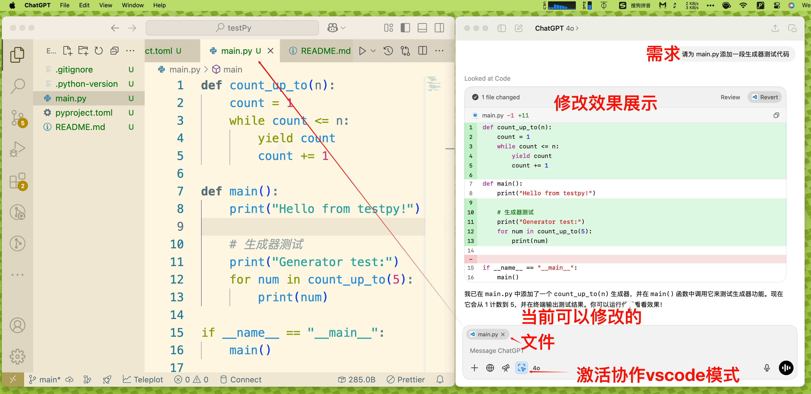
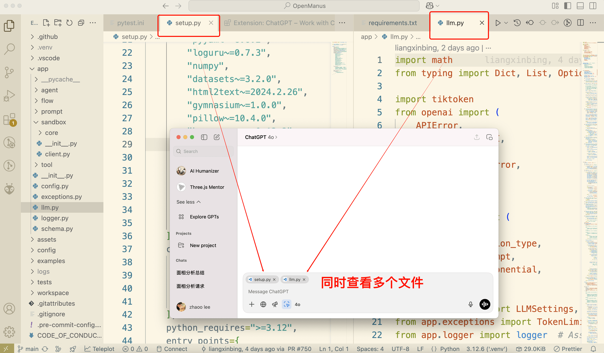
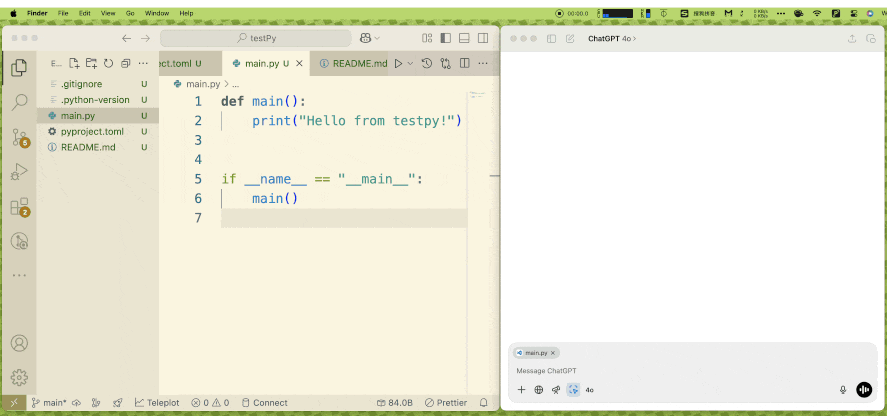
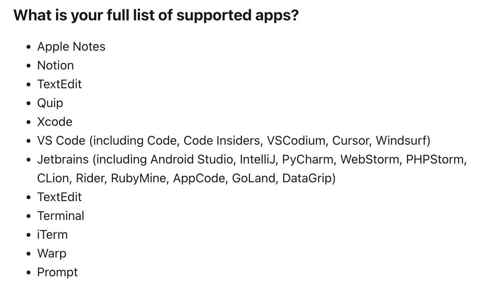

ChatGPT每月20刀的钱既然已经交了，就应该充分利用一下，我们可以通过ChatGPT官方的客户端，直接与VsCode等各类软件协作，自动修改任何工程的代码。

支持多文件编辑

## ChatGPT与VSCode协作实际使用效果

通过以上方法，用户可以使用最新的opeanAI模型，而且不用考虑token计量的问题，因为每月20刀的费用已经包括了。

从用户体验的方面考虑，ChatGPT客户端直接读取代码文件，比用户拖拽上传代码文件要好的多，而且修改可以一键Apply， 避免了修改后，再粘贴回来的麻烦。

## 支持的App列表

