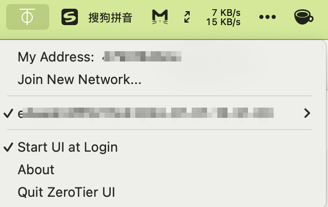

今天忽然发现macOS版Zerotier无法连接到服务器了，显示如下图所示，使用官方最新版apk重装也不好使


最后的解决方法是关闭Zerotier图形化界面客户端,然后删一个文件，然后启动Zerotier客户端，系统会要求输入密码，然后就顺利运行了

```
cd ~/Library/Application\ Support/ZeroTier/One
rm authtoken.secret
```



