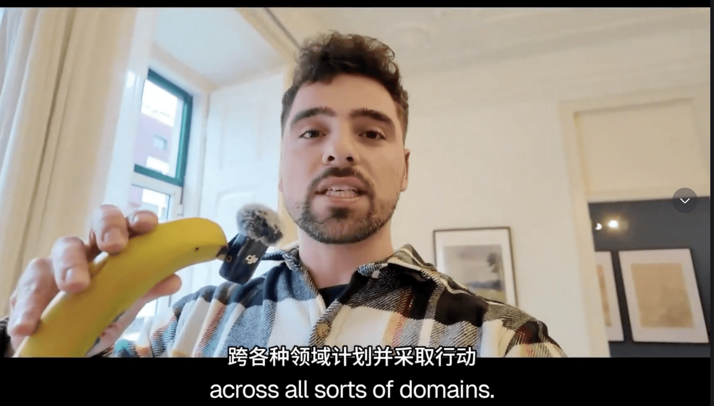
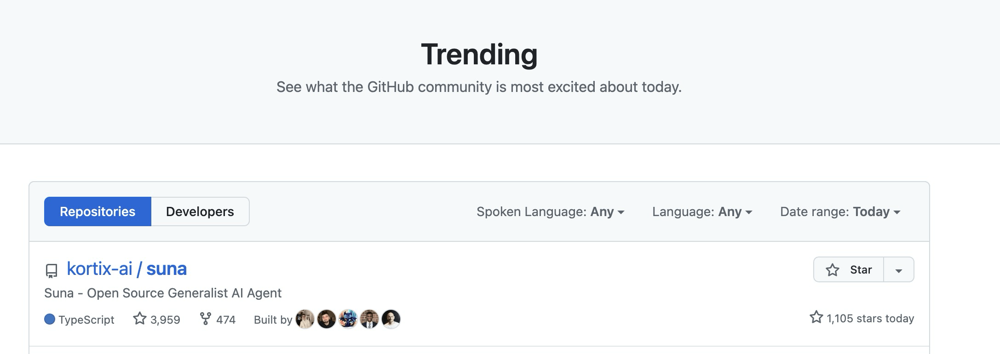
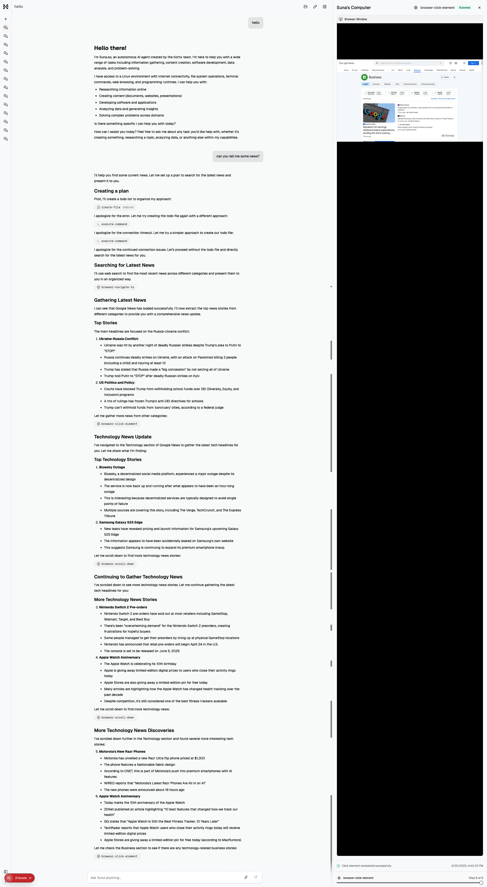
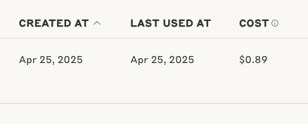
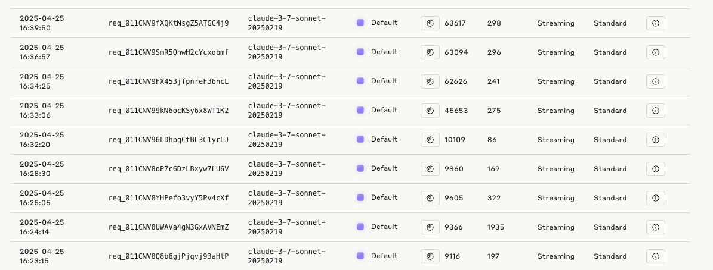
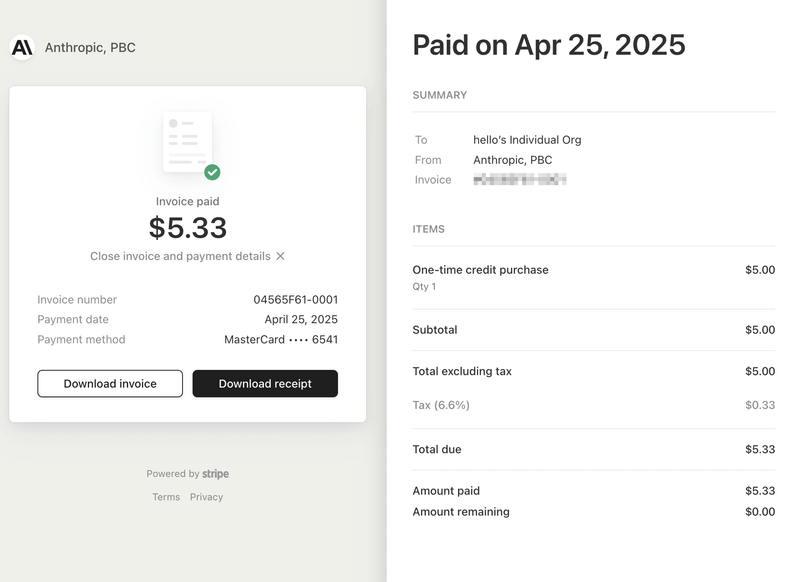
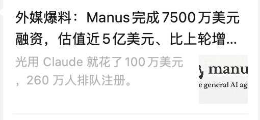

最近有个高仿Manus的真开源项目Suna，开发者号称在一个小别墅，3周完成了开发，开发者拿着香蕉麦克风，兴致勃勃的发了个小视频。

视频地址：https://www.toutiao.com/video/7496300307304038939/

Suna开源地址为 : https://github.com/kortix-ai/suna

2025年4月25日已经登顶Github Trending榜第一名，这下不得不品了

这个项目依赖了很多在线服务，我投入了3个多小时才把这个项目运行起来，运行后的效果如图所示

我本地部署后，项目默认调用 claude-3-7-sonnet-20250219 模型，一个任务消耗了0.89刀的token

目前的行情，往Claude充值5刀，要额外缴0.33元的税

换算下来，一个搜集新闻的任务，光是token就要消耗0.94刀，如果算上虚拟机和数据库的计费，一美刀是不够的。

回顾Manus前段时间的新闻，消耗100万刀的token，融资7500万美元，团队成员应该还是可以过的很滋润。

## 小结

AI应用领域依然是出于大力出奇迹的阶段，用户并不知道自己需要什么，直到开发者们把产品展示到用户眼前。

现阶段，普通用户的消费能力，无法覆盖每个任务1美元的成本，而企业用户付费能力强，但往往需要兼容老系统，企业**需要在不改造已有系统的前提下，让大模型替代人工操作**，降低机械性工作的人工成本，提高系统的效率。

我认为Suna的意义在于创造需求，让一部分人以成本价体验到目前最好用的AI产品，好的产品形态，会不断拉高AI产品的产品力上限。

