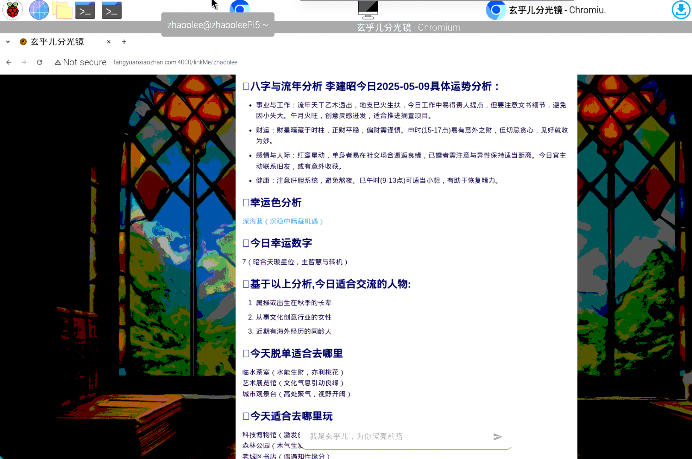

最近写了个《玄乎儿分光镜》，（体验地址 http://fangyuanxiaozhan.com:4000/register ）可以基于八字，自动测算每天运势，非常适合放在树莓派运行，我的树莓派使用的是树莓派官方系统 raspberry pi os , 使用Chrome浏览器打开网页发现无法显示Emoji





经过一番查找后，发现只需运行以下命令，安装emoji


```
sudo apt-get install fonts-noto-color-emoji
```


最后重新启动浏览器，即可！
