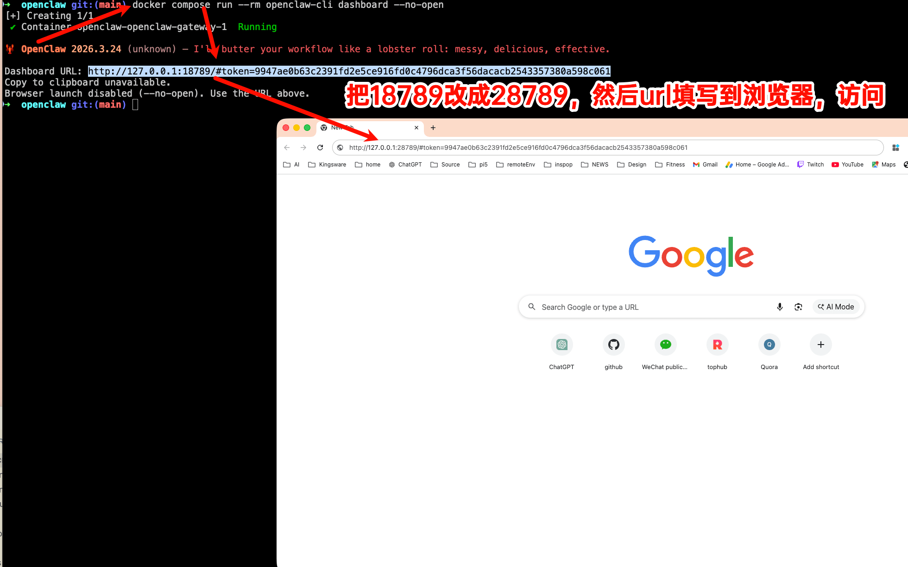
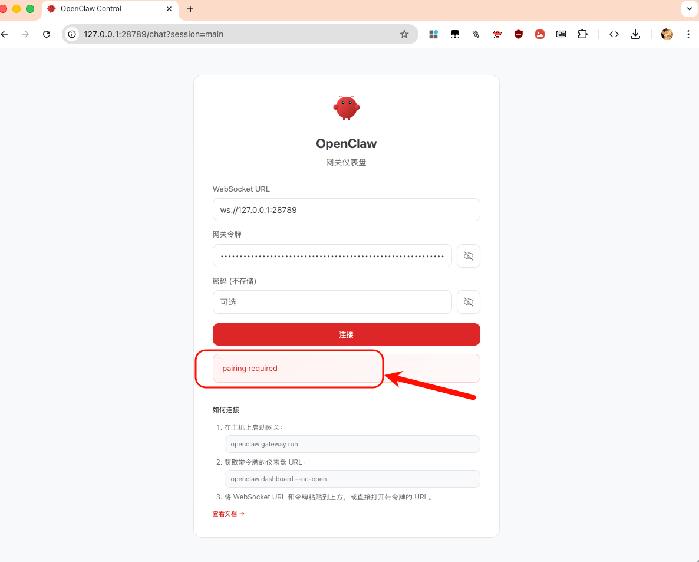
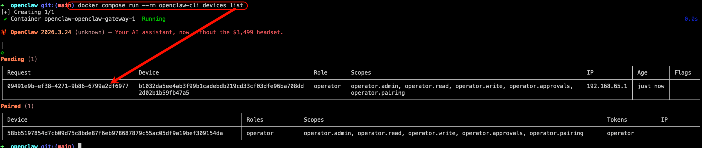
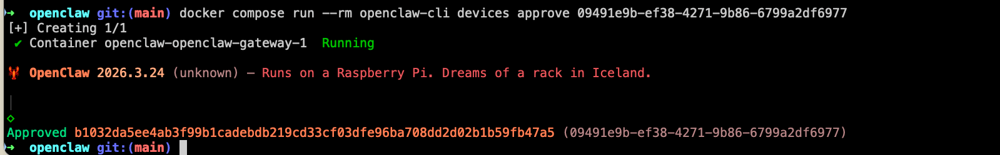
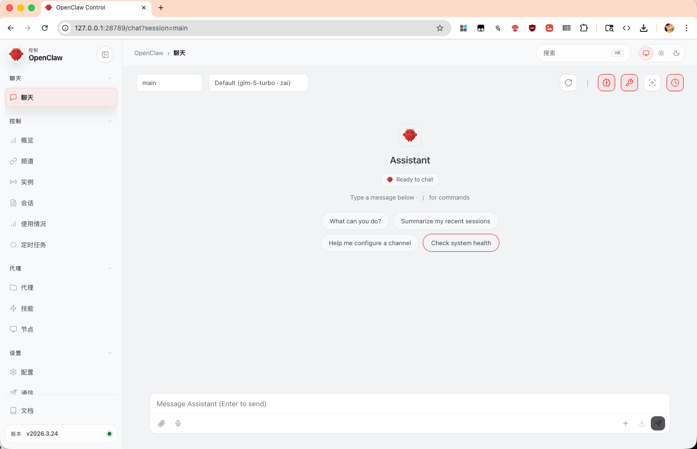
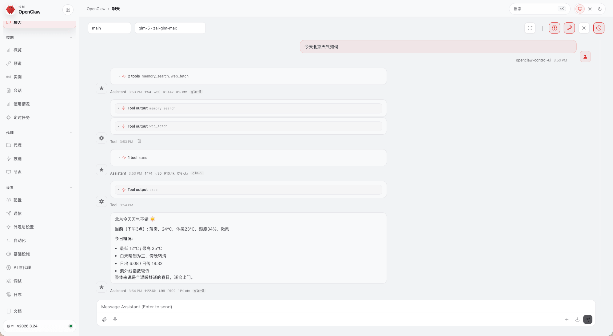
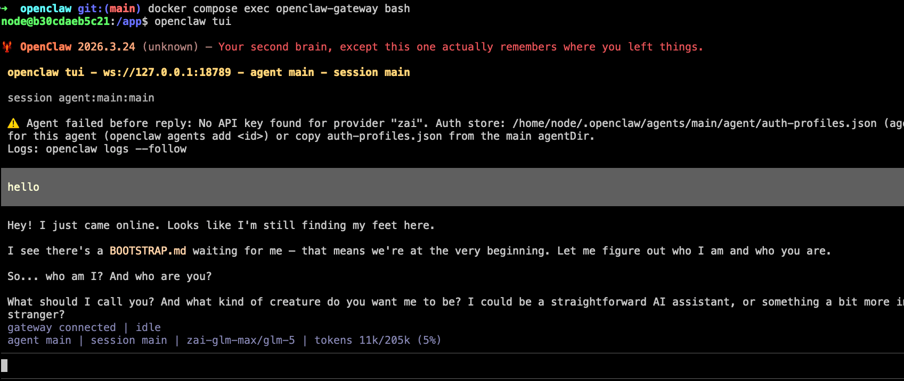

最近openclaw的更新太猛了，新版本干爆了一批插件，主机不敢更新，只能用docker尝尝鲜。本文是docker尝鲜2026.3.24版的方案


## 获取开源项目

```
mkdir ~/github/
cd ~/github/
git clone https://github.com/openclaw/openclaw
```


## 启动

```
mkdir -p ~/openclaw-docker-2026.3.24/workspace

cd ~/github/openclaw

export OPENCLAW_CONFIG_DIR="~/openclaw-docker-2026.3.24"
export OPENCLAW_WORKSPACE_DIR="~/openclaw-docker-2026.3.24/workspace"
# 这里的镜像tag可以通过https://github.com/openclaw/openclaw/pkgs/container/openclaw 获取
export OPENCLAW_IMAGE="ghcr.io/openclaw/openclaw:2026.3.24"
export OPENCLAW_GATEWAY_PORT="28789"
export OPENCLAW_GATEWAY_TOKEN="$(openssl rand -hex 32)"

./scripts/docker/setup.sh
```

启动的log

```
➜  github git clone https://github.com/openclaw/openclaw
Cloning into 'openclaw'...
remote: Enumerating objects: 290032, done.
remote: Counting objects: 100% (323/323), done.
remote: Compressing objects: 100% (178/178), done.
remote: Total 290032 (delta 202), reused 151 (delta 145), pack-reused 289709 (from 2)
Receiving objects: 100% (290032/290032), 335.02 MiB | 3.61 MiB/s, done.
Resolving deltas: 100% (184774/184774), done.
Updating files: 100% (10206/10206), done.
➜  github ls -la | grep .env
➜  github cd ~/github/openclaw
➜  openclaw git:(main) export OPENCLAW_CONFIG_DIR="~/openclaw-docker-2026.3.24"
export OPENCLAW_WORKSPACE_DIR="~/openclaw-docker-2026.3.24/workspace"
# 这里的镜像tag可以通过https://github.com/openclaw/openclaw/pkgs/container/openclaw 获取
export OPENCLAW_IMAGE="ghcr.io/openclaw/openclaw:2026.3.24"
export OPENCLAW_GATEWAY_PORT="28789"
export OPENCLAW_GATEWAY_TOKEN="$(openssl rand -hex 32)"
➜  openclaw git:(main) ./scripts/docker/setup.sh
==> Pulling Docker image: ghcr.io/openclaw/openclaw:2026.3.24
2026.3.24: Pulling from openclaw/openclaw
Digest: sha256:7091859602df6b8cdd59b38adbaed723a6d94806fdd4274d488400dd2fcf0fb6
Status: Image is up to date for ghcr.io/openclaw/openclaw:2026.3.24
ghcr.io/openclaw/openclaw:2026.3.24

==> Fixing data-directory permissions
[+] Creating 1/1
 ✔ Network openclaw_default  Created                                                                                                            0.0s

==> Onboarding (interactive)
Docker setup pins Gateway mode to local.
Gateway runtime bind comes from OPENCLAW_GATEWAY_BIND (default: lan).
Current runtime bind: lan
Gateway token: 9947ae0b63c2391fd2e5ce916fd0c4796dca3f56dacacb2543357380a598c061
Tailscale exposure: Off (use host-level tailnet/Tailscale setup separately).
Install Gateway daemon: No (managed by Docker Compose)


🦞 OpenClaw 2026.3.24 (unknown) — Your config is valid, your assumptions are not.

▄▄▄▄▄▄▄▄▄▄▄▄▄▄▄▄▄▄▄▄▄▄▄▄▄▄▄▄▄▄▄▄▄▄▄▄▄▄▄▄▄▄▄▄▄▄▄▄▄▄▄▄
██░▄▄▄░██░▄▄░██░▄▄▄██░▀██░██░▄▄▀██░████░▄▄▀██░███░██
██░███░██░▀▀░██░▄▄▄██░█░█░██░█████░████░▀▀░██░█░█░██
██░▀▀▀░██░█████░▀▀▀██░██▄░██░▀▀▄██░▀▀░█░██░██▄▀▄▀▄██
▀▀▀▀▀▀▀▀▀▀▀▀▀▀▀▀▀▀▀▀▀▀▀▀▀▀▀▀▀▀▀▀▀▀▀▀▀▀▀▀▀▀▀▀▀▀▀▀▀▀▀▀
                  🦞 OPENCLAW 🦞

┌  OpenClaw setup
│
◇  Security ─────────────────────────────────────────────────────────────────────────────────╮
│                                                                                            │
│  Security warning — please read.                                                           │
│                                                                                            │
│  OpenClaw is a hobby project and still in beta. Expect sharp edges.                        │
│  By default, OpenClaw is a personal agent: one trusted operator boundary.                  │
│  This bot can read files and run actions if tools are enabled.                             │
│  A bad prompt can trick it into doing unsafe things.                                       │
│                                                                                            │
│  OpenClaw is not a hostile multi-tenant boundary by default.                               │
│  If multiple users can message one tool-enabled agent, they share that delegated tool      │
│  authority.                                                                                │
│                                                                                            │
│  If you’re not comfortable with security hardening and access control, don’t run           │
│  OpenClaw.                                                                                 │
│  Ask someone experienced to help before enabling tools or exposing it to the internet.     │
│                                                                                            │
│  Recommended baseline:                                                                     │
│  - Pairing/allowlists + mention gating.                                                    │
│  - Multi-user/shared inbox: split trust boundaries (separate gateway/credentials, ideally  │
│    separate OS users/hosts).                                                               │
│  - Sandbox + least-privilege tools.                                                        │
│  - Shared inboxes: isolate DM sessions (`session.dmScope: per-channel-peer`) and keep      │
│    tool access minimal.                                                                    │
│  - Keep secrets out of the agent’s reachable filesystem.                                   │
│  - Use the strongest available model for any bot with tools or untrusted inboxes.          │
│                                                                                            │
│  Run regularly:                                                                            │
│  openclaw security audit --deep                                                            │
│  openclaw security audit --fix                                                             │
│                                                                                            │
│  Must read: https://docs.openclaw.ai/gateway/security                                      │
│                                                                                            │
├────────────────────────────────────────────────────────────────────────────────────────────╯
│
◆  I understand this is personal-by-default and shared/multi-user use requires lock-down. Continue?
│  ○ Yes / ● No
└

```


配置过程

```
◇  I understand this is personal-by-default and shared/multi-user use requires lock-down. Continue?
│  Yes
│
◇  Setup mode
│  QuickStart
│
◇  QuickStart ─────────────────────────╮
│                                      │
│  Gateway port: 18789                 │
│  Gateway bind: Loopback (127.0.0.1)  │
│  Gateway auth: Token (default)       │
│  Tailscale exposure: Off             │
│  Direct to chat channels.            │
│                                      │
├──────────────────────────────────────╯
│
◇  Model/auth provider
│  Skip for now
│
◇  Filter models by provider
│  zai
│
◇  Default model
│  zai/glm-5-turbo
│
◇  Model check ──────────────────────────────────────────────────────────────────────────────╮
│                                                                                            │
│  No auth configured for provider "zai". The agent may fail until credentials are added.    │
│  Run `openclaw models auth login --provider zai`, `openclaw configure`, or set an API key  │
│  env var.                                                                                  │
│                                                                                            │
├────────────────────────────────────────────────────────────────────────────────────────────╯
│
◇  Channel status ───────────────────╮
│                                    │
│  Telegram: needs token             │
│  Discord: needs token              │
│  IRC: needs host + nick            │
│  Slack: needs tokens               │
│  Signal: needs setup               │
│  signal-cli: missing (signal-cli)  │
│  iMessage: needs setup             │
│  imsg: missing (imsg)              │
│  LINE: needs token + secret        │
│  Accounts: 0                       │
│  WhatsApp: not configured          │
│  Google Chat: not configured       │
│  Feishu: installed                 │
│  Google Chat: installed            │
│  Nostr: installed                  │
│  Microsoft Teams: installed        │
│  Mattermost: installed             │
│  Nextcloud Talk: installed         │
│  Matrix: installed                 │
│  BlueBubbles: installed            │
│  Zalo: installed                   │
│  Zalo Personal: installed          │
│  Synology Chat: installed          │
│  Tlon: installed                   │
│  Twitch: installed                 │
│  WhatsApp: installed               │
│                                    │
├────────────────────────────────────╯
│
◇  How channels work ───────────────────────────────────────────────────────────────────────╮
│                                                                                           │
│  DM security: default is pairing; unknown DMs get a pairing code.                         │
│  Approve with: openclaw pairing approve <channel> <code>                                  │
│  Public DMs require dmPolicy="open" + allowFrom=["*"].                                    │
│  Multi-user DMs: run: openclaw config set session.dmScope "per-channel-peer" (or          │
│  "per-account-channel-peer" for multi-account channels) to isolate sessions.              │
│  Docs: channels/pairing              │
│                                                                                           │
│  Telegram: simplest way to get started — register a bot with @BotFather and get going.    │
│  WhatsApp: works with your own number; recommend a separate phone + eSIM.                 │
│  Discord: very well supported right now.                                                  │
│  IRC: classic IRC networks with DM/channel routing and pairing controls.                  │
│  Google Chat: Google Workspace Chat app with HTTP webhook.                                │
│  Slack: supported (Socket Mode).                                                          │
│  Signal: signal-cli linked device; more setup (David Reagans: "Hop on Discord.").         │
│  iMessage: this is still a work in progress.                                              │
│  LINE: LINE Messaging API webhook bot.                                                    │
│  Feishu: 飞书/Lark enterprise messaging with doc/wiki/drive tools.                        │
│  Nostr: Decentralized protocol; encrypted DMs via NIP-04.                                 │
│  Microsoft Teams: Teams SDK; enterprise support.                                          │
│  Mattermost: self-hosted Slack-style chat; install the plugin to enable.                  │
│  Nextcloud Talk: Self-hosted chat via Nextcloud Talk webhook bots.                        │
│  Matrix: open protocol; install the plugin to enable.                                     │
│  BlueBubbles: iMessage via the BlueBubbles mac app + REST API.                            │
│  Zalo: Vietnam-focused messaging platform with Bot API.                                   │
│  Zalo Personal: Zalo personal account via QR code login.                                  │
│  Synology Chat: Connect your Synology NAS Chat to OpenClaw with full agent capabilities.  │
│  Tlon: decentralized messaging on Urbit; install the plugin to enable.                    │
│  Twitch: Twitch chat integration                                                          │
│                                                                                           │
├───────────────────────────────────────────────────────────────────────────────────────────╯
│
◇  Select channel (QuickStart)
│  Skip for now
Updated ~/.openclaw/openclaw.json
Workspace OK: ~/.openclaw/workspace
Sessions OK: ~/.openclaw/agents/main/sessions
│
◇  Web search ─────────────────────────────────────────────────────────────────╮
│                                                                              │
│  Web search lets your agent look things up online.                           │
│  Choose a provider. Some providers need an API key, and some work key-free.  │
│  Docs: https://docs.openclaw.ai/tools/web                                    │
│                                                                              │
├──────────────────────────────────────────────────────────────────────────────╯
│
◇  Search provider
│  Skip for now
│
◇  Skills status ─────────────╮
│                             │
│  Eligible: 4                │
│  Missing requirements: 39   │
│  Unsupported on this OS: 7  │
│  Blocked by allowlist: 0    │
│                             │
├─────────────────────────────╯
│
◇  Configure skills now? (recommended)
│  No
│
◇  Hooks ──────────────────────────────────────────────────────────────────╮
│                                                                          │
│  Hooks let you automate actions when agent commands are issued.          │
│  Example: Save session context to memory when you issue /new or /reset.  │
│                                                                          │
│  Learn more: https://docs.openclaw.ai/automation/hooks                   │
│                                                                          │
├──────────────────────────────────────────────────────────────────────────╯
│
◇  Enable hooks?
│  Skip for now
Config overwrite: /home/node/.openclaw/openclaw.json (sha256 2f36db1b1e6d94c92bf274c8d609ed53033e9cd28cb3637381f632769b83ac82 -> 0a8fb9391152718fc5f3e25a5267ce4cb00402a07ae893ba365dc1c3db9599e2, backup=/home/node/.openclaw/openclaw.json.bak)
│
◇  Systemd ───────────────────────────────────────────────────────────────────────────────╮
│                                                                                         │
│  Systemd user services are unavailable. Skipping lingering checks and service install.  │
│                                                                                         │
├─────────────────────────────────────────────────────────────────────────────────────────╯
│
◇
Health check failed: gateway closed (1006 abnormal closure (no close frame)): no close reason
  Gateway target: ws://127.0.0.1:18789
  Source: local loopback
  Config: /home/node/.openclaw/openclaw.json
  Bind: loopback
│
◇  Health check help ────────────────────────────────╮
│                                                    │
│  Docs:                                             │
│  https://docs.openclaw.ai/gateway/health           │
│  https://docs.openclaw.ai/gateway/troubleshooting  │
│                                                    │
├────────────────────────────────────────────────────╯
│
◇  Optional apps ────────────────────────╮
│                                        │
│  Add nodes for extra features:         │
│  - macOS app (system + notifications)  │
│  - iOS app (camera/canvas)             │
│  - Android app (camera/canvas)         │
│                                        │
├────────────────────────────────────────╯
│
◇  Control UI ─────────────────────────────────────────────────────────────────────────────────────╮
│                                                                                                  │
│  Web UI: http://127.0.0.1:18789/                                                                 │
│  Web UI (with token):                                                                            │
│  http://127.0.0.1:18789/#token=9947ae0b63c2391fd2e5ce916fd0c4796dca3f56dacacb2543357380a598c061  │
│  Gateway WS: ws://127.0.0.1:18789                                                                │
│  Gateway: not detected (gateway closed (1006 abnormal closure (no close frame)): no close        │
│  reason)                                                                                         │
│  Docs: https://docs.openclaw.ai/web/control-ui                                                   │
│                                                                                                  │
├──────────────────────────────────────────────────────────────────────────────────────────────────╯
│
◇  Workspace backup ────────────────────────────────────────╮
│                                                           │
│  Back up your agent workspace.                            │
│  Docs: https://docs.openclaw.ai/concepts/agent-workspace  │
│                                                           │
├───────────────────────────────────────────────────────────╯
│
◇  Security ──────────────────────────────────────────────────────╮
│                                                                 │
│  Running agents on your computer is risky — harden your setup:  │
│  https://docs.openclaw.ai/security                              │
│                                                                 │
├─────────────────────────────────────────────────────────────────╯
│
◇  Shell completion ───────────────────────────────────────────────────────╮
│                                                                          │
│  Shell completion installed. Restart your shell or run: source ~/.zshrc  │
│                                                                          │
├──────────────────────────────────────────────────────────────────────────╯
│
◇  Dashboard ready ────────────────────────────────────────────────────────────────────────────────╮
│                                                                                                  │
│  Dashboard link (with token):                                                                    │
│  http://127.0.0.1:18789/#token=9947ae0b63c2391fd2e5ce916fd0c4796dca3f56dacacb2543357380a598c061  │
│  Copy/paste this URL in a browser on this machine to control OpenClaw.                           │
│  No GUI detected. Open from your computer:                                                       │
│  ssh -N -L 18789:127.0.0.1:18789 user@<host>                                                     │
│  Then open:                                                                                      │
│  http://localhost:18789/                                                                         │
│  http://localhost:18789/#token=9947ae0b63c2391fd2e5ce916fd0c4796dca3f56dacacb2543357380a598c061  │
│  Docs:                                                                                           │
│  https://docs.openclaw.ai/gateway/remote                                                         │
│  https://docs.openclaw.ai/web/control-ui                                                         │
│                                                                                                  │
├──────────────────────────────────────────────────────────────────────────────────────────────────╯
│
◇  Web search ───────────────────────────────────────╮
│                                                    │
│  Web search was skipped. You can enable it later:  │
│    openclaw configure --section web                │
│                                                    │
│  Docs: https://docs.openclaw.ai/tools/web          │
│                                                    │
├────────────────────────────────────────────────────╯
│
◇  What now ─────────────────────────────────────────────────────────────╮
│                                                                        │
│  What now: https://openclaw.ai/showcase ("What People Are Building").  │
│                                                                        │
├────────────────────────────────────────────────────────────────────────╯
│
└  Onboarding complete. Use the dashboard link above to control OpenClaw.


==> Docker gateway defaults
Config overwrite: /home/node/.openclaw/openclaw.json (sha256 0a8fb9391152718fc5f3e25a5267ce4cb00402a07ae893ba365dc1c3db9599e2 -> e5c9e7c74a2ea604f64e943ab3791d2b94ee3aaba1099c511ea60c95c5a1a9bb, backup=/home/node/.openclaw/openclaw.json.bak)
Config overwrite: /home/node/.openclaw/openclaw.json (sha256 e5c9e7c74a2ea604f64e943ab3791d2b94ee3aaba1099c511ea60c95c5a1a9bb -> ce2018877a50933480bf349879870a7e15ac54eb89cb3a5877cbf550eda921e8, backup=/home/node/.openclaw/openclaw.json.bak)
Pinned gateway.mode=local and gateway.bind=lan for Docker setup.

==> Control UI origin allowlist
Config overwrite: /home/node/.openclaw/openclaw.json (sha256 ce2018877a50933480bf349879870a7e15ac54eb89cb3a5877cbf550eda921e8 -> e00408ea533cf0194275616bd71b5ecbef71c12c27b3dcb5c41164f170aeff33, backup=/home/node/.openclaw/openclaw.json.bak)
Set gateway.controlUi.allowedOrigins to ["http://localhost:28789","http://127.0.0.1:28789"] for non-loopback bind.

==> Provider setup (optional)
WhatsApp (QR):
  docker compose -f /Users/zhaoolee/github/openclaw/docker-compose.yml run --rm openclaw-cli channels login
Telegram (bot token):
  docker compose -f /Users/zhaoolee/github/openclaw/docker-compose.yml run --rm openclaw-cli channels add --channel telegram --token <token>
Discord (bot token):
  docker compose -f /Users/zhaoolee/github/openclaw/docker-compose.yml run --rm openclaw-cli channels add --channel discord --token <token>
Docs: https://docs.openclaw.ai/channels

==> Starting gateway
[+] Running 1/1
 ✔ Container openclaw-openclaw-gateway-1  Started                                                                                               0.2s
[+] Creating 1/1
 ✔ Container openclaw-openclaw-gateway-1  Running0.0s
Config overwrite: /home/node/.openclaw/openclaw.json (sha256 e00408ea533cf0194275616bd71b5ecbef71c12c27b3dcb5c41164f170aeff33 -> d051db1a879ac8b12fc4bb9a3e8f78782bbb18acb56839bb84d8ce9314b35e00, backup=/home/node/.openclaw/openclaw.json.bak)

Gateway running with host port mapping.
Access from tailnet devices via the host's tailnet IP.
Config: ~/openclaw-docker-2026.3.24
Workspace: ~/openclaw-docker-2026.3.24/workspace
Token: 9947ae0b63c2391fd2e5ce916fd0c4796dca3f56dacacb2543357380a598c061

Commands:
  docker compose -f /Users/zhaoolee/github/openclaw/docker-compose.yml logs -f openclaw-gateway
  docker compose -f /Users/zhaoolee/github/openclaw/docker-compose.yml exec openclaw-gateway node dist/index.js health --token "9947ae0b63c2391fd2e5ce916fd0c4796dca3f56dacacb2543357380a598c061"
➜  openclaw git:(main)
```

获取可以访问的url

```
cd ~/github/openclaw

docker compose run --rm openclaw-cli dashboard --no-open
```




访问后显示要求匹配




在终端运行以下命令

```
cd ~/github/openclaw

docker compose run --rm openclaw-cli devices list
```




找到要求匹配的id，进行匹配

```
cd ~/github/openclaw

docker compose run --rm openclaw-cli devices approve 09491e9b-ef38-4271-9b86-6799a2df6977
```



匹配后，在浏览器重新访问 http://127.0.0.1:18789/#token=9947ae0b63c2391fd2e5ce916fd0c4796dca3f56dacacb2543357380a598c061 即可




## 修改配置文件，重启网关

配置文件位置`~/openclaw-docker-2026.3.24/openclaw.json`

```
cd ~/github/openclaw
docker compose restart openclaw-gateway
```
## 使用网页




## 使用tui

```
cd ~/github/openclaw
docker compose exec openclaw-gateway bash
# 进入容器后进入tui
openclaw tui
# 使用/q 可以退出tui
# 使用 ctrl+d 退出容器
```

