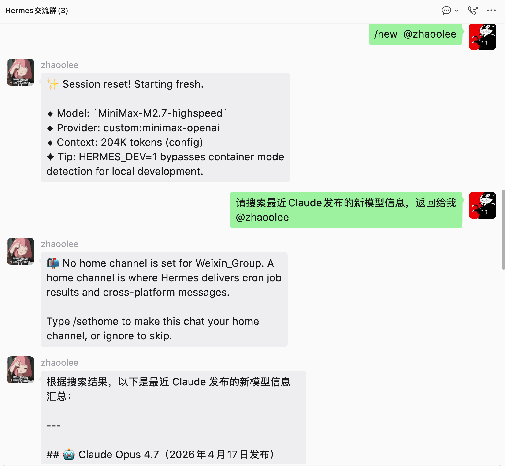
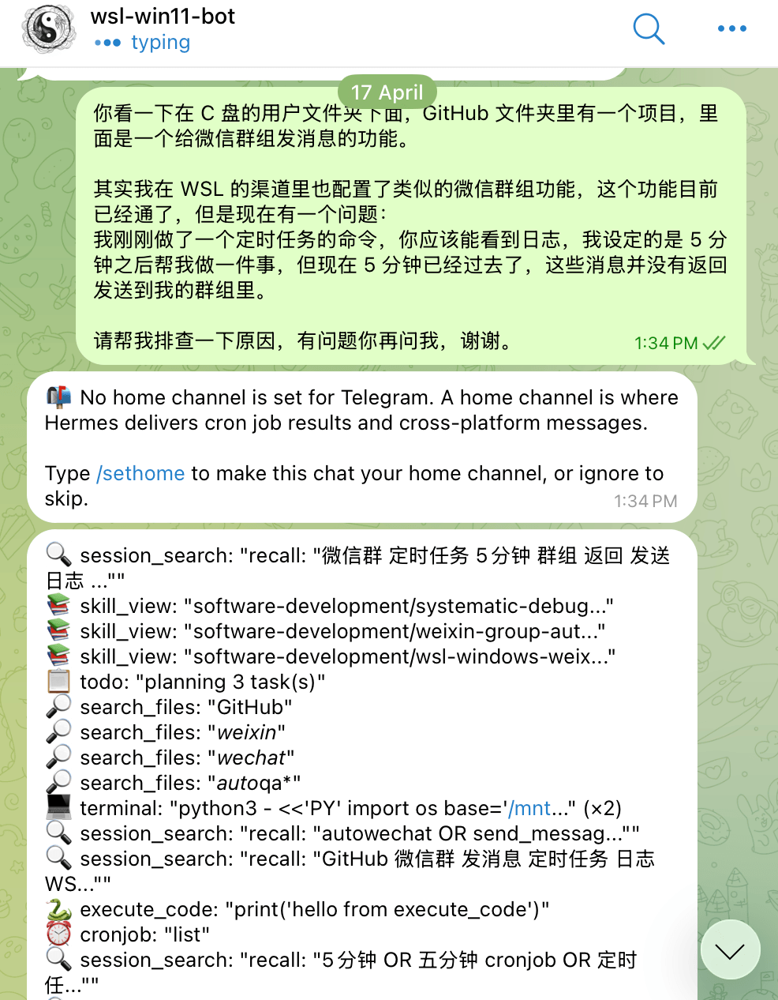
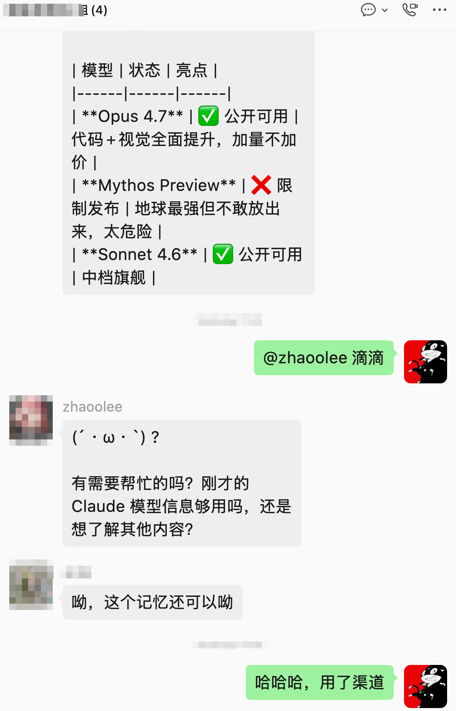
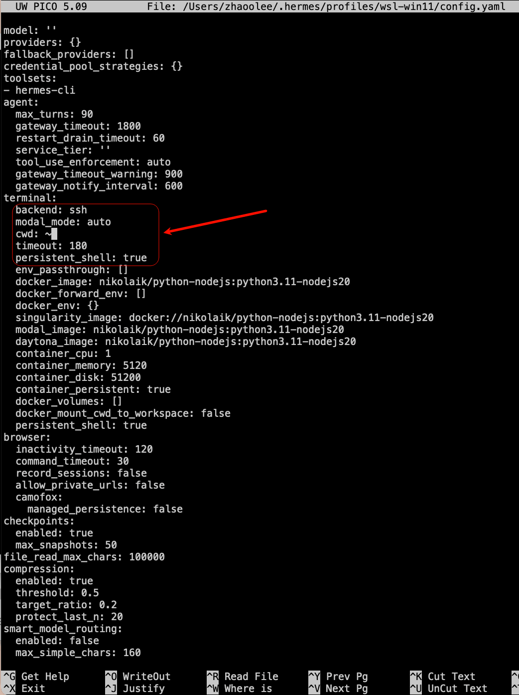
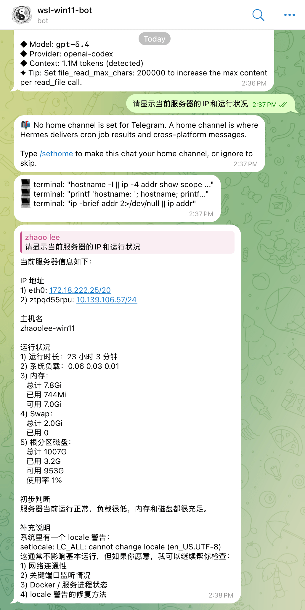

最近我需要用pywinauto写一个Windows自动回复微信群消息的脚本，但我只有一台运行在ubuntu的Windows虚拟机可用，Windowsw本身的环境不适合hermes运行，为了能使用hermes流畅vibe coding，我搞了一套Windows编程的新姿势。

在ubuntu的Windows虚拟机开启wsl，然后wsl加入zerotier网络，我用hermes backend ssh连接wsl，然后用hermes为远程的Windows写脚本，写了脚本可以通过wsl控制powershell运行和截图，校准结果。





这个hermes backend ssh可以接入telegram机器人，我所有的编程和调优指令使用telegram下发给hermes, hermes直接编程实现自动回复微信群组消息。




## 创建密钥

```
ssh-keygen -t ed25519 -f ~/.ssh/hermes-ssh
```

## 传输密钥


```
ssh-copy-id -i ~/.ssh/hermes-ssh.pub user@server-ip
```

回车后，输入ssh登陆密码即可

## 然后自己验证：

```bash
ssh -i ~/.ssh/hermes-ssh user@server-ip
```

如果可以免密登录，就能给 Hermes 添加配置


## 在Hermes创建profile

按照Hermes的设计，一台机器就是一个profile，本机是一个profile，远程的机器也是一个profile，我们想要切换机器，直接切换profile即可，首先新建profile

```
hermes profile create wsl-win11
```

```
➜  ~ hermes profile create wsl-win11

Profile 'wsl-win11' created at /Users/zhaoolee/.hermes/profiles/wsl-win11
79 bundled skills synced.
Wrapper created: /Users/zhaoolee/.local/bin/wsl-win11

Next steps:
  wsl-win11 setup              Configure API keys and model
  wsl-win11 chat               Start chatting
  wsl-win11 gateway start      Start the messaging gateway

  ⚠ This profile has no API keys yet. Run 'wsl-win11 setup' first,
    or it will inherit keys from your shell environment.
  Edit ~/.hermes/profiles/wsl-win11/SOUL.md to customize personality

➜  ~
```

## 进入新建的`wsl-win11`，并开始编辑

```
hermes profile use wsl-win11
hermes config edit
```



```
terminal:
    backend: ssh
    cwd: ~
    timeout: 180
    persistent_shell: true
```

修改完成后，`ctrl+o`存储(记得回车)，`ctrl+x`退出，这个文件其实就是在 `~/.hermes/profiles/wsl-win11/config.yaml`，其实也可以直接用vim

## 编辑profile的.env写入服务器信息

文件地址为`~/.hermes/profiles/wsl-win11/.env`

```bash
TERMINAL_SSH_HOST=10.139.106.57
TERMINAL_SSH_USER=zhaoolee
TERMINAL_SSH_PORT=22
TERMINAL_SSH_KEY=/Users/zhaoolee/.ssh/hermes-ssh
```

## 选一个模型

```bash
hermes -p wsl-win11 model
```

```
➜  ~ hermes -p wsl-win11 model

  Current model:    (not set)
  Active provider:  OpenAI Codex


Default model set to: gpt-5.4 (via OpenAI Codex)
➜  ~
```

## 最后登陆远程服务器


```
hermes -p wsl-win11
```


成功
```
➜  ~ hermes -p wsl-win11

██╗  ██╗███████╗██████╗ ███╗   ███╗███████╗███████╗       █████╗  ██████╗ ███████╗███╗   ██╗████████╗
██║  ██║██╔════╝██╔══██╗████╗ ████║██╔════╝██╔════╝      ██╔══██╗██╔════╝ ██╔════╝████╗  ██║╚══██╔══╝
███████║█████╗  ██████╔╝██╔████╔██║█████╗  ███████╗█████╗███████║██║  ███╗█████╗  ██╔██╗ ██║   ██║
██╔══██║██╔══╝  ██╔══██╗██║╚██╔╝██║██╔══╝  ╚════██║╚════╝██╔══██║██║   ██║██╔══╝  ██║╚██╗██║   ██║
██║  ██║███████╗██║  ██║██║ ╚═╝ ██║███████╗███████║      ██║  ██║╚██████╔╝███████╗██║ ╚████║   ██║
╚═╝  ╚═╝╚══════╝╚═╝  ╚═╝╚═╝     ╚═╝╚══════╝╚══════╝      ╚═╝  ╚═╝ ╚═════╝ ╚══════╝╚═╝  ╚═══╝   ╚═╝

╭──────────────────────── Hermes Agent v0.9.0 (2026.4.13) · upstream cc6e8941 ─────────────────────────╮
│                                   Available Tools                                                    │
│  ⠀⠀⠀⠀⠀⠀⠀⠀⠀⠀⢀⣀⡀⠀⣀⣀⠀⢀⣀⡀⠀⠀⠀⠀⠀⠀⠀⠀⠀⠀   browser: browser_back, browser_click, ...                          │
│  ⠀⠀⠀⠀⠀⠀⢀⣠⣴⣾⣿⣿⣇⠸⣿⣿⠇⣸⣿⣿⣷⣦⣄⡀⠀⠀⠀⠀⠀⠀   clarify: clarify                                                   │
│  ⠀⢀⣠⣴⣶⠿⠋⣩⡿⣿⡿⠻⣿⡇⢠⡄⢸⣿⠟⢿⣿⢿⣍⠙⠿⣶⣦⣄⡀⠀   code_execution: execute_code                                       │
│  ⠀⠀⠉⠉⠁⠶⠟⠋⠀⠉⠀⢀⣈⣁⡈⢁⣈⣁⡀⠀⠉⠀⠙⠻⠶⠈⠉⠉⠀⠀   cronjob: cronjob                                                   │
│  ⠀⠀⠀⠀⠀⠀⠀⠀⠀⠀⣴⣿⡿⠛⢁⡈⠛⢿⣿⣦⠀⠀⠀⠀⠀⠀⠀⠀⠀⠀   delegation: delegate_task                                          │
│  ⠀⠀⠀⠀⠀⠀⠀⠀⠀⠀⠿⣿⣦⣤⣈⠁⢠⣴⣿⠿⠀⠀⠀⠀⠀⠀⠀⠀⠀⠀   file: patch, read_file, search_files, write_file                   │
│  ⠀⠀⠀⠀⠀⠀⠀⠀⠀⠀⠀⠈⠉⠻⢿⣿⣦⡉⠁⠀⠀⠀⠀⠀⠀⠀⠀⠀⠀⠀   homeassistant: ha_call_service, ha_get_state, ...                  │
│  ⠀⠀⠀⠀⠀⠀⠀⠀⠀⠀⠀⠀⠘⢷⣦⣈⠛⠃⠀⠀⠀⠀⠀⠀⠀⠀⠀⠀⠀⠀   image_gen: image_generate                                          │
│  ⠀⠀⠀⠀⠀⠀⠀⠀⠀⠀⠀⢠⣴⠦⠈⠙⠿⣦⡄⠀⠀⠀⠀⠀⠀⠀⠀⠀⠀⠀   (and 11 more toolsets...)                                          │
│  ⠀⠀⠀⠀⠀⠀⠀⠀⠀⠀⠀⠸⣿⣤⡈⠁⢤⣿⠇⠀⠀⠀⠀⠀⠀⠀⠀⠀⠀⠀                                                                      │
│  ⠀⠀⠀⠀⠀⠀⠀⠀⠀⠀⠀⠀⠀⠉⠛⠷⠄⠀⠀⠀⠀⠀⠀⠀⠀⠀⠀⠀⠀⠀   Available Skills                                                   │
│  ⠀⠀⠀⠀⠀⠀⠀⠀⠀⠀⠀⠀⢀⣀⠑⢶⣄⡀⠀⠀⠀⠀⠀⠀⠀⠀⠀⠀⠀⠀   apple: apple-notes, apple-reminders, findmy, imessage              │
│  ⠀⠀⠀⠀⠀⠀⠀⠀⠀⠀⠀⠀⣿⠁⢰⡆⠈⡿⠀⠀⠀⠀⠀⠀⠀⠀⠀⠀⠀⠀   autonomous-ai-agents: claude-code, codex, hermes-agent, opencode   │
│  ⠀⠀⠀⠀⠀⠀⠀⠀⠀⠀⠀⠀⠈⠳⠈⣡⠞⠁⠀⠀⠀⠀⠀⠀⠀⠀⠀⠀⠀⠀   creative: architecture-diagram, ascii-art, ascii-video, e...       │
│  ⠀⠀⠀⠀⠀⠀⠀⠀⠀⠀⠀⠀⠀⠀⠈⠀⠀⠀⠀⠀⠀⠀⠀⠀⠀⠀⠀⠀⠀⠀   data-science: jupyter-live-kernel                                  │
│                                   devops: webhook-subscriptions                                      │
│      gpt-5.4 · Nous Research      email: himalaya                                                    │
│               None                gaming: minecraft-modpack-server, pokemon-player                   │
│  Session: 20260416_110256_35e25b  general: dogfood                                                   │
│                                   github: codebase-inspection, github-auth, github-code-r...         │
│                                   leisure: find-nearby                                               │
│                                   mcp: mcporter, native-mcp                                          │
│                                   media: gif-search, heartmula, songsee, youtube-content             │
│                                   mlops: audiocraft-audio-generation, axolotl, clip, dsp...          │
│                                   note-taking: obsidian                                              │
│                                   productivity: google-workspace, linear, nano-pdf, notion, ocr...   │
│                                   red-teaming: godmode                                               │
│                                   research: arxiv, blogwatcher, llm-wiki, polymarket, resea...       │
│                                   smart-home: openhue                                                │
│                                   social-media: xitter                                               │
│                                   software-development: plan, requesting-code-review,                │
│                                   subagent-driven-d...                                               │
│                                                                                                      │
│                                   Profile: wsl-win11                                                 │
│                                   28 tools · 79 skills · /help for commands                          │
│                                   ⚠ 105 commits behind — run hermes update to update                 │
╰──────────────────────────────────────────────────────────────────────────────────────────────────────╯

Welcome to Hermes Agent! Type your message or /help for commands.
✦ Tip: /rollback 2 src/file.py restores a single file from a specific checkpoint.

  ⚠ tirith security scanner enabled but not available — command scanning will use pattern matching only
────────────────────────────────────────
● 当前你的能看到哪些文件夹，当前路径是什么？本机的状态如何

Initializing agent...
────────────────────────────────────────

  ┊ 💻 $         pwd && printf '\n---DATE---\n' && date && printf '\n---UNAME---\n' && uname -a && printf '\n---UPTIME---\n' && uptime && printf '\n---MEM---\n' && free -h && printf '\n---DISK---\n' && df -h / && printf '\n---CPU---\n' && (lscpu | sed -n '1,20p')  12.1s
  ┊ 🔎 find      *  0.7s [error]
  ┊ 💻 $         printf '---DIRS---\n' && find . -maxdepth 1 -mindepth 1 -type d | sort && printf '\n---FILES---\n' && find . -maxdepth 1 -mindepth 1 -type f | sort | sed -n '1,80p'  8.3s [error]
  ┊ 💻 $         echo '---DIRS---' && find . -maxdepth 1 -mindepth 1 -type d | sort && echo && echo '---FILES---' && find . -maxdepth 1 -mindepth 1 -type f | sort | sed -n '1,80p'  8.1s
 ─  ⚕ Hermes  ─────────────────────────────────────────────────────────────────────────────────────────

     我刚查了当前环境，结果如下。

     当前路径
     /home/zhaoolee

     当前路径下能看到的文件夹
     ./.cache
     ./.hermes
     ./.oh-my-zsh
     ./.ssh

     当前路径下还能看到这些文件
     ./._.hermes
     ./.bash_history
     ./.bash_logout
     ./.bashrc
     ./.motd_shown
     ./.profile
     ./.shell.pre-oh-my-zsh
     ./.sudo_as_admin_successful
     ./.zcompdump
     ./.zcompdump-zhaoolee-win11-5.9
     ./.zcompdump-zhaoolee-win11-5.9.zwc
     ./.zsh_history
     ./.zshrc

     本机状态
     1) 系统信息
     Linux zhaoolee-win11
     内核: 6.6.87.2-microsoft-standard-WSL2
     架构: x86_64

     也就是说，这是一台运行在 WSL2 上的 Linux 环境。

     2) 时间
     Thu Apr 16 11:03:43 CST 2026

     3) 运行时长 / 负载
     已运行: 1小时11分钟
     load average: 0.02, 0.01, 0.00

     说明当前机器非常空闲，几乎没什么负载。

     4) 内存
     总内存: 7.8 GiB
     已用: 474 MiB
     可用: 7.3 GiB
     Swap: 2.0 GiB，当前未使用

     说明内存很充足。

     5) 磁盘
     根分区 /: 1007G 总容量
     已用: 1.7G
     可用: 955G
     使用率: 1%

     说明磁盘空间非常充足。

     6) CPU
     型号: AMD Ryzen 5 3600X 6-Core Processor
     当前系统识别到 CPU(s): 4

     整体判断
     - 当前目录是 /home/zhaoolee
     - 当前目录下主要是 shell 配置、SSH、Hermes、缓存相关目录
     - 机器处于空闲状态
     - 内存和磁盘都很充足
     - 这是 Windows 上的 WSL2 Linux 环境

     如果你愿意，我还可以继续帮你查：
     1. 当前有哪些端口在监听
     2. 当前有哪些进程最占 CPU / 内存
     3. 当前目录做一个更完整的树状结构展示

 ──────────────────────────────────────────────────────────────────────────────────────────────────────
 ⚕ gpt-5.4 │ 12.1K/1.1M │ [░░░░░░░░░░] 1% │ 2m
────────────────────────────────────────────────────────────────────────────────────────────────────────
wsl-win11 ❯
────────────────────────────────────────────────────────────────────────────────────────────────────────
```


## Hermes 在 macOS + SSH backend 下出现 “unix_listener: path ... too long for Unix domain socket” 的原因与解决方案

我在 macOS 上通过 Hermes 的 profile ssh backend 连接远程主机时，发现很多工具突然失效了，例如：
- terminal
- search_files
- read_file
- 以及依赖 SSH backend 的其它远程执行能力

典型报错如下：

SSH connection failed: unix_listener: path "/var/folders/.../T/hermes-ssh/zhaoolee@10.139.106.57:22.sock...." too long for Unix domain socket

直接后果就是：
- Hermes 无法通过 SSH 连到远端
- 远程文件读不到
- terminal 命令跑不了
- 看起来像“网关起来了”，但实际上工具层已经坏了

问题起因

根因不是远程 Linux/WSL 挂了，也不是 SSH 密钥错了，而是 macOS 本地 Unix domain socket 路径太长。

Hermes 在 SSH backend 下会创建 SSH ControlMaster socket。
这个 socket 的路径大概由几部分组成：

1. macOS 的临时目录
通常是这种很长的路径：
`/var/folders/.../T/`

2. Hermes 自己的目录名
类似：
`hermes-ssh`

3. 连接信息拼出来的 socket 文件名
例如：
`zhaoolee@10.139.106.57:22.sock`

4. SSH 还可能附加随机后缀

把这几段拼起来以后，最终路径就超过了 macOS 对 Unix domain socket 的长度限制，于是 SSH 连接在本地就失败了。

也就是说：
问题发生在本机创建 socket 这一步，甚至还没真正进入远程主机。

为什么前台 `run` 能用，但 `gateway start` 不行

这是这次排查里最关键的一点。

我一开始以为只要这样启动就行：

```bash
export TMPDIR=/tmp
hermes -p wsl-win11 gateway restart
```

后来发现不行。

原因是：hermes -p wsl-win11 gateway start 走的是 launchd 托管服务，不是当前 shell 直接前台启动。

也就是说：

1. 你在 shell 里 `export TMPDIR=/tmp`
只会影响当前 shell 以及它直接启动的子进程

2. 但 hermes gateway start 的本质是：
让 launchd 按 plist 配置启动服务

3. launchd 启动服务时，并不会自动继承你这一条 shell 命令里的 TMPDIR

所以即便你写：

```bash
TMPDIR=/tmp/hermes-tmp hermes -p wsl-win11 gateway start
```

它也依然可能没用。
因为真正启动 gateway 的不是当前 shell，而是 launchd。

为什么手工改 plist 也没用

后来我又试着直接修改：

```bash
/Users/zhaoolee/Library/LaunchAgents/ai.hermes.gateway-wsl-win11.plist
```
手工往里面加：

```bash
<key>TMPDIR</key>
<string>/tmp/hermes-tmp</string>
```

结果发现,每次运行`hermes -p wsl-win11 gateway start`, 这个 plist 都会被重新覆盖。

根因是 Hermes 自己的启动逻辑会检查 launchd plist 是否“和当前安装版本一致”。
如果发现不一致，就会重新生成 plist，把手工修改覆盖掉。

所以：手改 plist 不是长期解法。

经过漫长的验证，我发现： `TMPDIR=/tmp/hermes-tmp hermes -p wsl-win11 gateway run`

是可以稳定工作的。

原因很简单：

1. gateway run 是当前 shell 直接前台启动
2. 这个进程真的继承了你设置的 TMPDIR
3. 于是 Hermes/SSH backend 在本地创建 control socket 时，走的是更短的临时目录
4. socket 路径缩短后，不再超限
5. 远程 terminal / 文件读取就恢复正常了

也就是说：

能用的是：
`TMPDIR=/tmp/hermes-tmp hermes -p wsl-win11 gateway run`

不能用的是：
`TMPDIR=/tmp/hermes-tmp hermes -p wsl-win11 gateway start`

两者最大的区别是run 是前台直接启动，start 是交给 launchd 启动。

官方仓库里有没有类似问题?

我查到的最相关内容有：

1. Issue #11840
标题：
[Bug]: SSH ControlMaster socket path exceeds macOS limit with IPv6 hosts

这个 issue 说明：
Hermes 当前会把 user@host:port 直接塞进 socket 文件名，macOS 上很容易超长。

2. PR #11987
标题：
fix(tools): keep SSH ControlMaster socket path under macOS 104-byte limit

这个 PR 的修法不是继续依赖 TMPDIR，而是从根上修：
把 socket 文件名从
user@host:port.sock
改成短 hash 文件名。

这说明官方也已经确认这是 Hermes 的实现问题，不是用户操作问题。

另外，官方以前已经修过类似的 launchd 环境变量问题，比如：
- PATH
- VIRTUAL_ENV
- HERMES_HOME

所以从设计上说，TMPDIR 也完全可以被正式支持。
只是截至我排查时，官方主线更倾向于“缩短 socket 名”，而不是单独提供一个 TMPDIR 配置项。


最终临时方案（后面官方解决了，这个方案就可以废弃了）：

```bash
tmux new-session -d -s hermes-wsl-win11 'export TMPDIR=/tmp/hermes-tmp && hermes -p wsl-win11 gateway run'
```
这条命令的作用是：

1. 新建一个名为 hermes-wsl-win11 的 tmux 会话
2. 在这个会话里先设置短 TMPDIR
3. 再启动 hermes -p wsl-win11 gateway run
4. 并且整个会话在后台运行，不占当前终端

这样做的好处

1. 保留了 run 模式的可用性
也就是继续使用已经验证过有效的短 TMPDIR 启动方式

2. 不占当前终端
命令执行完就返回 shell 了

3. 不容易因为关窗口而把 gateway 一起杀掉
tmux 会托管这个前台进程

4. 随时可以回去看日志/现场
比如：

`tmux attach -t hermes-wsl-win11`

5. 比 launchd 更稳定，至少在当前这个 bug 没修好之前是这样

常用 tmux 命令

查看会话：`tmux ls`

重新进入网关会话：`tmux attach -t hermes-wsl-win11`

只看最近输出：`tmux capture-pane -t hermes-wsl-win11 -p | tail -100`

停止它：`tmux kill-session -t hermes-wsl-win11`

最终结论，Hermes 在 macOS 上通过 SSH backend 创建 ControlMaster socket 时，socket 路径过长，超过了 Unix domain socket 的长度限制，导致所有远程工具调用失败。

## 最后配合telegram，这个新的profile可以支持远程运维或编程了




