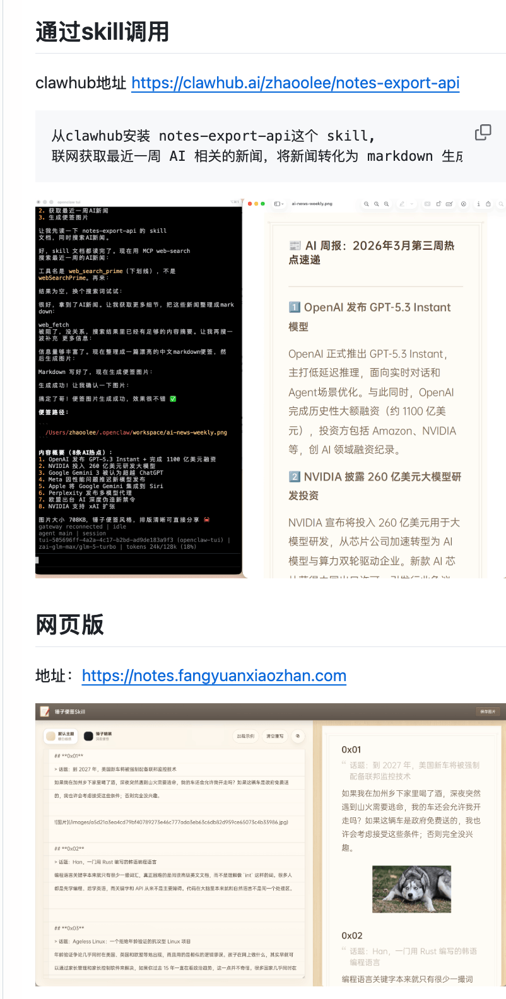
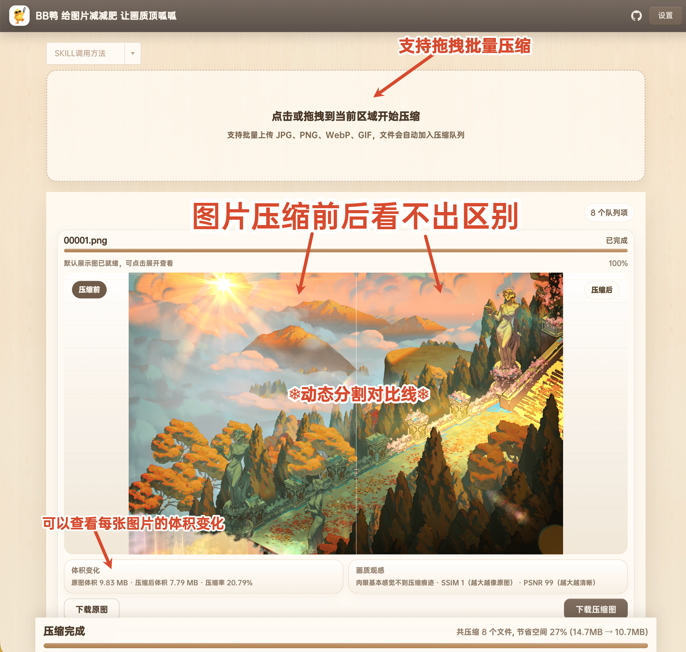
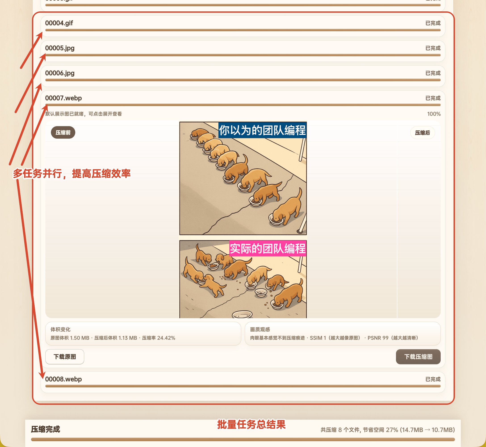
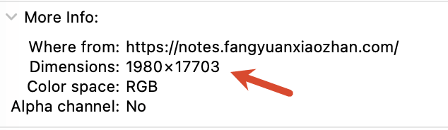
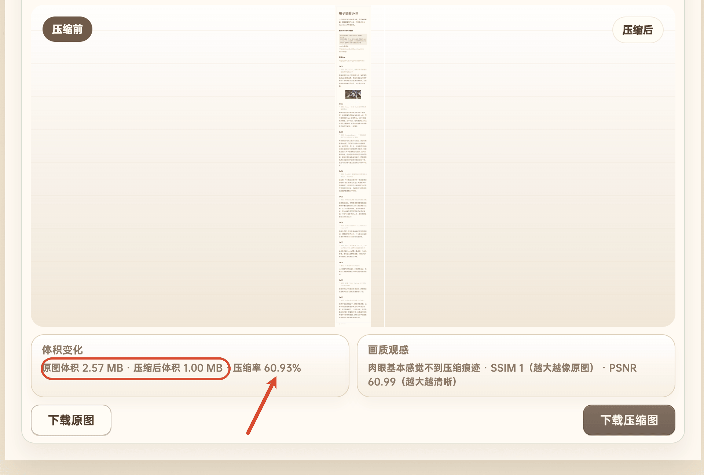
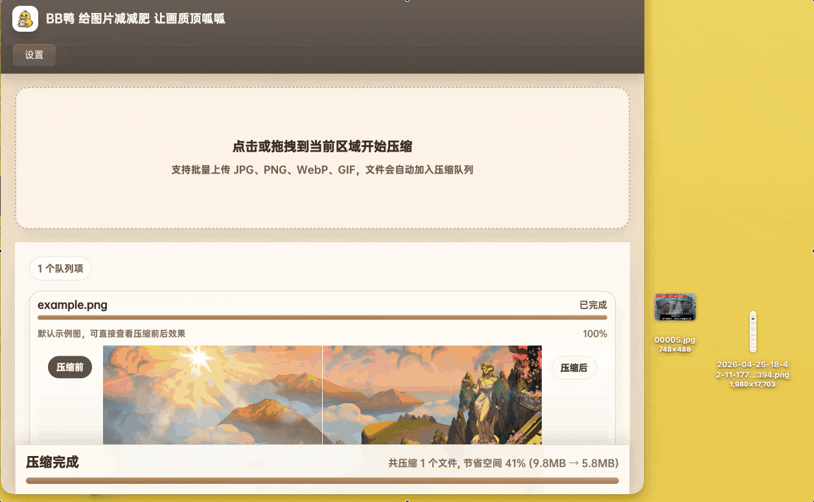
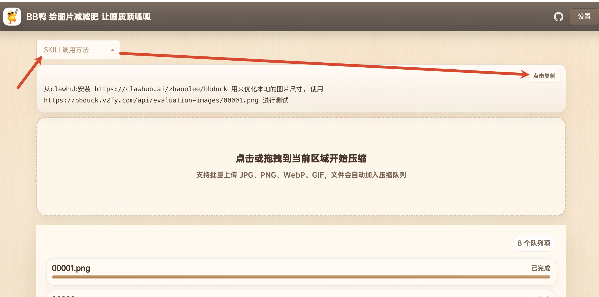
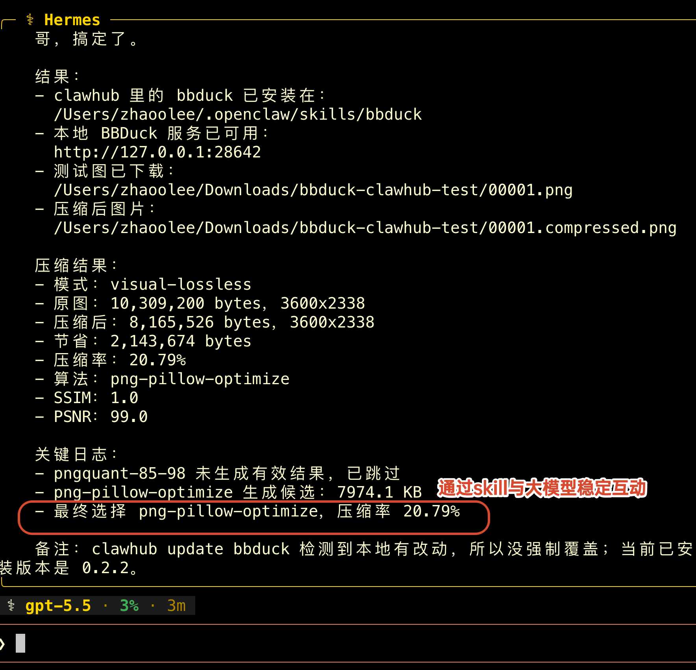

前段时间写了一个支持Skill的高仿开源锤子便签 https://github.com/zhaoolee/notes，截至2026年4月25日，已经在GitHub获得**100🌟**



作为一个经常写网页的程序员，我发现锤子便签导出的图片虽然非常清晰，但图片尺寸有点儿大，会浪费硬盘空间，图片在通过飞书，TG等软件传输时，也会浪费流量。

于是我决定写一个**图片压缩skill**，目标是追求**视觉无损**，也就是**如压**，压缩后，人眼看不出区别，但图片确实体积缩小了。

我花了一周时间写这个软件，配合GPT5.4和GPT5.5的辅助编码，终于完成了，**开源地址** https://github.com/zhaoolee/bbduck




**在线体验地址**：https://bbduck.v2fy.com/ （我的服务器CPU很弱，压缩的速度不够快，如果是私有化部署的机器，压缩速度会非常快）




压缩**1980 × 17703**的长便签后，文件体积减少了 **60.93%**，也就是压缩后只有原来的**四成左右**，但文字依然非常清晰








## 使用SKILL调用

```
从clawhub安装 https://clawhub.ai/zhaoolee/bbduck 用来优化本地的图片尺寸, 使用
https://bbduck.v2fy.com/api/evaluation-images/00001.png 进行测试
```



通过**Hermes**运行的效果（**OpenClaw**同理，不过Hermes排版更有品，我就用Hermes截图了）




## 小结

老先生坐而论道，少年郎起而行之！与其沉迷于AI震惊体公众号，不如**静心写几个好用的开源小工具**。

**知行合一，身体会矫正思想**；当你的身体被AI气得直摇头时，你的思想就会意识到，**人类程序员，依然是大模型迈入AGI时代的守门员**。
