## 弹幕为鸟叫配字幕

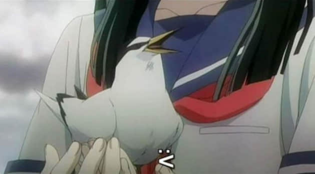

## 局座张召忠和疯狂动物城的闪电

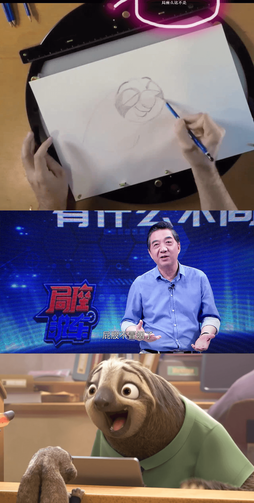

## 朱自清的「背影」与「鼹鼠的故事」

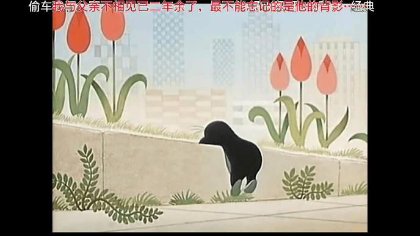

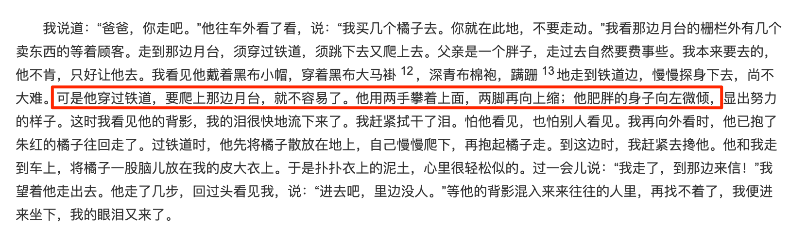

## 三国演义刘备种菜浇水 经验+15

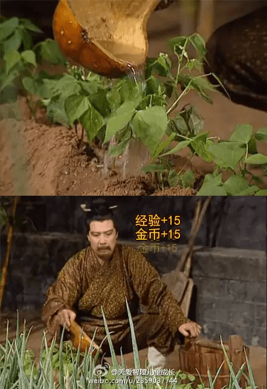

## 小熊维尼的蜂蜜罐

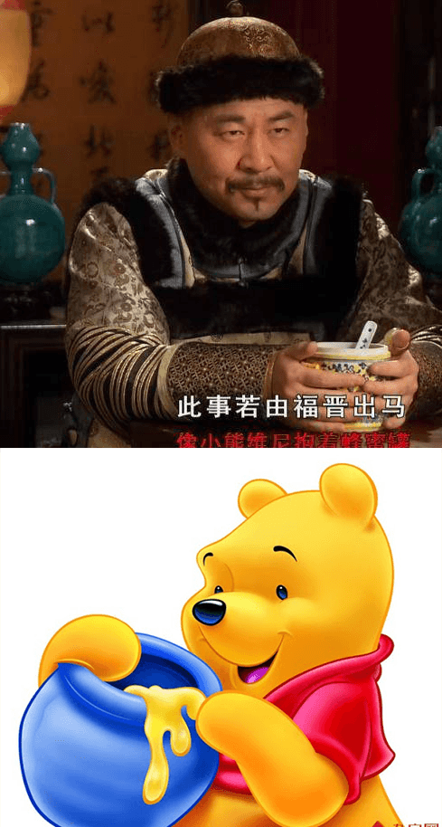

## 「余罪」跳戏到三国张飞

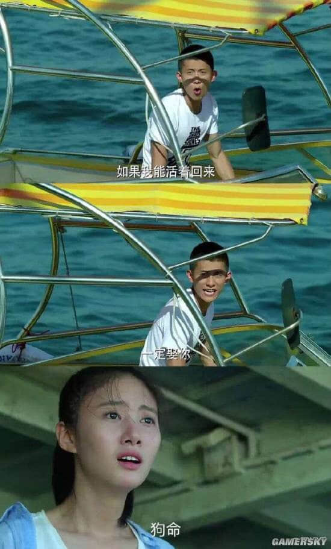

等我回来,一定娶你(狗命🐶)

## 杜甫骑了个马,手提青龙偃月刀

## 众所周知,和珅是申通快递的创始人

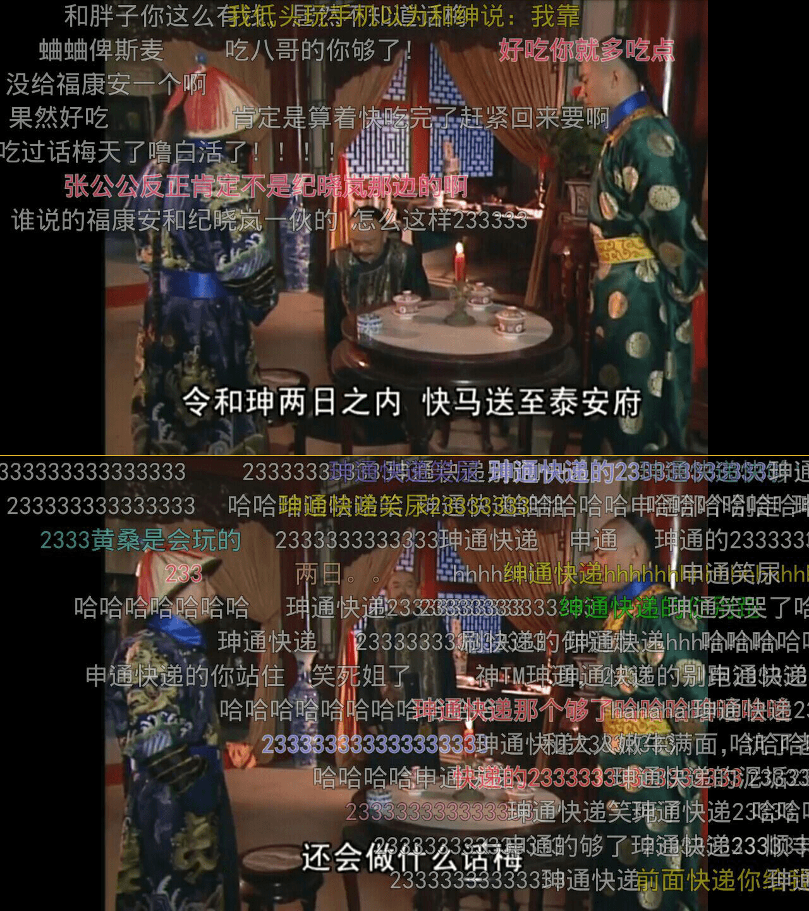

## 弹幕给目标人物戴绿帽

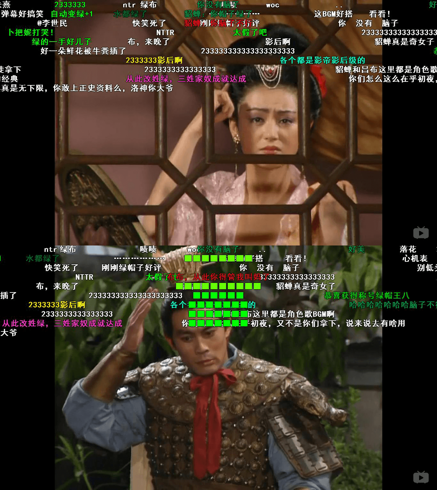

lv布lv奉先

## 张全蛋微服私访记

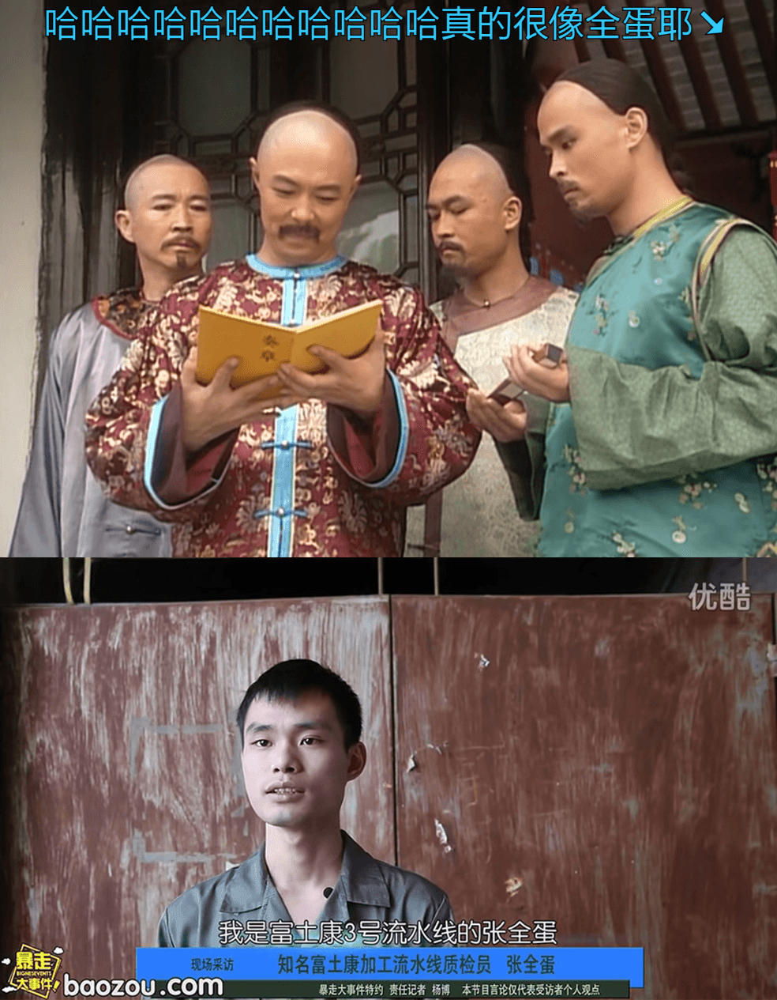

## 我要给你们点颜色看看

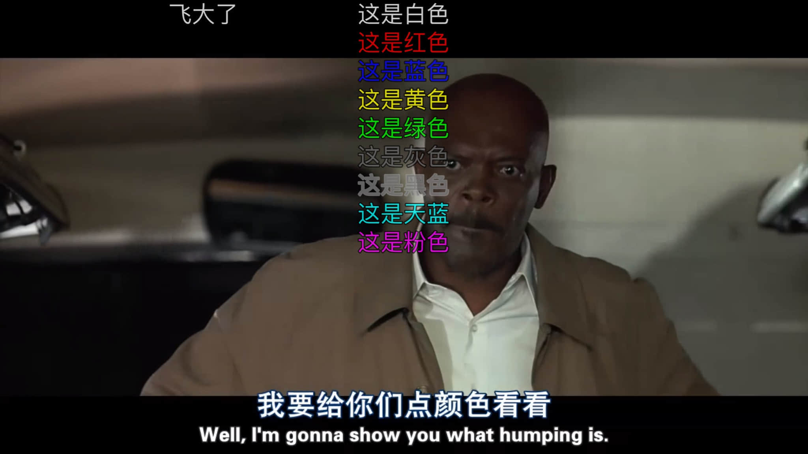

## 关二爷九尺男儿身长七尺

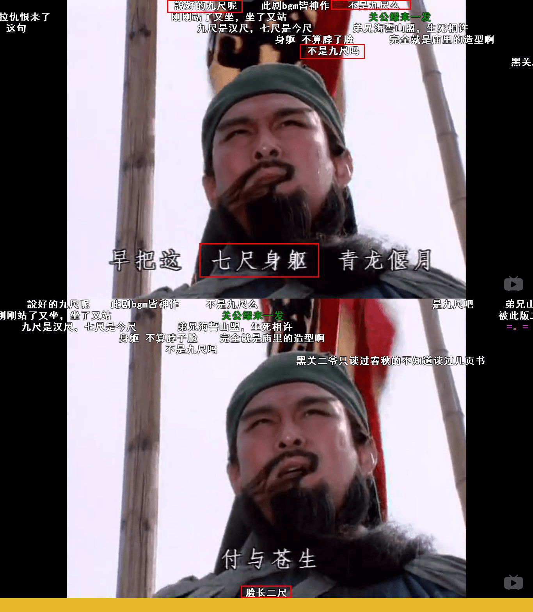

关二爷九尺男儿,身长七尺,脸两尺

## 小米10新手机上市

## 「寂静岭」的中文翻译「哑巴屯」

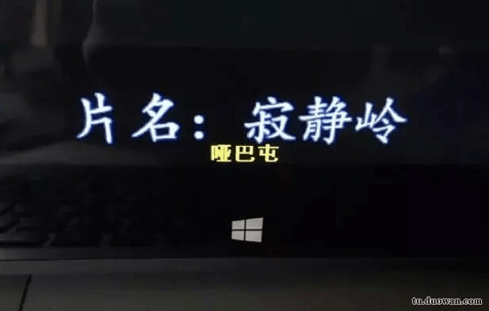

