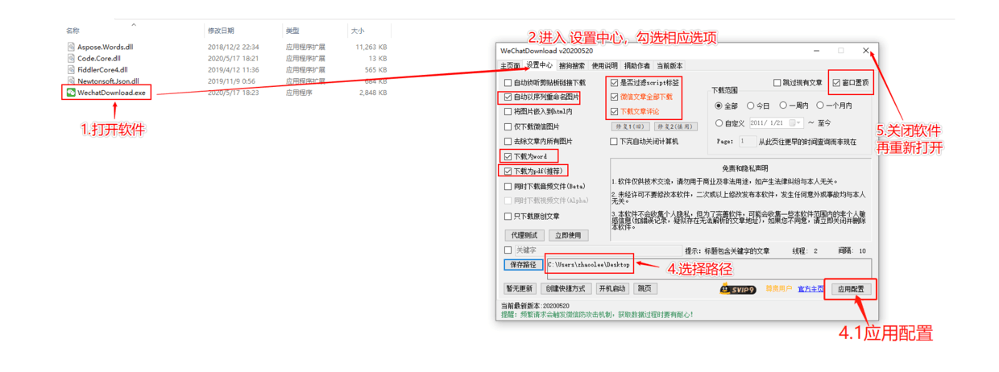
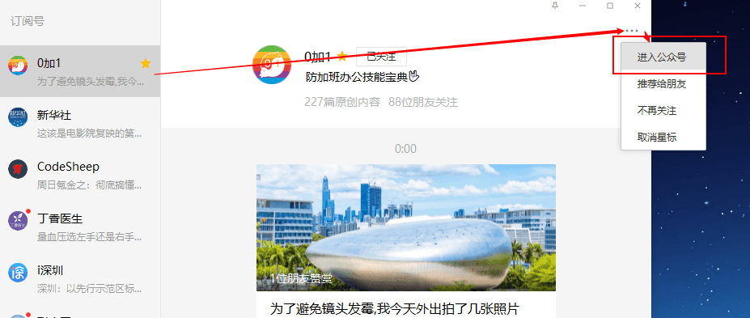
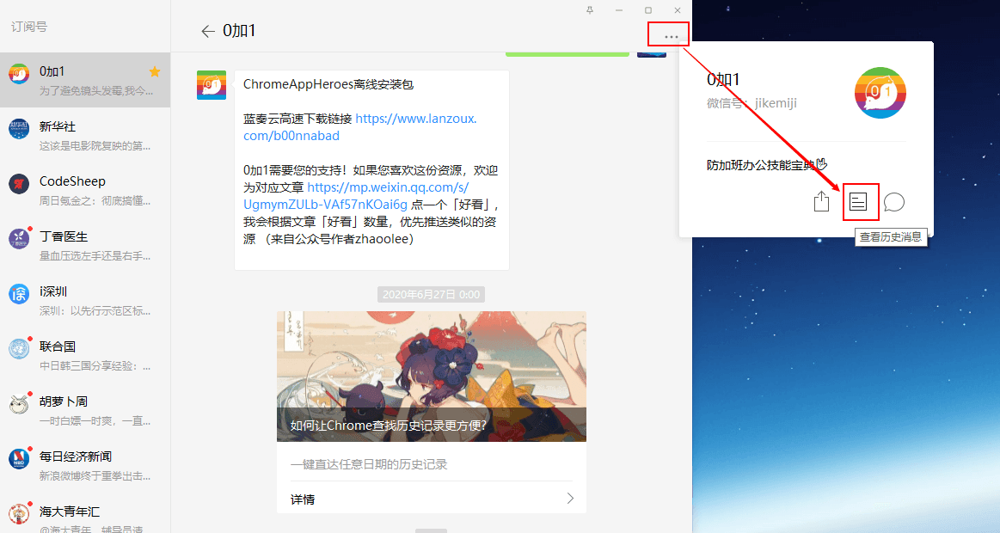
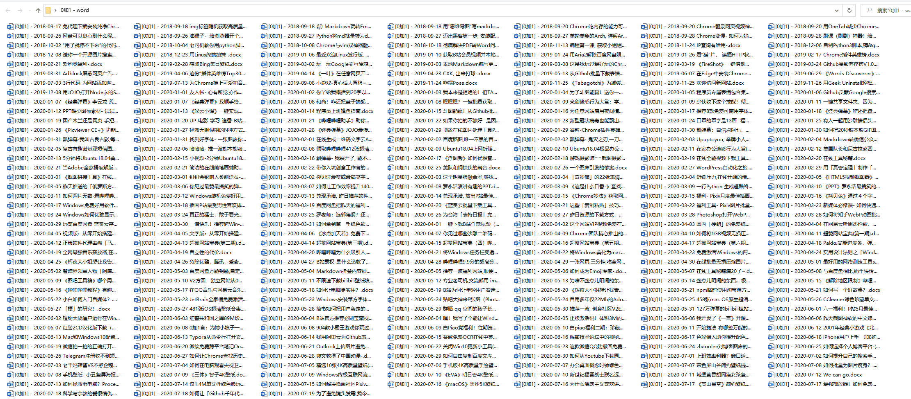

## 资源下载地址

<!--  -->
https://frp.v2fy.com/%E6%89%B9%E9%87%8F%E4%B8%8B%E8%BD%BD%E5%85%AC%E4%BC%97%E5%8F%B7%E6%96%87%E7%AB%A0/

## 1.打开软件，选择对应选项

以上设置可以按照自己的实际情况选择，上图只是我的一个实例

## 2.确认证书安装

重启软件时，会要求安装一个证书，这个直接选**是**，即可成功安装

## 3. 爬取单篇文章

按照第一步的设置，爬取的文章会分到三个文件夹，一个保存网页格式，一个保存pdf格式,一个保存word格式

## 4.爬取多篇文章

通过PC端微信，进入公众号

查看历史记录即可，开始自动爬取

爬取效果

## 小结:

微信独有的闭源生态特性，即使是公众号作者，也无法快速导出已发布的文章，而这款小工具解决了微信文章批量导出的问题，而且还给出了 html, doc, pdf，三种格式同时导出的选项，真的是良心软件

当然这款工具也方便我们下载友商的公众号数据，为分析友商的公众号发文技巧，打下数据基础