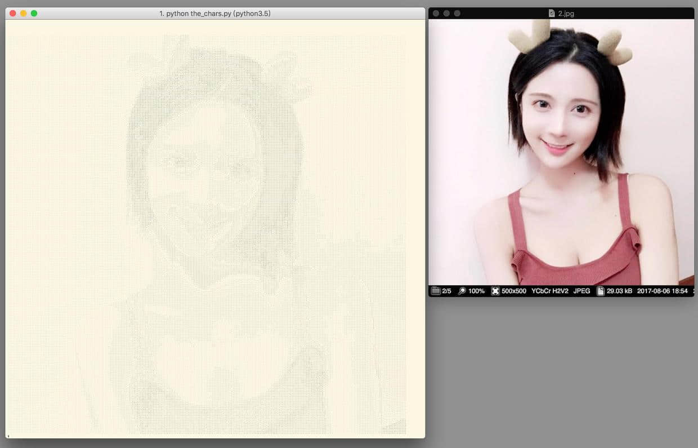
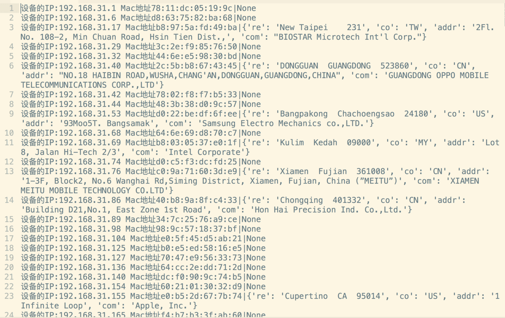
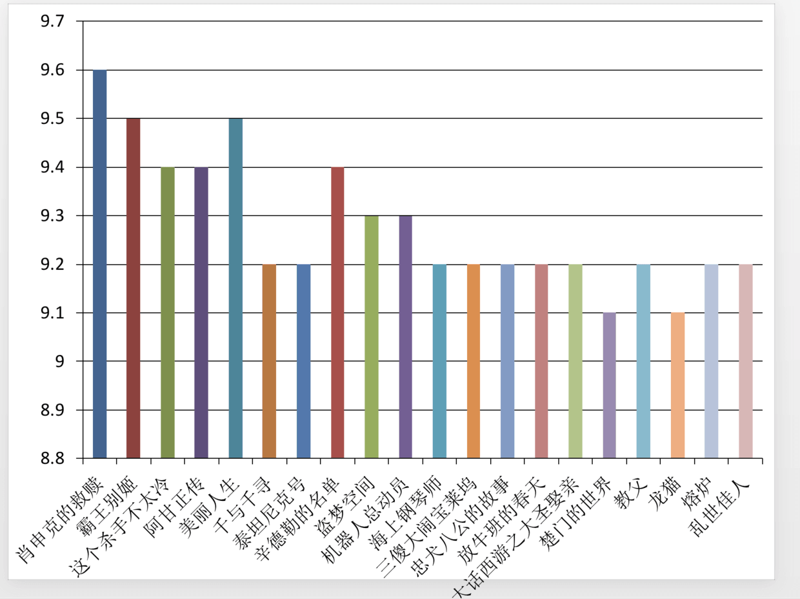
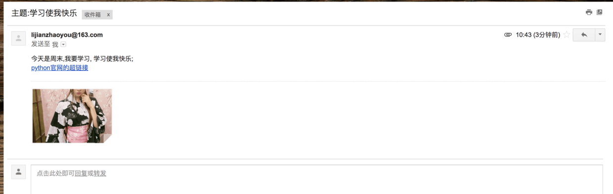
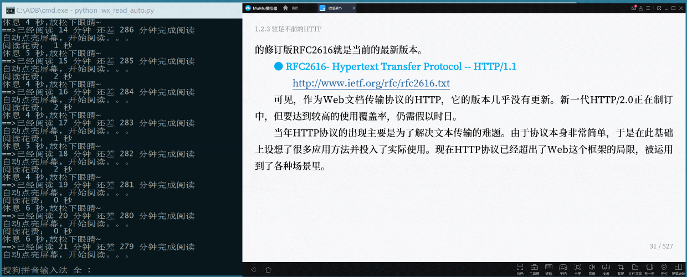

## Python给王尼玛表情包批量修改文件名


源码: https://www.jianshu.com/p/2403e013bee4

## 这可能是最好玩的Python GUI入门实例!


源码: https://www.jianshu.com/p/8abcf73adba3

## Python字符影集





源码: https://www.jianshu.com/p/68a59650b3e7


## Python抓取任意百度贴吧图片


源码: https://www.jianshu.com/p/9e0136ad57d5


## Python刺探星巴克无线网，记录顾客信息




源码: https://www.jianshu.com/p/da65f942882d

## <自动化办公> 两秒完成250页豆瓣电影PPT


#### Python 生成Top20评分报表




源码: https://www.jianshu.com/p/5b294515b480


## 3行代码自动发邮件

```
import yagmail

# 连接邮箱服务器
yag = yagmail.SMTP(user="lijianzhaoyou@163.com", password="填自己的", host='smtp.163.com')

# 邮箱正文
contents = ['今天是周末,我要学习, 学习使我快乐;', '<a href="https://www.python.org/">python官网的超链接</a>', './girl.jpg']

# 发送邮件
yag.send('zhaoolee@gmail.com', '主题:学习使我快乐', contents)
```





原文地址: https://www.jianshu.com/p/1be807735914


## 一行Python生成终端二维码


源码: https://www.jianshu.com/p/664554ae44e6


## 用Python脚本刷微信读书的时长





源码: https://www.jianshu.com/p/fffaf97ccf11